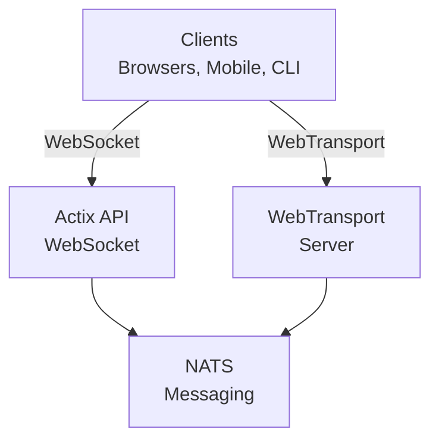
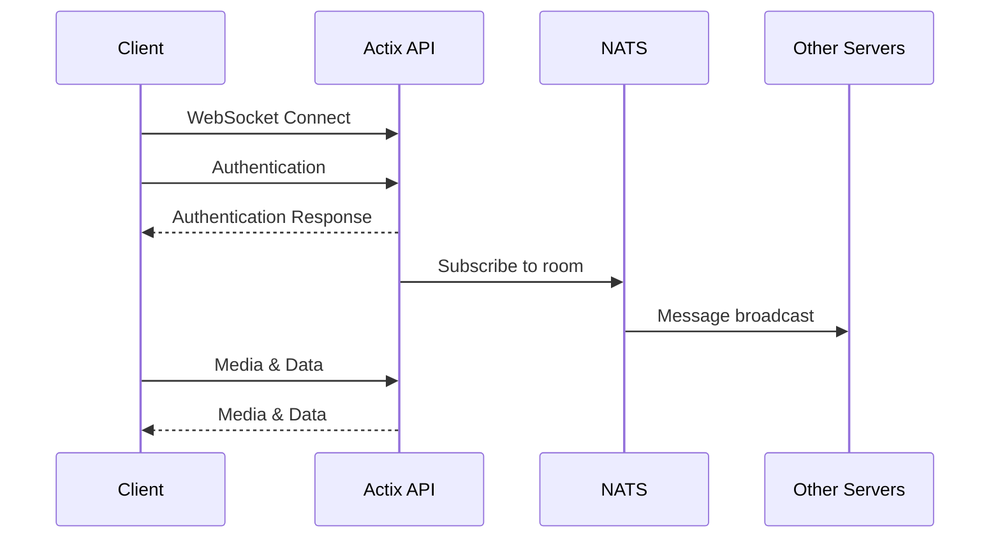
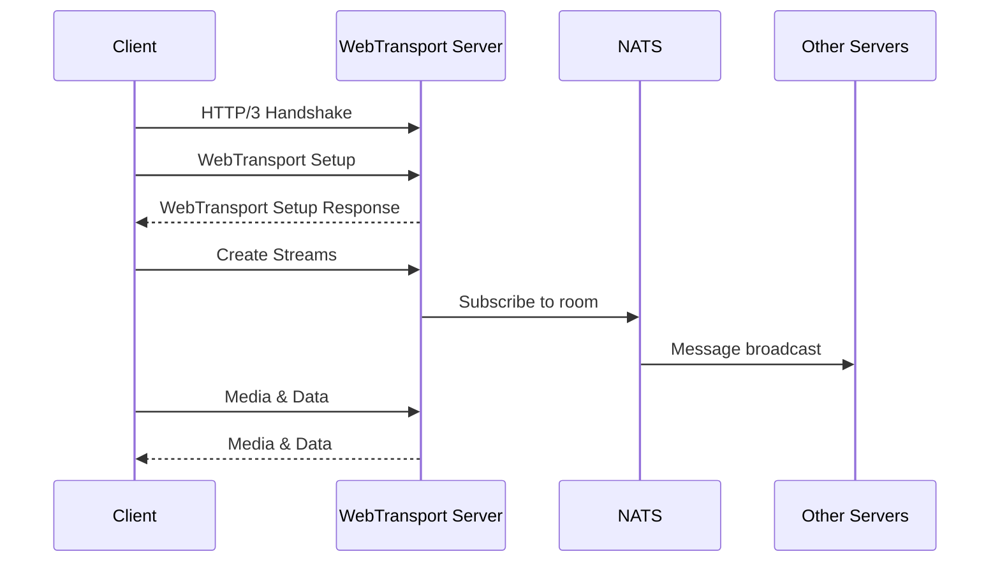
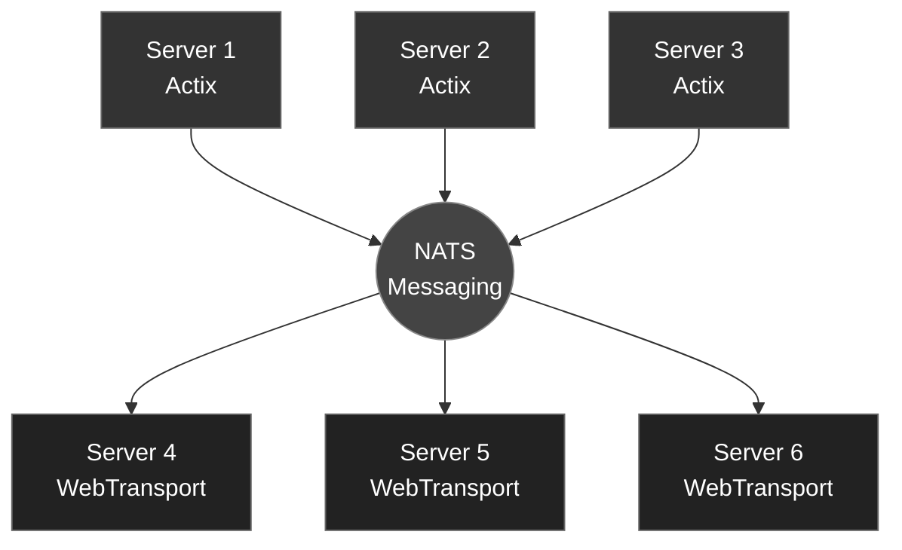

# videocall.rs Architecture

This document provides a comprehensive overview of the videocall.rs architecture, explaining how the various components interact to deliver a scalable, real-time video conferencing solution.

## Table of Contents

- [System Overview](#system-overview)
- [Key Components](#key-components)
- [Connection Flows](#connection-flows)
- [Message Handling](#message-handling)
- [Horizontal Scaling](#horizontal-scaling)
- [Media Processing](#media-processing)
- [Security Architecture](#security-architecture)

## System Overview

videocall.rs is designed as a distributed system with multiple specialized components that work together to provide real-time video conferencing. The architecture supports horizontal scaling through a pub/sub messaging system.

## Key Components

### 1. Client Applications

- **Web Client**: Built with Yew (Rust-to-WebAssembly framework)
- **CLI Client**: Native Rust client for headless devices
- **Mobile Clients**: Native mobile applications (in development)

### 2. Transport Servers

- **Actix API Server**: Handles WebSocket connections
  - Built with Actix Web framework
  - Manages session state and room coordination
  - Processes signaling messages

- **WebTransport Server**: Handles WebTransport connections
  - Uses QUIC protocol for faster, more reliable connections
  - Better performance for high-packet-loss environments
  - Requires Chrome/Chromium with WebTransport support

### 3. Messaging System

- **NATS**: High-performance message broker
  - Enables horizontal scaling of backend servers
  - Handles inter-server communication
  - Manages pub/sub for room events and signaling

## Connection Flows

### WebSocket Connection Flow

### WebTransport Connection Flow

### Message Flow

1. **Client Generates Message**: A client creates a message (e.g., chat message, video frame)
2. **Transport Layer**: Message is sent via WebSocket or WebTransport to the respective server
3. **Server Processing**: The server validates and processes the message
4. **NATS Publication**: The server publishes the message to the appropriate NATS subject
5. **Distribution**: All servers subscribed to that subject receive the message
6. **Client Delivery**: Servers forward the message to connected clients in the same room

## Horizontal Scaling

videocall.rs achieves horizontal scaling through its NATS-based architecture:

### Scaling Characteristics

1. **Client Distribution**: Clients can connect to any available server
2. **Room Coordination**: All servers in a room coordinate through NATS subjects
3. **Load Balancing**: Front-end load balancers distribute client connections
4. **Server Independence**: Servers can be added or removed without disrupting service
5. **Failover**: If a server fails, clients can reconnect to another server

## Media Processing

The media processing component handles the encoding and decoding of video streams. It supports various codecs and formats, including H.264, VP8, and VP9.

## Security Architecture

The security architecture ensures that the system is secure and protects against common security threats. It includes features such as encryption, authentication, and access control.
