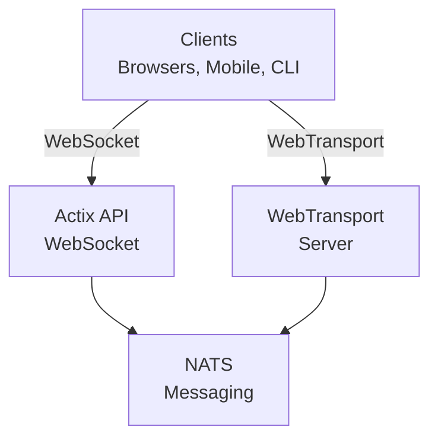
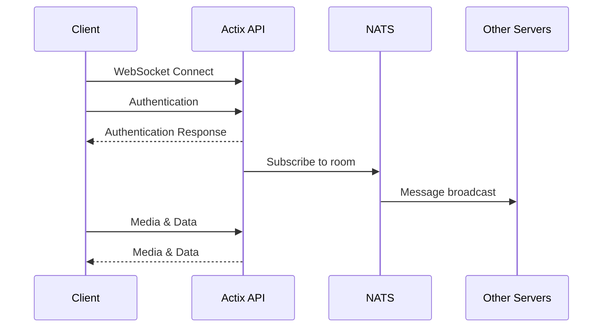
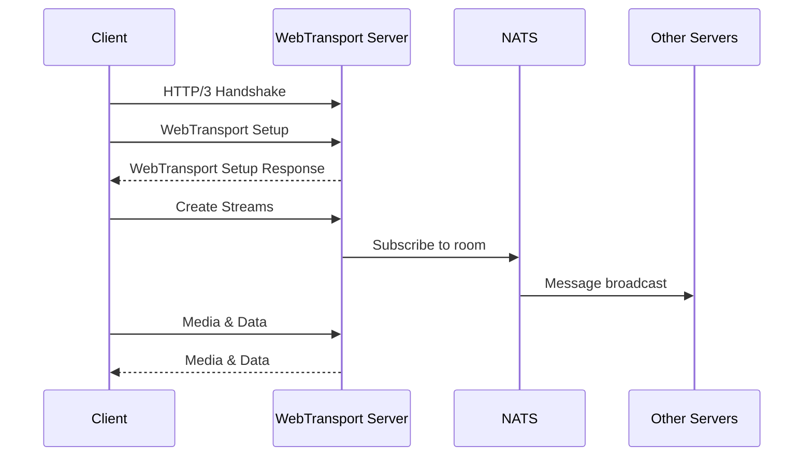
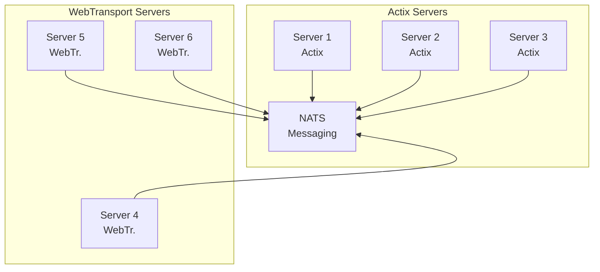

# videocall.rs Architecture

This document provides a comprehensive overview of the videocall.rs architecture, explaining how the various components interact to deliver a scalable, real-time video conferencing solution.

## Table of Contents

- [System Overview](#system-overview)
- [Key Components](#key-components)
- [Connection Flows](#connection-flows)
- [Message Handling](#message-handling)
- [Horizontal Scaling](#horizontal-scaling)
- [Media Processing](#media-processing)
- [Security Architecture](#security-architecture)

## System Overview

videocall.rs is designed as a distributed system with multiple specialized components that work together to provide real-time video conferencing. The architecture supports horizontal scaling through a pub/sub messaging system.



## Key Components

### 1. Client Applications

- **Web Client**: Built with Yew (Rust-to-WebAssembly framework)
- **CLI Client**: Native Rust client for headless devices
- **Mobile Clients**: Native mobile applications (in development)

### 2. Transport Servers

- **Actix API Server**: Handles WebSocket connections
  - Built with Actix Web framework
  - Manages session state and room coordination
  - Processes signaling messages

- **WebTransport Server**: Handles WebTransport connections
  - Uses QUIC protocol for faster, more reliable connections
  - Better performance for high-packet-loss environments
  - Requires Chrome/Chromium with WebTransport support

### 3. Messaging System

- **NATS**: High-performance message broker
  - Enables horizontal scaling of backend servers
  - Handles inter-server communication
  - Manages pub/sub for room events and signaling

## Connection Flows

### WebSocket Connection Flow



### WebTransport Connection Flow



## Message Handling

All communication in videocall.rs follows a consistent message format, regardless of transport protocol:

```rust
// Simplified message structure
struct Message {
    message_type: MessageType,
    room_id: String,
    sender: UserId,
    payload: Vec<u8>,
    timestamp: u64,
}

enum MessageType {
    Join,
    Leave,
    Media,
    ChatMessage,
}
```

### Message Flow

1. **Client Generates Message**: A client creates a message (e.g., chat message, video frame)
2. **Transport Layer**: Message is sent via WebSocket or WebTransport to the respective server
3. **Server Processing**: The server validates and processes the message
4. **NATS Publication**: The server publishes the message to the appropriate NATS subject
5. **Distribution**: All servers subscribed to that subject receive the message
6. **Client Delivery**: Servers forward the message to connected clients in the same room

## Horizontal Scaling

videocall.rs achieves horizontal scaling through its NATS-based architecture:



### Scaling Characteristics

1. **Client Distribution**: Clients can connect to any available server
2. **Room Coordination**: All servers in a room coordinate through NATS subjects
3. **Load Balancing**: Front-end load balancers distribute client connections
4. **Server Independence**: Servers can be added or removed without disrupting service
5. **Failover**: If a server fails, clients can reconnect to another server

### NATS Subject Structure

- `room.<room_id>.join` - New participant events
- `room.<room_id>.leave` - Participant departure events
- `room.<room_id>.message` - Chat messages
- `system.stats` - System performance metrics (in development)

## Media Processing

videocall.rs uses WebTransport for media transmission, with custom optimizations:

### Client-Side Processing

1. **Media Capture**: Access to camera and microphone via browser APIs or native interfaces
2. **Encoding**: Video encoded using VP8/VP9/H.264, audio with Opus
3. **WebCodecs API**: Efficient media processing in modern browsers
4. **Adaptive Bitrate**: Dynamic quality adjustment based on network conditions

### Server-Side Processing (SFU Mode)

For large meetings (10+ participants), the system switches to a Selective Forwarding Unit model:

1. **Media Routing**: Server receives streams from broadcasters and selectively forwards to viewers via WebTransport
2. **Speaker Detection**: Automated active speaker detection
3. **Video Composition**: Optional server-side video composition for bandwidth-constrained clients
4. **Recording**: Optional meeting recording functionality

## Security Architecture

### End-to-End Encryption

When E2EE is enabled:

1. **Key Exchange**: Peers exchange encryption keys using ECDH (Elliptic Curve Diffie-Hellman)
2. **Media Encryption**: Media streams are encrypted before leaving the client
3. **Server Blindness**: Servers cannot access the unencrypted media content
4. **Key Rotation**: Regular key rotation for enhanced security

### Transport Security

1. **TLS/HTTPS**: All connections secured with TLS 1.3
2. **QUIC Security**: WebTransport inherits QUIC's security properties
3. **Certificate Validation**: Strict certificate validation

---

This architecture document is meant to provide a clear understanding of how videocall.rs components fit together. For more detailed implementation information, please refer to the codebase documentation and comments. 