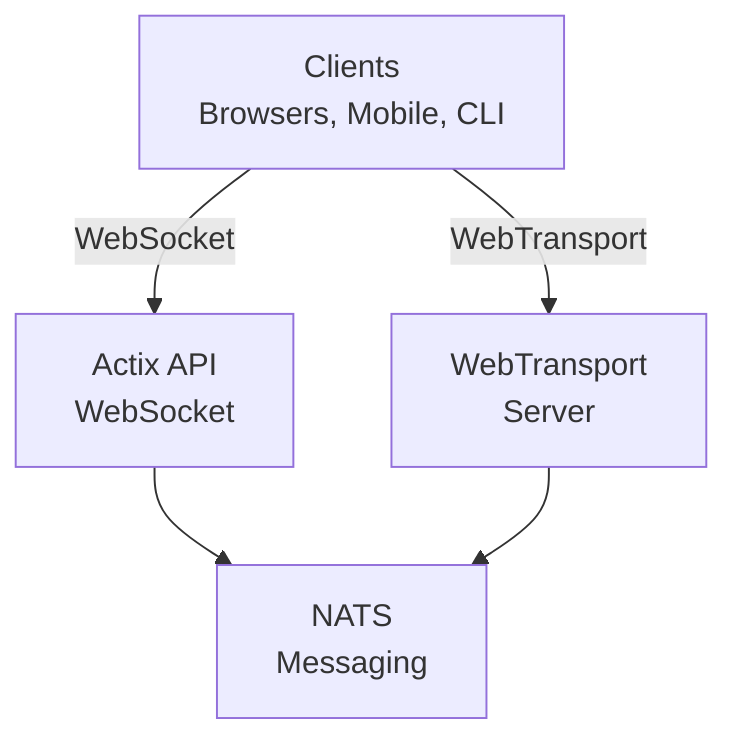
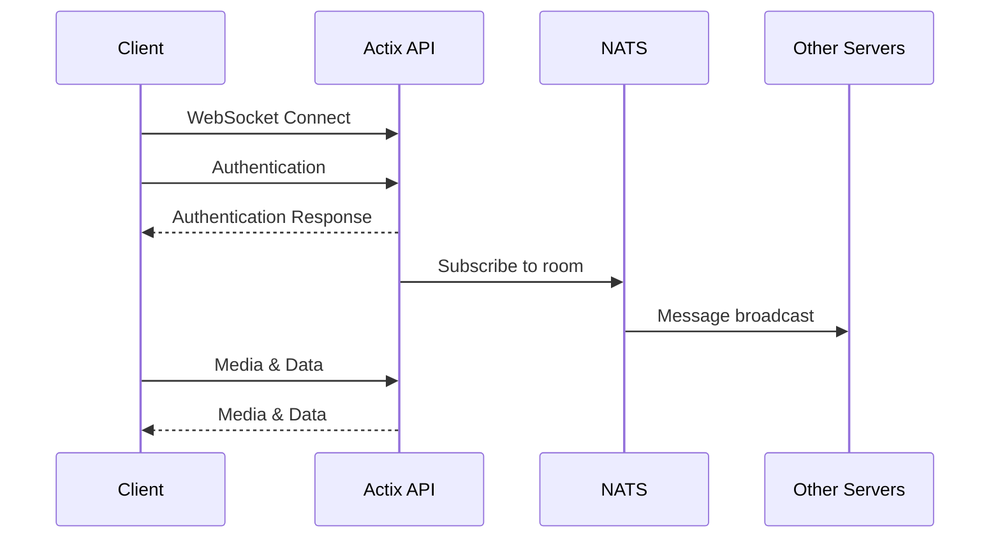
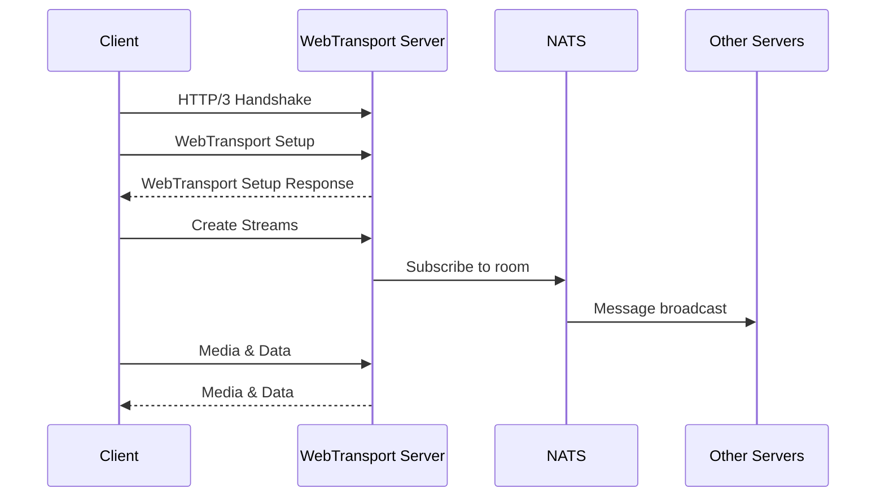
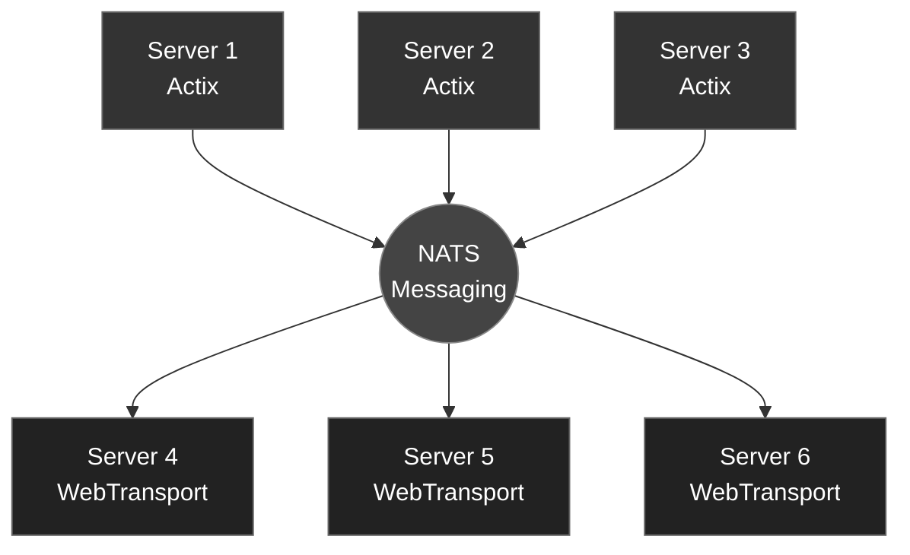
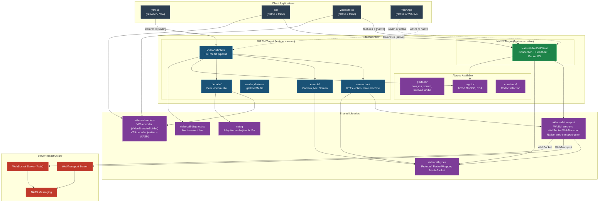
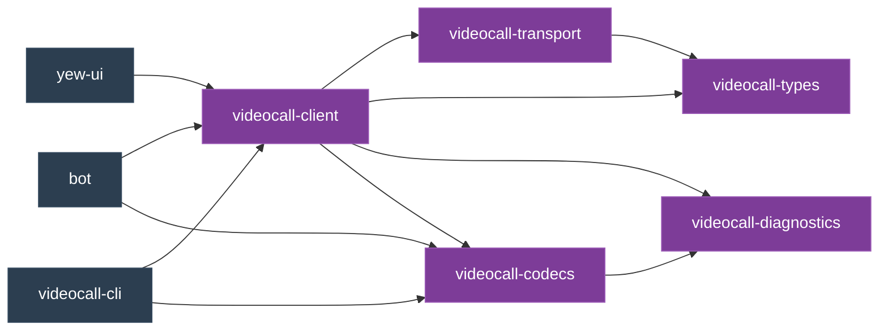
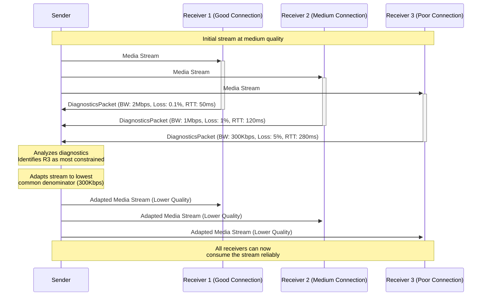
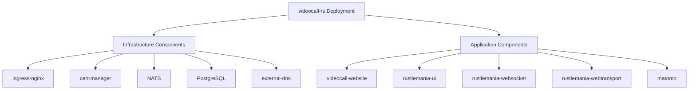

# videocall.rs Architecture

This document provides a comprehensive overview of the videocall.rs architecture, explaining how the various components interact to deliver a scalable, real-time video conferencing solution.

## Table of Contents

- [System Overview](#system-overview)
- [Key Components](#key-components)
- [Connection Flows](#connection-flows)
- [Message Handling](#message-handling)
- [Horizontal Scaling](#horizontal-scaling)
- [Media Processing](#media-processing)
- [Adaptive Streaming](#adaptive-streaming)
- [Security Architecture](#security-architecture)
- [Deployment Architecture](#deployment-architecture)

## System Overview

videocall.rs is designed as a distributed system with multiple specialized components that work together to provide real-time video conferencing. The architecture supports horizontal scaling through a pub/sub messaging system.



## Key Components

- **actix-api:** Rust-based backend server using Actix Web framework
- **videocall-types:** Shared data types and protocol definitions

### 1. Client Applications

- **Web Client**: Built with Yew (Rust-to-WebAssembly framework)
  - **`yew-ui`** Web frontend built with the Yew framework and compiled to WebAssembly
  - **`tailwind-yew`** css
  - **`videocall-client`** Client library for native integration
- **CLI Client**: Native Rust client for headless devices
  - **`videocall-cli`** Command-line interface for headless video streaming
- **Mobile Clients**: Native mobile applications (in development)
  - **`videocall-sdk`**

### 2. Transport Servers

- **Actix API Server**: Handles WebSocket connections
  - Built with Actix Web framework
  - Manages session state and room coordination
  - Processes signaling messages

- **WebTransport Server**: Handles WebTransport connections
  - Uses QUIC protocol for faster, more reliable connections
  - Better performance for high-packet-loss environments
  - Requires Chrome/Chromium with WebTransport support

### 3. Messaging System

- **NATS**: High-performance message broker
  - Enables horizontal scaling of backend servers
  - Handles inter-server communication
  - Manages pub/sub for room events and signaling

## Connection Flows

### WebSocket Connection Flow



### WebTransport Connection Flow



### Message Flow

1. **Client Generates Message**: A client creates a message (e.g., chat message, video frame)
2. **Transport Layer**: Message is sent via WebSocket or WebTransport to the respective server
3. **Server Processing**: The server validates and processes the message
4. **NATS Publication**: The server publishes the message to the appropriate NATS subject
5. **Distribution**: All servers subscribed to that subject receive the message
6. **Client Delivery**: Servers forward the message to connected clients in the same room

## Message Handling

All communication in videocall.rs follows a consistent message format defined by Protocol Buffers. The primary message structure is the `PacketWrapper`:

```rust
// From protobuf definitions
message PacketWrapper {
  enum PacketType {
    RSA_PUB_KEY = 0;
    AES_KEY = 1;
    MEDIA = 2;
    CONNECTION = 3;
  }
  PacketType packet_type = 1;
  string email = 2;
  bytes data = 3;
}
```

Inside the `data` field, different packet types are serialized based on the `packet_type`:

- **MEDIA**: Contains media data (audio/video frames)
- **CONNECTION**: Contains information about the meeting being joined

For media packets specifically, the structure is:

```rust
message MediaPacket {
  enum MediaType {
    VIDEO = 0;
    AUDIO = 1;
    SCREEN = 2;
    HEARTBEAT = 3;
  }
  MediaType media_type = 1;
  string email = 2;
  bytes data = 3;
  string frame_type = 4;
  double timestamp = 5;
  double duration = 6;
  AudioMetadata audio_metadata = 7;
  VideoMetadata video_metadata = 8;
}
```

### Message Routing

1. **Message Generation**: A client creates a message (e.g., chat message, video frame)
2. **Packet Wrapping**: The message is wrapped in a `PacketWrapper` with appropriate type 
3. **Transport Layer**: The packet is sent via WebSocket or WebTransport to the server
4. **Server Processing**: 
   - The server extracts the room ID from the connection URL `lobby/{email}/{room}` 

5. **NATS Subject Formation**:
   - Messages are published to subject: `room.{room_id}.{sender_id}`
   - Servers subscribe to wildcard pattern: `room.{room_id}.*`
6. **Distribution**: All servers subscribed to that pattern receive the message
7. **Client Delivery**: Servers forward the message to clients in the room, excluding the original sender

## Horizontal Scaling

videocall.rs achieves horizontal scaling through its NATS-based architecture:



### Scaling Characteristics

1. **Client Distribution**: Clients can connect to any available server
2. **Room Coordination**: All servers in a room coordinate through NATS subjects
3. **Load Balancing**: Front-end load balancers distribute client connections
4. **Server Independence**: Servers can be added or removed without disrupting service
5. **Failover**: If a server fails, clients can reconnect to another server

## Client Platform Architecture

`videocall-client` is a **cross-platform** crate that compiles to both WASM (browser) and native (desktop/server/embedded) targets. All client applications depend on it for the protocol layer — connection lifecycle, heartbeat, packet I/O, and E2EE.



### How Each Client Uses videocall-client

| Client | Target | Feature | API Used | Media Encoding | Media Decoding |
|--------|--------|---------|----------|----------------|----------------|
| **yew-ui** | `wasm32` | `wasm` | `VideoCallClient` | WebCodecs (browser) | WebCodecs + Web Workers |
| **bot** | native | `native` | `NativeVideoCallClient` | `videocall-codecs` VP9 + Opus | _(does not decode)_ |
| **videocall-cli** | native | `native` | `NativeVideoCallClient` | `videocall-codecs` VP9 + Opus | _(does not decode)_ |
| **Your App** | either | `wasm` or `native` | Either client API | Your choice | Your choice |

### What videocall-client Handles Automatically

The client library handles the protocol layer so applications don't have to:

- **Connection lifecycle** — WebTransport/WebSocket setup, connection packets
- **Heartbeat** — 1 Hz `HEARTBEAT` packets with video/audio/screen enabled flags
- **Packet framing** — Protobuf `PacketWrapper` serialization/deserialization
- **E2EE** — RSA key exchange + AES-128-CBC encryption/decryption
- **RTT testing** — Server election based on round-trip time (WASM only)
- **Inbound packet routing** — Dispatching to peer decoders (WASM only)

### Crate Dependency Graph



## Media Processing

The media processing component handles the encoding and decoding of video streams. It supports various codecs and formats, including H.264, VP8, and VP9.

## Adaptive Streaming

videocall.rs implements an adaptive streaming system that dynamically adjusts media quality based on network conditions. This ensures optimal user experience across varying network environments.

### Diagnostics Exchange

1. **Diagnostics Messages**: Peers periodically exchange diagnostics messages containing metrics about the quality of received media streams.
   - These messages are sent by receivers back to the senders of media streams.
   - Diagnostics include metrics like packet loss, latency, jitter, and estimated bandwidth.
   - Audio and video streams have specialized metrics appropriate to their media type.

2. **Message Flow**: 
   ```mermaid
   sequenceDiagram
     participant A as Peer A (Sender)
     participant B as Peer B (Receiver)
     
     A->>B: Media Stream
     Note over B: Measures reception quality
     B->>A: Diagnostics Packet
     Note over A: Adapts encoding parameters
     A->>B: Adapted Media Stream
   ```

### Adaptation Algorithm

1. **Quality Parameters**: The system dynamically adjusts several parameters:
   - Video: bitrate, resolution, frame rate, keyframe interval
   - Audio: bitrate, sample rate, encoding complexity

2. **Decision Logic**: Senders use an algorithm that considers:
   - Current network conditions (from diagnostics)
   - Receiver's quality preferences
   - Available resources
   - The relative importance of different quality aspects (resolution vs. framerate)

3. **Adaptation Strategy**: The system follows these principles:
   - Proactive adaptation before quality degrades
   - Gradual quality changes to avoid jarring transitions (Future Work)
   - Fast reaction to severe network degradation
   - Balanced optimization for calls with multiple participants (Future Work)

### Implementation Details

The diagnostics and adaptation system uses Protocol Buffers for efficient message encoding:
- `DiagnosticsPacket`: Contains all quality metrics and adaptation hints
- `VideoMetrics`: Video-specific diagnostic information
- `AudioMetrics`: Audio-specific diagnostic information
- `QualityHints`: Receiver's preferences for adaptation

### Multi-Receiver Adaptation Strategy

When a sender streams to multiple receivers, each with potentially different network conditions and capabilities, an adaptation strategy is needed to determine optimal encoding parameters.

#### Lowest Common Denominator Approach

The initial implementation uses a "lowest common denominator" approach:

1. **Collection Phase**: The sender collects diagnostics from all receivers.
2. **Analysis Phase**: The sender identifies the most constrained receiver by selecting:
   - Lowest estimated bandwidth
   - Highest packet loss
   - Highest latency
   - Highest round-trip time (RTT)
3. **Adaptation Phase**: The sender adjusts encoding parameters to accommodate the most constrained receiver.

This ensures that all participants can receive the stream, though at a quality level determined by the most constrained participant.



#### Future Enhancements (Future Work)

While the lowest common denominator approach ensures accessibility for all participants, future implementations will explore:

1. **Tiered Quality Levels**: Group receivers into quality tiers based on their network conditions
2. **Simulcast**: Encode multiple quality levels simultaneously for optimal experience
3. **Weighted Prioritization**: Prioritize quality for active speakers or specified participants

## Security Architecture

### End-to-End Encryption

videocall.rs implements true end-to-end encryption (E2EE) using a hybrid RSA/AES approach:

1. **Key Generation**:
   - Each client generates an RSA key pair (2048 bits) for asymmetric encryption
   - Each client generates an AES-128-CBC key and initialization vector (IV) for symmetric encryption

2. **Key Exchange Protocol**:
   - When a new participant joins a room, they broadcast their RSA public key in a `RSA_PUB_KEY` packet
   - Upon receiving another participant's RSA public key, a client encrypts their AES key using the received RSA public key
   - The encrypted AES key is sent back in an `AES_KEY` packet
   - This results in a secure peer-to-peer key exchange with no server access to keys

3. **Media Encryption**:
   - All media frames (audio/video) are encrypted with the sender's AES key before transmission
   - The encrypted data is wrapped in a `MEDIA` packet with appropriate metadata
   - Encryption is performed by the `Aes128State` component in the client code

4. **Media Decryption**:
   - Receivers use the decrypted AES key from the sender to decrypt incoming media frames
   - Decryption happens client-side in the browser or native client

5. **Server Blindness**:
   - The server never has access to unencrypted media content
   - Encryption/decryption happens only at client endpoints

### Transport Security

1. **TLS/HTTPS**: All WebSocket connections are secured with TLS 1.3
2. **QUIC Security**: WebTransport inherits QUIC's built-in encryption
3. **Connection Validation**: Strict path and format validation for connection URLs

This security model ensures that even if the server infrastructure is compromised, the media content remains confidential between participants.

## Deployment Architecture

videocall.rs is deployed using Helm charts for Kubernetes, providing a consistent and repeatable deployment process across environments.

### Helm Chart Structure

The deployment architecture consists of multiple Helm charts organized in a modular fashion:



### Primary Helm Charts

1. **Infrastructure Components**
   - **ingress-nginx**: Handles external traffic routing and load balancing
   - **cert-manager**: Manages TLS certificates for secure connections
   - **NATS**: Messaging backbone for component communication
   - **PostgreSQL**: Database for persistent storage
   - **external-dns**: Manages DNS records for service discovery

2. **Application Components**
   - **rustlemania-websocket**: Deploys the Actix API server for WebSocket connections
   - **rustlemania-webtransport**: Deploys the WebTransport server
   - **rustlemania-ui**: Deploys the Yew-based frontend application
   - **videocall-website**: Deploys the marketing website
   - **matomo**: Deploys analytics tools for usage tracking

### Deployment Configuration

Each component is configured through values files that specify:

- Resource requirements (CPU, memory)
- Replica counts for horizontal scaling
- Connection parameters for inter-service communication
- Security settings and credentials
- Persistence configuration

Example from the `matomo` chart values:

```yaml
# Matomo deployment configuration
replicaCount: 1

mariadb:
  enabled: true
  auth:
    database: matomo
    username: matomo

service:
  type: NodePort
  port: 80

ingress:
  enabled: true
  hostname: matomo.videocall.rs
  annotations:
    kubernetes.io/ingress.class: nginx
    cert-manager.io/issuer: letsencrypt-prod
```

### Deployment Workflow

1. **Infrastructure Deployment**:
   ```
   helm repo update
   helm upgrade --install nats ./helm/nats
   helm upgrade --install postgres ./helm/postgres
   helm upgrade --install cert-manager ./helm/cert-manager
   helm upgrade --install ingress-nginx ./helm/ingress-nginx
   ```

2. **Application Deployment**:
   ```
   helm upgrade --install rustlemania-ui ./helm/rustlemania-ui
   helm upgrade --install rustlemania-websocket ./helm/rustlemania-websocket
   helm upgrade --install rustlemania-webtransport ./helm/rustlemania-webtransport
   ```

### Scaling Considerations

The Helm charts are designed to support horizontal scaling:

- WebSocket and WebTransport servers can be scaled independently
- NATS ensures message delivery across all server instances
- Stateless components use Kubernetes Deployments with configurable replica counts
- Stateful components (PostgreSQL, MariaDB) use StatefulSets with proper persistence

### Environment-Specific Configuration

The deployment architecture supports multiple environments through value overrides:

- **Development**: Minimal resource requirements, single replicas
- **Staging**: Moderate resources, multiple replicas for testing
- **Production**: Full resource allocation, high-availability configuration

Each environment uses separate value files (e.g., `values.yaml`).

---

This architecture document is meant to provide a clear understanding of how videocall.rs components fit together. For more detailed implementation information, please refer to the codebase documentation and comments.