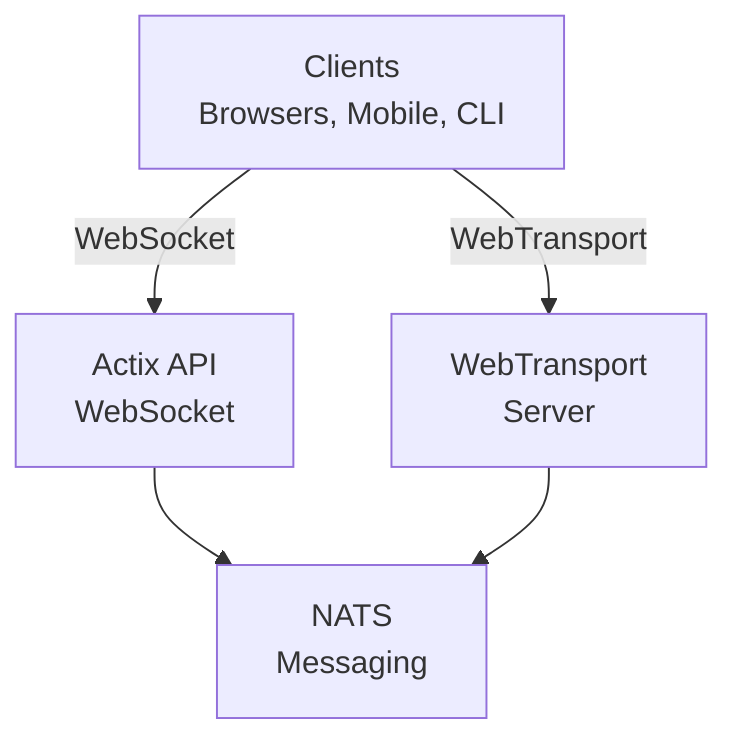

# videocall.rs

<a href="https://opensource.org/licenses/MIT"></a>
<a href="https://discord.gg/JP38NRe4CJ"></a> 
<a href="https://www.digitalocean.com/?refcode=6de4e19c5193&utm_campaign=Referral_Invite&utm_medium=Referral_Program&utm_source=badge"></a>

An open-source, high-performance video conferencing platform built with Rust, providing real-time communication with low latency.

**[Website](https://videocall.rs)** | **[Discord Community](https://discord.gg/JP38NRe4CJ)**

## Table of Contents

- [Overview](#overview)
- [Features](#features)
- [Why WebTransport Instead of WebRTC?](#why-webtransport-instead-of-webrtc)
- [System Architecture](#system-architecture)
- [Getting Started](#getting-started)
  - [Prerequisites](#prerequisites)
  - [Docker Setup](#docker-setup)
  - [Manual Setup](#manual-setup)
- [Runtime Configuration](#runtime-configuration-frontend-configjs)
  - [Local/Docker](#localdocker-start-yewsh)
  - [Kubernetes/Helm](#kuberneteshelm-configmap-configjsyaml)
- [Usage](#usage)
- [Performance](#performance)
- [Security](#security)
- [Roadmap](#roadmap)
- [Contributing](#contributing)
- [Project Structure](#project-structure)
- [Demos and Media](#demos-and-media)
- [Contributors](#contributors)
- [License](#license)

## Overview

videocall.rs is a modern, open-source video conferencing system written entirely in Rust, designed for developers who need reliable, scalable, and secure real-time communication capabilities. It provides a foundation for building custom video communication solutions, with support for both browser-based and native clients.

**Project Status:** Beta - Actively developed and suitable for non-critical production use

## Features

- **High Performance:** Built with Rust for optimal resource utilization and low latency
- **Multiple Transport Protocols:** Support for WebSockets and WebTransport 
- **End-to-End Encryption (E2EE):** Optional secure communications between peers
- **Scalable Architecture:** Designed with a pub/sub model using NATS for horizontal scaling
- **Cross-Platform Support:** Works on Chromium-based browsers (Chrome, Edge, Brave) with Safari support in development. Firefox is not supported due to incomplete MediaStreamTrackProcessor implementation.
- **Native Client Support:** CLI tool for headless video streaming from devices like Raspberry Pi
- **Open Source:** MIT licensed for maximum flexibility

## Why WebTransport Instead of WebRTC?

WebTransport is a core technology that differentiates videocall.rs from traditional video conferencing solutions. As a developer, here's why our WebTransport approach is technically superior:

### Technical Advantages

- **No SFUs, No NAT Traversal:** WebTransport eliminates the need for complex Selective Forwarding Units and NAT traversal mechanisms that plague WebRTC implementations and cause countless developer headaches.

- **Simplified Architecture**: No more complex STUN/TURN servers, ICE candidates negotiation, or complicated signaling dances required by WebRTC. Just direct, straightforward connections.

- **Protocol Efficiency**: Built on HTTP/3 and QUIC, WebTransport provides multiplexed, bidirectional streams with better congestion control and packet loss recovery than WebRTC's dated SCTP data channels.

- **Lower Latency**: QUIC's 0-RTT connection establishment reduces initial connection times compared to WebRTC's multiple roundtrips.

- **Clean Development Experience**: WebTransport offers a more intuitive developer API with a promise-based design and cleaner stream management.

- **Future-Proof**: As part of the modern web platform developed by the IETF and W3C, WebTransport has strong browser vendor support and an actively evolving specification.

### Developer Implications

For developers integrating videocall.rs, this means:
- ✅ Drastically simpler deployment architecture
- ✅ No complex network configuration or firewall issues
- ✅ Better performance in challenging network conditions
- ✅ More predictable behavior across implementations
- ✅ Less time spent debugging connectivity issues
- ✅ A forward-looking technology investment

Read our [Architecture Document](ARCHITECTURE.md) for a deep dive into how we implement WebTransport and the technical benefits it provides.

## System Architecture

videocall.rs follows a microservices architecture with these primary components:



1. **actix-api:** Rust-based backend server using Actix Web framework
2. **yew-ui:** Web frontend built with the Yew framework and compiled to WebAssembly
3. **videocall-types:** Shared data types and protocol definitions
4. **videocall-client:** Client library for native integration
5. **videocall-cli:** Command-line interface for headless video streaming


For a more detailed explanation of the system architecture, please see our [Architecture Document](ARCHITECTURE.md).

## Getting Started

**⭐ RECOMMENDED: Docker is the only fully supported development method ⭐**

We strongly recommend using the Docker-based setup for development, as it's well-maintained and provides consistent behavior across platforms. The manual setup described below is not as well maintained and may require additional troubleshooting.

### Prerequisites

- Modern Linux distribution, macOS, or Windows 10/11
- [Docker](https://docs.docker.com/engine/install/) and Docker Compose (for containerized setup)
- [Rust toolchain](https://rustup.rs/) 1.85+ (for manual setup)
- Chromium-based browser (Chrome, Edge, Brave) for frontend access - Firefox is not supported

### Docker Setup

The quickest way to get started is with our Docker-based setup:

1. Clone the repository:
   ```
   git clone https://github.com/security-union/videocall-rs.git
   cd videocall-rs
   ```

2. Start the server (replace `<server-ip>` with your machine's IP address):
   ```
   make up
   ```

3. Open Chrome using the provided script for local WebTransport:
   ```
   ./launch_chrome.sh
   ```

4. Access the application at:
   ```
   http://<server-ip>/meeting/<username>/<meeting-id>
   ```

### Manual Setup (Experimental)

⚠️ **Warning**: This setup method is experimental and not as well maintained as the Docker approach. You may encounter issues that require manual debugging.

For advanced users who prefer to run services directly on their machine:

1. Create a PostgreSQL database:
   ```
   createdb actix-api-db
   ```

2. Install required tools:
   ```
   # Install NATS server
   curl -L https://github.com/nats-io/nats-server/releases/download/v2.9.8/nats-server-v2.9.8-linux-amd64.tar.gz | tar xz
   sudo mv nats-server-v2.9.8-linux-amd64/nats-server /usr/local/bin
   
   # Install trurl
   cargo install trurl
   ```

3. Start the development environment:
   ```
   ./start_dev.sh
   ```

4. Connect to:
   ```
   http://localhost:8081/meeting/<username>/<meeting-id>
   ```

For detailed configuration options, see our [setup documentation](https://docs.videocall.rs/setup).

## Runtime Configuration (Frontend config.js)

The Yew UI is configured at runtime via a `window.__APP_CONFIG` object provided by a `config.js` file. There are two supported ways to supply this file:

### Local/Docker: start-yew.sh

When running locally (or via the provided Docker environment), `docker/start-yew.sh` generates `/app/yew-ui/scripts/config.js` on container startup from environment variables:

- **API_BASE_URL → apiBaseUrl**: default `http://localhost:${ACTIX_PORT:-8080}`
- **ACTIX_UI_BACKEND_URL → wsUrl**: default `ws://localhost:${ACTIX_PORT:-8080}`
- **WEBTRANSPORT_HOST → webTransportHost**: default `https://127.0.0.1:4433`
- **ENABLE_OAUTH → oauthEnabled**: default `false` (string)
- **E2EE_ENABLED → e2eeEnabled**: default `false` (string)
- **WEBTRANSPORT_ENABLED → webTransportEnabled**: default `false` (string)
- **USERS_ALLOWED_TO_STREAM → usersAllowedToStream**: default empty string (comma-separated user IDs)
- **SERVER_ELECTION_PERIOD_MS → serverElectionPeriodMs**: default `2000`
- **AUDIO_BITRATE_KBPS → audioBitrateKbps**: default `65`
- **VIDEO_BITRATE_KBPS → videoBitrateKbps**: default `1000`
- **SCREEN_BITRATE_KBPS → screenBitrateKbps**: default `1000`

Example override when running a container:

```sh
# Example: customize URLs and enable WebTransport
API_BASE_URL=https://api.local \
ACTIX_UI_BACKEND_URL=wss://api.local/ws \
WEBTRANSPORT_HOST=https://api.local:4433 \
WEBTRANSPORT_ENABLED=true \
E2EE_ENABLED=true \
make up
```

Notes:
- Values are injected verbatim into `window.__APP_CONFIG`; booleans are strings (`"true"`/`"false"`).
- The file is generated at container start, so update env vars and restart the container to apply changes.

### Kubernetes/Helm: configmap-configjs.yaml

In Kubernetes, the Helm chart `helm/rustlemania-ui/templates/configmap-configjs.yaml` creates a ConfigMap that renders `config.js` from `.Values.runtimeConfig`:

```yaml
# values.yaml
runtimeConfig:
  apiBaseUrl: "https://api.example.com"
  wsUrl: "wss://api.example.com/ws"
  webTransportHost: "https://webtransport.example.com:4433"
  oauthEnabled: "false"
  e2eeEnabled: "true"
  webTransportEnabled: "true"
  usersAllowedToStream: "alice,bob"
  serverElectionPeriodMs: 2000
  audioBitrateKbps: 65
  videoBitrateKbps: 1000
  screenBitrateKbps: 1000
```

Usage:
- Set `runtimeConfig` in your chart values to match your environment.
- Deploy or upgrade the release; the chart will serve `config.js` with `window.__APP_CONFIG = <your JSON>;`.
- Prefer quoting booleans as strings to match the local env behavior unless your UI expects strict boolean types.

## Usage

### Browser-Based Clients

1. Navigate to your deployed instance or localhost setup:
   ```
   http://<server-address>/meeting/<username>/<meeting-id>
   ```

2. Grant camera and microphone permissions when prompted

3. Click "Connect" to join the meeting

### CLI-Based Streaming

For headless devices like Raspberry Pi:

```bash
# Install the CLI tool
cargo install videocall-cli

# Stream from a camera
videocall-cli stream \
  --user-id <your-user-id> \
  --video-device-index 0 \
  --meeting-id <meeting-id> \
  --resolution 1280x720 \
  --fps 30 \
  --frame-format NV12 \
  --bitrate-kbps 500
```

For detailed information about the CLI tool and all available options, see the [videocall-cli README](videocall-cli/README.md).

## Performance

videocall.rs has been benchmarked and optimized for the following scenarios:

- **1-on-1 Calls:** Minimal resource utilization with <100ms latency on typical connections
- **Small Groups (3-10):** Efficient mesh topology with adaptive quality based on network conditions
- **Large Conferences:** Tested with up to 1000 participants using selective forwarding architecture

### Technical Optimizations

- **Zero-Copy Design:** Minimizes data copying between network stack and application code
- **Asynchronous Core:** Built on Rust's async/await ecosystem with Tokio runtime  
- **SIMD-Accelerated Processing:** Uses CPU vectorization for media operations where available
- **Lock-Free Data Structures:** Minimizes contention in high-throughput scenarios
- **Protocol-Level Optimizations:** Custom-tuned congestion control and packet scheduling

### Resource Utilization

Our server-side architecture is designed for efficiency at scale:

- **Horizontal Scaling:** Linear performance scaling with additional server instances
- **Load Distribution:** Automatic connection balancing across server pool
- **Resource Governance:** Configurable limits for bandwidth, connections, and CPU utilization
- **Container-Optimized:** Designed for efficient deployment in Kubernetes environments

Performance metrics and tuning guidelines will be available in our [performance documentation](PERFORMANCE.md). (WIP)

## Security

Security is a core focus of videocall.rs:

- **Transport Security:** All communications use TLS/HTTPS.
- **End-to-End Encryption:** Optional E2EE between peers with no server access to content.
- **Authentication:** Flexible integration with identity providers.
- **Access Controls:** Fine-grained permission system for meeting rooms.

For details on our security model and best practices, see our [security documentation](https://docs.videocall.rs/security).

## Roadmap

| Version | Target Date | Key Features |
|---------|------------|--------------|
| 0.5.0   | Q2 2023    | ✅ End-to-End Encryption |
| 0.6.0   | Q3 2023    | ✅ Safari Browser Support |
| 0.7.0   | Q4 2023    | ✅ Native Mobile SDKs |
| 0.8.0   | Q1 2024    | 🔄 Screen Sharing Improvements |
| 1.0.0   | Q2 2024    | 🔄 Production Release with Full API Stability |


## Contributing

We welcome contributions from the community! Here's how to get involved:

1. **Issues:** Report bugs or suggest features via [GitHub Issues](https://github.com/security-union/videocall-rs/issues)

2. **Pull Requests:** Submit PRs for bug fixes or enhancements

3. **RFC Process:** For significant changes, participate in our [RFC process](/rfc)

4. **Community:** Join our [Discord server](https://discord.gg/JP38NRe4CJ) to discuss development

See our [Contributing Guidelines](CONTRIBUTING.md) for more detailed information.


### Technology Stack

- **Backend**: Rust + Actix Web + PostgreSQL + NATS
- **Frontend**: Rust + Yew + WebAssembly + Tailwind CSS
- **Transport**: WebTransport (QUIC/HTTP3) + WebSockets (fallback)
- **Build System**: Cargo + Trunk + Docker + Helm
- **Testing**: Rust test framework + Playwright for E2E tests

### Key Technical Features

- **Bidirectional Streaming**: Fully asynchronous message passing using QUIC streams
- **Error Handling**: Comprehensive Result-based error propagation throughout the codebase
- **Modularity**: Clean separation of concerns with well-defined interfaces between components
- **Type Safety**: Extensive use of Rust's type system to prevent runtime errors
- **Binary Protocol**: Efficient Protocol Buffer serialization for all messages

For a more comprehensive technical overview, see the [Architecture Document](ARCHITECTURE.md).

### Git Hooks

This repository includes Git hooks to ensure code quality:

1. **Pre-commit Hook**: Automatically runs `cargo fmt` before each commit to ensure consistent code formatting.
2. **Post-commit Hook**: Runs `cargo clippy` after each commit to check for potential code improvements.

To install these hooks, run the following commands from the project root:

```bash
# Create the hooks directory if it doesn't exist
mkdir -p .git/hooks

# Create the pre-commit hook
cat > .git/hooks/pre-commit << 'EOF'
#!/bin/sh

# Run cargo fmt and check if there are changes
echo "Running cargo fmt..."
cargo fmt --all -- --check

# Check the exit code of cargo fmt
if [ $? -ne 0 ]; then
    echo "cargo fmt found formatting issues. Please fix them before committing."
    exit 1
fi

exit 0
EOF

# Create the post-commit hook
cat > .git/hooks/post-commit << 'EOF'
#!/bin/sh

# Run cargo clippy after the commit
echo "Running cargo clippy..."
ACTIX_UI_BACKEND_URL="" WEBTRANSPORT_HOST="" LOGIN_URL="" WEBTRANSPORT_URL="" ACTIX_API_URL="" cargo clippy -- -D warnings

# Check the exit code of cargo clippy
if [ $? -ne 0 ]; then
    echo "Cargo clippy found issues in your code. Please fix them."
    # We can't abort the commit since it's already done, but we can inform the user
    echo "The commit was successful, but please consider fixing the clippy issues before pushing."
fi

exit 0
EOF

# Make the hooks executable
chmod +x .git/hooks/pre-commit .git/hooks/post-commit
```

These hooks help maintain code quality by ensuring proper formatting and checking for common issues.

## Demos and Media

### Technical Presentations

- [Scaling to 1000 Users Per Call](https://youtu.be/LWwOSZJwEJI)
- [Initial Proof of Concept (2022)](https://www.youtube.com/watch?v=kZ9isFw1TQ8)

### Channels

- [YouTube Channel](https://www.youtube.com/@dario.lencina)

## Contributors

<table>
<tr>
<td align="center"><a href="https://github.com/darioalessandro"><br /><sub><b>Dario Lencina</b></sub></a></td>
<td align="center"><a href="https://github.com/majorrawdawg"><br /><sub><b>Seth Reid</b></sub></a></td>
<td align="center"><a href="https://github.com/griffobeid"><br /><sub><b>Griffin Obeid</b></sub></a></td>    
<td align="center"><a href="https://github.com/ronen"><br /><sub><b>Ronen Barzel</b></sub></a></td>
<td align="center"><a href="https://github.com/leon3s"><br /><sub><b>Leone</b></sub></a></td>
<td align="center"><a href="https://github.com/JasterV"><br /><sub><b>Victor Martínez</b></sub></a></td>
</tr>
</table>

## License

This project is dual licensed under the MIT License and the Apache License 2.0. See the [LICENSE-APACHE](LICENSE-APACHE) and [LICENSE-MIT](LICENSE-MIT) files for details.