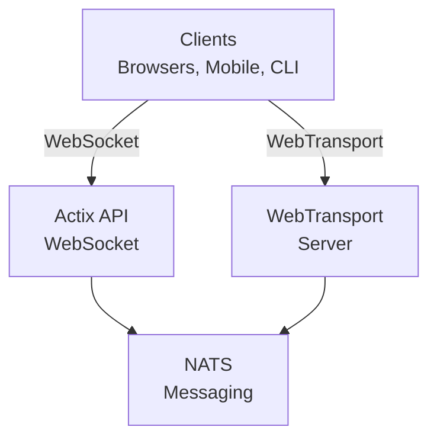

# videocall.rs

<a href="https://crates.io/crates/videocall-cli"></a>
<a href="https://opensource.org/licenses/MIT"></a>
<a href="https://discord.gg/JP38NRe4CJ"></a>

**videocall.rs is an open-source, low-latency video conferencing platform and streaming API written entirely in Rust.** It is a WebRTC alternative built on WebTransport (HTTP/3 and QUIC) with an automatic WebSocket fallback, and it runs in the browser, on native devices through a command-line client, and on mobile through iOS and Android SDKs. It is self-hostable, dual-licensed under MIT and Apache-2.0, and built for real-time video streaming from robots, drones, and embedded Linux boards (Raspberry Pi, Jetson) as well as conventional browser-to-browser calls.

**[Website](https://videocall.rs)** | **[Documentation](https://docs.videocall.rs)** | **[Discord](https://discord.gg/JP38NRe4CJ)** | **[Crates.io](https://crates.io/crates/videocall-cli)**

**Project status:** Beta. Actively developed and used in production for non-critical workloads.

## Table of Contents

- [What videocall.rs is for](#what-videocallrs-is-for)
- [Features](#features)
- [FAQ](#faq)
- [Why WebTransport instead of WebRTC?](#why-webtransport-instead-of-webrtc)
- [How it compares](#how-it-compares)
- [Browser compatibility](#browser-compatibility)
- [Architecture](#architecture)
- [Getting Started](#getting-started)
  - [Prerequisites](#prerequisites)
  - [Dev loop](#dev-loop-everything-native-hot-reload-zero-docker)
  - [Container images](#container-images-the-k8s-deliverable)
  - [OAuth (optional)](#oauth-optional)
  - [Nix build system](#nix-build-system)
- [Runtime configuration (config.js)](#runtime-configuration-configjs)
- [Usage](#usage)
- [Meeting management](#meeting-management)
- [Performance](#performance)
- [Security](#security)
- [Feature flags](#feature-flags)
- [Testing](#testing)
- [Release history](#release-history)
- [Contributing](#contributing)
- [Demos and media](#demos-and-media)
- [Contributors](#contributors)
- [Sponsors](#sponsors)
- [License](#license)

## What videocall.rs is for

videocall.rs gives you the building blocks for real-time video communication without the WebRTC stack. It is aimed at three audiences:

- **Software professionals** building custom video applications on a type-safe Rust API, from web apps to autonomous-vehicle feeds.
- **Robotics and IoT engineers** streaming low-latency video from drones, robots, and embedded devices using the lightweight [`videocall-cli`](https://github.com/security-union/videocall-rs/blob/main/videocall-cli/README.md) and the mobile SDKs.
- **Teams that want to self-host** their own conferencing infrastructure with JWT authentication, SSO/OAuth, and transport encryption (TLS 1.3 / QUIC), deployed with the provided Helm charts.

The same core powers browser calls at [videocall.rs](https://videocall.rs).

## Features

- **Low latency by design.** Media travels over WebTransport (QUIC/HTTP3), which avoids head-of-line blocking and recovers from packet loss faster than TCP-based transports.
- **WebTransport with WebSocket fallback.** Clients negotiate WebTransport where available and fall back to WebSockets automatically for compatibility.
- **Encrypted in transit.** WebSocket connections use TLS 1.3 and WebTransport uses QUIC's built-in TLS 1.3, so media is encrypted between each client and the relay. See [Security](#security).
- **Browser, native, and mobile clients.** A Dioxus/WebAssembly web UI, a native `videocall-cli` for headless streaming, and `videocall-sdk` bindings for iOS and Android.
- **Horizontally scalable.** A NATS pub/sub backbone lets WebSocket and WebTransport servers scale independently behind a load balancer.
- **Self-hostable.** Kubernetes Helm charts, a fully native dev stack, and reproducible container images built with Nix.
- **Pure-Rust media pipeline.** VP9 encode/decode and Opus audio are pure Rust with no C libvpx or libopus dependency.
- **Open source.** Dual-licensed under MIT and Apache-2.0.

## FAQ

### Is videocall.rs a WebRTC replacement?

For most server-mediated video use cases, yes. videocall.rs does not use WebRTC's peer-connection stack. Media flows over WebTransport (QUIC/HTTP3), or a WebSocket fallback, to a Rust server that forwards packets to other participants through NATS. You give up WebRTC's mature browser SFU ecosystem, but you also drop ICE, STUN/TURN, and SDP negotiation entirely.

### Can I self-host it?

Yes. The repository ships Helm charts for Kubernetes and a fully native local dev stack. Production container images are built reproducibly with Nix. See [Getting Started](#getting-started) and the [architecture document](https://github.com/security-union/videocall-rs/blob/main/docs/ARCHITECTURE.md).

### Does it work in the browser?

Yes, on Chromium-based browsers (Chrome, Edge, Brave) and Safari (macOS and iOS). Firefox is not currently supported. See [Browser compatibility](#browser-compatibility).

### How is it different from LiveKit, Jitsi, or mediasoup?

Those stacks are WebRTC selective-forwarding units. videocall.rs forwards media over WebTransport/QUIC instead of WebRTC, is written entirely in Rust (server, browser client, and native client), and requires no STUN/TURN/ICE infrastructure. See [How it compares](#how-it-compares).

### Can I stream from a Raspberry Pi?

Yes. `videocall-cli` is a headless native client that streams from a camera on Raspberry Pi, Jetson Nano, and other embedded Linux devices. See [CLI-based streaming](#cli-based-streaming).

### Is the media encrypted?

Media is encrypted in transit. WebSocket connections use TLS 1.3, and WebTransport uses QUIC's built-in TLS 1.3 encryption, so media is protected between each client and the relay. The relay server forwards media between participants; it is not end-to-end encrypted.

## Why WebTransport instead of WebRTC?

WebTransport is the core technology that sets videocall.rs apart. Built on HTTP/3 and QUIC, it provides multiplexed, bidirectional streams and datagrams with modern congestion control. Choosing it over WebRTC has concrete consequences:

- **No ICE, STUN, or TURN.** Clients connect to a server over QUIC. There is no NAT-traversal negotiation, no candidate gathering, and no relay-server fleet to operate for connectivity.
- **No SDP signaling dance.** Session setup is a single QUIC handshake rather than an offer/answer exchange over a separate signaling channel.
- **Better loss recovery.** QUIC's per-stream flow control avoids the head-of-line blocking that degrades TCP-based transports on lossy links, which matters on mobile and long-haul networks.
- **Faster connection establishment.** QUIC's 0-RTT and 1-RTT handshakes reduce setup round-trips compared with WebRTC's multi-step negotiation.
- **A standards-track platform.** WebTransport is developed at the IETF and W3C with active browser-vendor support.

videocall.rs still runs a forwarding server, so it is architecturally closer to an SFU than to peer-to-peer WebRTC. The difference is that the transport and signaling are radically simpler: no ICE, no TURN, no SDP. For a deep dive, see the [architecture document](https://github.com/security-union/videocall-rs/blob/main/docs/ARCHITECTURE.md).

## How it compares

An honest, verifiable comparison with widely used WebRTC-based stacks. All four are open source and server-mediated (SFU-style); the differences are in transport and implementation language.

| Project | Media transport | Signaling / NAT traversal | Core language | License |
|---|---|---|---|---|
| **videocall.rs** | WebTransport (QUIC/HTTP3), WebSocket fallback | QUIC handshake, no ICE/STUN/TURN | Rust (server, browser, native) | MIT / Apache-2.0 |
| LiveKit | WebRTC | ICE / STUN / TURN | Go | Apache-2.0 |
| Jitsi Videobridge | WebRTC | ICE / STUN / TURN | Java | Apache-2.0 |
| mediasoup | WebRTC | ICE / STUN / TURN | C++ core, Node.js / Rust API | ISC |

videocall.rs is the youngest of these and does not yet match their breadth of client SDKs, recording, and ecosystem integrations. Its advantage is a simpler transport and a single-language (Rust) codebase from server to browser.

## Browser compatibility

| Browser | Support |
|---|---|
| Chrome | Yes |
| Brave | Yes |
| Edge | Yes |
| Safari (macOS, iOS) | Yes |
| Firefox | No |

## Architecture

videocall.rs follows a microservices architecture in which clients connect over WebSocket or WebTransport and servers exchange media through a NATS pub/sub backbone.


```mermaid
graph TD
    Clients[Clients<br>Browsers, Mobile, CLI] -->|WebSocket| ActixAPI[Actix API<br>WebSocket]
    Clients -->|WebTransport| WebTransportServer[WebTransport<br>Server]
    ActixAPI --> NATS[NATS<br>Messaging]
    WebTransportServer --> NATS
```

Primary components:

1. **actix-api** streaming servers (`websocket_server`, `webtransport_server`, `metrics`) built on Actix Web.
2. **meeting-api** REST/auth API (login, meetings, host controls) on Axum with dbmate migrations.
3. **dioxus-ui** web frontend built with Dioxus and compiled to WebAssembly.
4. **videocall-types** shared protobuf data types and protocol definitions.
5. **videocall-client** client library for native and WebAssembly integration.
6. **videocall-cli** command-line client for headless streaming.
7. **videocall-sdk** iOS and Android bindings (UniFFI).
8. **videocall-codecs** / **neteq** pure-Rust codec wrappers and adaptive audio jitter buffer.

For details, including connection flows, message routing, and the encryption model, see the [architecture document](https://github.com/security-union/videocall-rs/blob/main/docs/ARCHITECTURE.md).

## Getting Started

Development is fully native: the entire dev stack (postgres, NATS, prometheus, grafana, and the Rust services) runs as host processes supervised by [process-compose](https://github.com/F1bonacc1/process-compose), with hot reload everywhere. Docker only appears when you want to run the *images*, which are built by Nix. There are no Dockerfiles in the dev workflow. See [docs/nix-architecture.md](https://github.com/security-union/videocall-rs/blob/main/docs/nix-architecture.md).

### Prerequisites

- Modern Linux distribution, macOS, or Windows 10/11 (WSL2).
- [Nix](https://nixos.org/download/), which provides the dev stack, toolchains, and image builds.
  - One-time on multi-user installs: add yourself to `trusted-users` so builds can pull the project's public binary cache instead of compiling everything locally. Until then Nix prints `ignoring untrusted substituter 'https://videocall-rs.cachix.org'` (harmless, but slow):
    ```bash
    echo "trusted-users = root $USER" | sudo tee -a /etc/nix/nix.conf
    sudo pkill nix-daemon
    ```
- Docker is **not needed**. It is optional, only if you want to `docker run` a published image locally.
- A Chromium-based browser (Chrome, Edge, Brave) or Safari (macOS, iOS). Firefox is not supported.

### Dev loop (everything native, hot reload, zero Docker)

```bash
git clone https://github.com/security-union/videocall-rs.git
cd videocall-rs
make dev
```

That's it. `make dev` opens the process-compose TUI running the whole stack as native processes:

| Process | What | Port |
|---|---|---|
| `postgres` | postgresql from nixpkgs, state in `.data/postgres` | 5432 |
| `nats` | nats-server with JetStream, state in `.data/nats` | 4222 / 8222 |
| `meeting-api` | dbmate migrations, then `cargo watch` | 8081 |
| `websocket` / `webtransport` | `cargo watch` | 8080 / 4433 udp |
| `metrics` / `server-stats` | `cargo watch` | 9091 / 9092 |
| `dioxus-ui` | tailwind watch + `trunk serve` | 3001 |
| `prometheus` / `grafana` | native, same dashboards/config as the container stack | 9090 / 3000 |

Services wait for middleware health (compose-style `depends_on`), recompile and restart instantly on save, and the TUI can restart individual processes on demand. Open `http://localhost:3001` and navigate to a meeting at `http://localhost:3001/meeting/<username>/<meeting-id>`.

To stop: quit the TUI (`F10` / `Ctrl-C`), or run `make dev-down` from another terminal. The TUI needs an interactive terminal; for scripted or headless use run `nix-shell default.nix -A shells.dev --run "dev-stack -t=false"`.

Prefer one service per terminal? `make dev-middleware` starts just postgres/nats/prometheus/grafana; then `make dev-websocket`, `make dev-meeting-api`, `make dev-ui`, and so on run a single watcher each (these also work with plain rustup plus cargo-watch).

**Overriding environment variables:** every process in `make dev` sees env layered as *built-in defaults* < `.env` < `.env.local`, both untracked. Copy `.env-sample` to `.env` for documented knobs (OAuth, service URLs, JWT secret); put personal or secret overrides in `.env.local`, which is gitignored and never checked in.

### Container images (the k8s deliverable)

Nothing local needs Docker: development, tests, and e2e all run native. The container images exist for Kubernetes. CI builds and publishes them from `release.nix` on every merge. To build one locally (for example, to debug an image's entrypoint with `docker run`):

```bash
make image-websocket-server   # nix-build one image and docker-load it
make images                   # all of them
```

On Linux the images build natively; on macOS the service binaries are cross-compiled to `aarch64-unknown-linux-musl` with no VM and no remote builder. The first macOS build compiles a musl cross-toolchain (one-time, tens of minutes); after that it is cached in the Nix store.

### OAuth (optional)

Both stacks read the same files: `make dev` layers `.env` then `.env.local` into every process. To enable Google login, create a `.env` from the sample and fill in credentials (or keep secrets in `.env.local`):

```bash
cp .env-sample .env
```

- Go to [Google Cloud Console → APIs & Credentials](https://console.cloud.google.com/apis/credentials).
- Create an OAuth 2.0 Client ID (Web application type).
- Add `http://localhost:8081/login/callback` as an authorized redirect URI.
- Copy the Client ID and Secret into your `.env`.

Without OAuth credentials the app runs with auth bypassed for local development.

**Platform notes:**

- **Rancher Desktop (Windows/WSL2) with Traefik Ingress on port 3001:** Rancher Desktop runs Traefik, which may conflict with the dioxus-ui frontend. Override the port in your local `.env` (not `.env-sample`):
  ```
  DIOXUS_SERVE_PORT=8088
  AFTER_LOGIN_URL=http://localhost:8088
  ALLOWED_REDIRECT_URLS=http://localhost:8088
  ```
  Then access the app at `http://localhost:8088`.
- **Shell environment variables:** if you have `API_BASE_URL`, `OAUTH_REDIRECT_URL`, or similar variables exported in your shell profile (`~/.bashrc`, `~/.zshrc`), they override `.env` values. Remove them from your profile before running `make dev`.

### Nix build system

The build system is native Nix, no flakes: `default.nix` (entry point), `shell.nix` (dev shells), `release.nix` (CI artifacts: packages and Docker images). Dependency pins live in `nix/tamal/` and are managed by [nixtamal](https://nixtamal.toast.al/); evaluating them needs plain Nix only. Full design: [docs/nix-architecture.md](https://github.com/security-union/videocall-rs/blob/main/docs/nix-architecture.md). Coming from the old Docker dev environment? See [docs/migrating-from-docker.md](https://github.com/security-union/videocall-rs/blob/main/docs/migrating-from-docker.md).

```bash
nix-shell                                              # default dev shell (frontend toolchain)
nix-shell default.nix -A shells.backend-dev           # backend toolchain + cargo-watch + dbmate
nix-build release.nix -A packages.websocket-server    # a single service binary (static musl)
make image-websocket-server                           # its Docker image, loaded into the daemon
make pins-update                                       # refresh nixtamal pins (nix/tamal/)
```

## Runtime configuration (config.js)

The frontend is configured at runtime via a `window.__APP_CONFIG` object provided by a `config.js` file. The file is copied by Trunk and loaded at `/config.js` by `dioxus-ui/index.html`.

- **Local:** `make dev` and `make dev-ui` run `scripts/start-dioxus.sh`, which writes `dioxus-ui/scripts/config.js` from the environment before Trunk starts. To point the UI somewhere custom, override the relevant env vars in `.env.local` (see `scripts/start-dioxus.sh` for the keys) rather than editing the generated file. The Nix-built `videocall/dioxus-ui` image does the same at container startup via its entrypoint.
- **Kubernetes / Helm:** `helm/videocall-ui/templates/configmap-configjs.yaml` renders `config.js` from `.Values.runtimeConfig`. Define `runtimeConfig` in your values file and deploy or upgrade.

### Voice Activity Detection (VAD) threshold

The `vadThreshold` config parameter controls how sensitive speaking detection is. It sets the minimum RMS audio level that counts as "speaking," used for tile border glow, peer-list mic glow, and self-video glow indicators.

```javascript
window.__APP_CONFIG = Object.freeze({
    // ... other config ...
    vadThreshold: 0.02   // default
});
```

| Value | Sensitivity | Use case |
|---|---|---|
| `0.01` | High: picks up quiet speech and background noise | Quiet environments, soft speakers |
| `0.02` | Medium (default): good balance for most setups | General use |
| `0.05` | Low: only triggers on louder speech | Noisy environments, reduces false positives |
| `0.10` | Very low: requires loud or close speech | Very noisy environments |

The threshold can also be set via the `VAD_THRESHOLD` environment variable (see `scripts/start-dioxus.sh`) or via `runtimeConfig.vadThreshold` in Helm values.

## Usage

### Browser-based clients

1. Navigate to your deployed instance or local setup:
   ```
   http://<server-address>/meeting/<username>/<meeting-id>
   ```
2. Grant camera and microphone permissions when prompted.
3. Click "Connect" to join the meeting.

### CLI-based streaming

For headless devices like a Raspberry Pi:

```bash
# Install the CLI tool
cargo install videocall-cli

# Stream from a camera
videocall-cli stream \
  --user-id <your-user-id> \
  --video-device-index 0 \
  --meeting-id <meeting-id> \
  --resolution 1280x720 \
  --fps 30 \
  --frame-format NV12 \
  --bitrate-kbps 500
```

The CLI joins an existing meeting; create the call from a browser first. For all options, see the [videocall-cli README](https://github.com/security-union/videocall-rs/blob/main/videocall-cli/README.md).

## Meeting management

videocall.rs includes a meeting management system with ownership, waiting rooms, and host controls.

- **Meeting ownership:** each meeting has an owner (the creator) identified by their email.
- **My Meetings:** users can view and manage all meetings they own from the home page.
- **Waiting room:** non-owners enter a waiting room and must be admitted by an existing participant.
- **Host identification:** the meeting owner is marked with "(Host)" in the UI.
- **Soft delete:** owners can delete their meetings; deleted meeting IDs can be reused.

Workflow: navigating to `/meeting/{meeting-id}` creates the meeting and makes you the owner if it does not exist. Owners see "Start Meeting," others see "Join Meeting." Non-owners wait for admission; admitted participants are auto-joined and can then manage the waiting room.

Meeting management requires the `FEATURE_MEETING_MANAGEMENT` flag (see [Feature flags](#feature-flags)):

```bash
export FEATURE_MEETING_MANAGEMENT=true
```

Details: [Meeting Ownership & Workflow](https://github.com/security-union/videocall-rs/blob/main/docs/MEETING_OWNERSHIP.md) and [Meeting API Reference](https://github.com/security-union/videocall-rs/blob/main/docs/MEETING_API.md).

## Performance

videocall.rs is engineered for real-time streaming across a range of hardware and networks:

- **One-on-one and small groups:** a mesh-style topology with adaptive quality driven by per-receiver diagnostics (packet loss, latency, jitter, estimated bandwidth).
- **Large conferences:** the NATS-backed forwarding architecture scales out horizontally — add relay servers for capacity, with WebSocket and WebTransport relays scaling independently behind a load balancer.

Implementation choices that support this:

- **Asynchronous core.** Built on Rust's async/await ecosystem with the Tokio runtime.
- **SIMD-accelerated VP9 encoding.** The pure-Rust VP9 encoder uses AVX2/SSE2 (x86-64) and NEON (aarch64) intrinsics for motion estimation, with scalar fallbacks.
- **Binary protocol.** All messages use Protocol Buffer serialization, keeping wire size small.
- **Adaptive streaming.** Senders adjust bitrate, resolution, and frame rate to the most constrained receiver based on diagnostics feedback.

Design goals still in progress (minimizing data copies on the media path, further congestion-control tuning) are tracked in the [architecture document](https://github.com/security-union/videocall-rs/blob/main/docs/ARCHITECTURE.md#adaptive-streaming). Detailed benchmarking guidelines are a work in progress.

## Security

- **Transport security.** WebSocket connections use TLS 1.3; WebTransport inherits QUIC's built-in TLS 1.3 encryption. Media is encrypted between each client and the relay, but not end-to-end: the relay forwards decrypted media between participants.
- **Authentication.** JWT-based access control with SSO/OAuth integration.
- **Access controls.** Meeting ownership, waiting rooms, and host controls (see [Meeting management](#meeting-management)).

For the full model, see the [security architecture](https://github.com/security-union/videocall-rs/blob/main/docs/ARCHITECTURE.md#security-architecture) and the [security documentation](https://docs.videocall.rs/security).

## Feature flags

videocall.rs uses environment-based feature flags to enable optional or experimental functionality at runtime. Flags are loaded lazily on first access and can be overridden for testing.

Flags are set via environment variables with the `FEATURE_` prefix:

```bash
export FEATURE_MEETING_MANAGEMENT=true
# or, with Docker:
docker run -e FEATURE_MEETING_MANAGEMENT=true ...
```

| Flag | Environment variable | Description | Default |
|---|---|---|---|
| Meeting Management | `FEATURE_MEETING_MANAGEMENT` | Meeting lifecycle management: creation, tracking, host controls | `false` |

Truthy values (case-insensitive) are `true`, `1`, and `yes`. Any other value, or an unset variable, is treated as `false`.

## Testing

### UI testing (dioxus-ui)

The Dioxus frontend uses a three-layer testing pyramid, all running in a real browser via `wasm-bindgen-test`:

| Layer | What it covers | Example |
|---|---|---|
| Unit | `MediaDeviceList` logic: hot-plug, fallback, device switching | `videocall-client/src/media_devices/media_device_list.rs` |
| Component | Isolated Dioxus components with mock `MediaDeviceInfo` objects | `dioxus-ui/tests/device_selector.rs`, `dioxus-ui/tests/video_control_buttons.rs` |
| Integration | Real Chrome fake devices rendered through the full pipeline | `dioxus-ui/tests/device_integration.rs` |

```bash
# Run UI component tests natively (requires Chrome + chromedriver)
cd dioxus-ui
CHROMEDRIVER=$(which chromedriver) cargo test --target wasm32-unknown-unknown
```

CI runs these via `.github/workflows/wasm-test.yaml`. For the full guide, see [dioxus-ui/README.md](https://github.com/security-union/videocall-rs/blob/main/dioxus-ui/README.md#testing).

### Backend testing (actix-api)

The `actix-api` crate has unit and integration tests that run against real PostgreSQL and NATS instances, started natively by `make check-backend`. Coverage includes session management, WebSocket and WebTransport meeting lifecycles, packet classification, the metrics server, and feature-flag behavior.

Tests use `#[serial_test::serial]` because they share a database, and each cleans up its own data. Everything runs natively, no Docker: `make check-backend` starts postgres 18 and NATS (JetStream) from nixpkgs under process-compose in a throwaway data dir, runs `dbmate` migrations, then clippy, fmt, and `cargo test` in the pinned nix-shell.

```bash
make check-backend          # all backend tests (native postgres/NATS, fresh state per run)
make check-backend-sqlite   # same, against the SQLite meeting-api backend
make check-backend-down     # stop the test middleware and delete its state
```

CI runs these via `.github/workflows/cargo-test.yaml` on PRs touching `actix-api/`, `videocall-types/`, or `protobuf/`. Full guide: [actix-api/TESTING.md](https://github.com/security-union/videocall-rs/blob/main/actix-api/TESTING.md).

### E2E testing (Playwright)

Full browser-based end-to-end tests using [Playwright](https://playwright.dev/). Tests run against the Dioxus UI, verifying meeting flows in real browsers; authentication is bypassed via JWT cookie injection, so no OAuth setup is needed.

The E2E stack runs natively, no Docker (`e2eStack` in `nix/dev-stack.nix`): postgres and NATS from nixpkgs, the meeting-api and websocket servers, and the Nix-built release UI dist served by caddy, which is the same payload the production images ship. Tests run automatically on pushes to `main` and can be triggered manually from the GitHub Actions page. See the `e2e-*` targets in the `Makefile`.

## Release history

<details>
<summary>Milestones from 2023 to 2026</summary>

| Quarter | Release | Deliverable |
|---------|---------|-------------|
| Q2 2023 | 0.5.0 | JWT authentication & SSO |
| Q3 2023 | 0.6.0 | Safari browser support |
| Q4 2023 | 0.7.0 | Native mobile SDKs |
| Q3 2024 | — | videocall.rs website launched, with Matomo analytics for self-hosted usage insight ([#169](https://github.com/security-union/videocall-rs/pull/169), [#170](https://github.com/security-union/videocall-rs/pull/170)) |
| Q3 2024 | — | Postgres made optional and a DigitalOcean deployment path documented, plus WebTransport connection fixes ([#163](https://github.com/security-union/videocall-rs/pull/163), [#165](https://github.com/security-union/videocall-rs/pull/165)) |
| Q4 2024 | — | `videocall-daemon` released: headless streaming for robotics and embedded targets ([#176](https://github.com/security-union/videocall-rs/pull/176)) |
| Q4 2024 | — | macOS builds for the daemon and Ubuntu 24 base images ([#177](https://github.com/security-union/videocall-rs/pull/177), [#173](https://github.com/security-union/videocall-rs/pull/173)) |
| Q1 2025 | `videocall-client` 1.0.0 | Whole workspace published to crates.io at 1.0.0 with `release-plz` automation; daemon renamed to `videocall-cli` ([#222](https://github.com/security-union/videocall-rs/pull/222), [#212](https://github.com/security-union/videocall-rs/pull/212), [#185](https://github.com/security-union/videocall-rs/pull/185)) |
| Q1 2025 | `videocall-client` 1.1.6 | In-call diagnostics panel, Yew UI redesign, and multi-peer bitrate control ([#206](https://github.com/security-union/videocall-rs/pull/206), [#196](https://github.com/security-union/videocall-rs/pull/196), [#242](https://github.com/security-union/videocall-rs/pull/242)) |
| Q2 2025 | `videocall-sdk` 0.1.0 | iOS and Android bindings shipped as `videocall-sdk` ([#253](https://github.com/security-union/videocall-rs/pull/253)) |
| Q2 2025 | `videocall-codecs` 0.1.1 | Full Safari support via a WASM Opus encoder, plus the `videocall-codecs` crate with a jitter-buffered decoder ([#266](https://github.com/security-union/videocall-rs/pull/266), [#282](https://github.com/security-union/videocall-rs/pull/282), [#285](https://github.com/security-union/videocall-rs/pull/285)) |
| Q3 2025 | `neteq` 0.1.0 | NetEQ adaptive audio jitter buffer ported to Rust/WASM and rolled out to every browser through an AudioWorklet ([#305](https://github.com/security-union/videocall-rs/pull/305), [#310](https://github.com/security-union/videocall-rs/pull/310), [#315](https://github.com/security-union/videocall-rs/pull/315)) |
| Q3 2025 | `videocall-cli` 3.0.0 | Prometheus + Grafana diagnostics and multi-region HA; CLI drops raw QUIC in favor of WebTransport ([#365](https://github.com/security-union/videocall-rs/pull/365), [#325](https://github.com/security-union/videocall-rs/pull/325), [#410](https://github.com/security-union/videocall-rs/pull/410)) |
| Q4 2025 | `videocall-client` 1.1.28 | End-to-end OAuth / SSO sign-in with configurable cookie domain ([#471](https://github.com/security-union/videocall-rs/pull/471), [#485](https://github.com/security-union/videocall-rs/pull/485)) |
| Q4 2025 | `videocall-client` 1.1.29 | Meeting ownership behind a feature flag, and a NetEQ overhaul with WebCodecs support ([#503](https://github.com/security-union/videocall-rs/pull/503), [#466](https://github.com/security-union/videocall-rs/pull/466)) |
| Q1 2026 | `videocall-client` 4.0.5 | Dioxus UI became the sole frontend and Yew was removed; WebTransport server consolidated onto an actor model ([#646](https://github.com/security-union/videocall-rs/pull/646), [#788](https://github.com/security-union/videocall-rs/pull/788), [#551](https://github.com/security-union/videocall-rs/pull/551)) |
| Q1 2026 | `videocall-types` 5.0.0 | Nix-based builds across backend, UI, and website; per-PR preview environments; Playwright E2E suite ([#639](https://github.com/security-union/videocall-rs/pull/639), [#672](https://github.com/security-union/videocall-rs/pull/672), [#714](https://github.com/security-union/videocall-rs/pull/714)) |
| Q1 2026 | `videocall-client` 4.0.5 | Adaptive quality stack: PID-driven encoder adaptation, PLI keyframe requests, and decoder visibility skipping ([#758](https://github.com/security-union/videocall-rs/pull/758), [#761](https://github.com/security-union/videocall-rs/pull/761), [#762](https://github.com/security-union/videocall-rs/pull/762)) |
| Q2 2026 | `videocall-cli` 4.0.0 | Pure-Rust audio: `audiopus-sys`/libopus removed workspace-wide in favor of `ropus` ([#872](https://github.com/security-union/videocall-rs/pull/872)) |
| Q2 2026 | `videocall-types` 6.0.0 | Dioxus UI Helm chart with relay Prometheus annotations, reworked screen sharing, and audio-level re-render fixes ([#757](https://github.com/security-union/videocall-rs/pull/757), [#817](https://github.com/security-union/videocall-rs/pull/817), [#816](https://github.com/security-union/videocall-rs/pull/816)) |
| Q3 2026 | unreleased | Pure-Rust VP9 encoder and decoder: C libvpx removed from `videocall-cli` and the bot ([#884](https://github.com/security-union/videocall-rs/pull/884)) |
| Q3 2026 | unreleased | SQLite available as an optional database backend for `meeting-api`, alongside Postgres ([#802](https://github.com/security-union/videocall-rs/pull/802)) |

</details>

## Contributing

Contributions are welcome.

1. **Issues:** report bugs or suggest features via [GitHub Issues](https://github.com/security-union/videocall-rs/issues).
2. **Pull requests:** submit PRs for bug fixes or enhancements.
3. **Community:** join the [Discord server](https://discord.gg/JP38NRe4CJ) to discuss development.

See the [Contributing Guidelines](https://github.com/security-union/videocall-rs/blob/main/CONTRIBUTING.md) for details.

### Technology stack

- **Backend:** Rust + Actix Web + PostgreSQL (or SQLite) + NATS.
- **Frontend:** Rust + Dioxus + WebAssembly + Tailwind CSS.
- **Transport:** WebTransport (QUIC/HTTP3) + WebSocket fallback.
- **Media:** pure-Rust VP9 and Opus; NetEQ adaptive audio jitter buffer.
- **Build system:** Cargo + Trunk + Nix + Helm.
- **Testing:** `cargo test` + `wasm-bindgen-test` (browser UI tests) + Playwright (E2E).

### Git hooks

The repo ships its hooks in `githooks/` (currently `pre-push`: `cargo clippy -D warnings` and `cargo fmt --check`). Enable them once per clone:

```bash
git config core.hooksPath githooks
```

## Demos and media

- [Scaling to 1000 Users Per Call](https://youtu.be/LWwOSZJwEJI)
- [Initial Proof of Concept (2022)](https://www.youtube.com/watch?v=kZ9isFw1TQ8)
- [YouTube channel](https://www.youtube.com/@dario.lencina)

## Contributors

<table>
<tr>
<td align="center"><a href="https://github.com/darioalessandro"><br /><sub><b>Dario Lencina</b></sub></a></td>
<td align="center"><a href="https://github.com/majorrawdawg"><br /><sub><b>Seth Reid</b></sub></a></td>
<td align="center"><a href="https://github.com/griffobeid"><br /><sub><b>Griffin Obeid</b></sub></a></td>
<td align="center"><a href="https://github.com/ronen"><br /><sub><b>Ronen Barzel</b></sub></a></td>
<td align="center"><a href="https://github.com/leon3s"><br /><sub><b>Leone</b></sub></a></td>
<td align="center"><a href="https://github.com/JasterV"><br /><sub><b>Victor Martínez</b></sub></a></td>
</tr>
</table>

## Sponsors

Hosting for the public videocall.rs instance is supported by DigitalOcean. Using this referral link helps fund the project:

<a href="https://www.digitalocean.com/?refcode=6de4e19c5193&utm_campaign=Referral_Invite&utm_medium=Referral_Program&utm_source=badge"></a>

[](https://star-history.dera.page/#security-union/videocall-rs&Date)

## License

Dual-licensed under the MIT License and the Apache License 2.0. See [LICENSE-MIT](https://github.com/security-union/videocall-rs/blob/main/LICENSE-MIT) and [LICENSE-APACHE](https://github.com/security-union/videocall-rs/blob/main/LICENSE-APACHE) for details.
