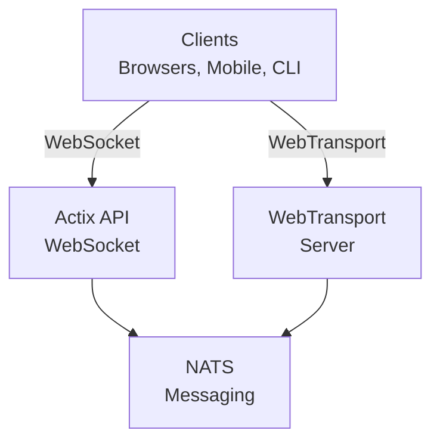

# videocall.rs

<a href="https://crates.io/crates/videocall-cli"></a>
<a href="https://opensource.org/licenses/MIT"></a>
<a href="https://discord.gg/JP38NRe4CJ"></a> 
<a href="https://www.digitalocean.com/?refcode=6de4e19c5193&utm_campaign=Referral_Invite&utm_medium=Referral_Program&utm_source=badge"></a>

An open-source, ultra-low-latency video conferencing platform and API built with Rust. Designed for software professionals, robotics, and embedded systems, it supports WebTransport with WebSocket fallback for high-performance real-time communication.

**[Website](https://videocall.rs)** | **[Discord Community](https://discord.gg/JP38NRe4CJ)**

## ⚡ Quick Links

- **[Documentation](https://docs.videocall.rs)** - Comprehensive guides and API reference.
- **[Crates.io](https://crates.io/crates/videocall-cli)** - Download the CLI tool.
- **[Report a Bug](https://github.com/security-union/videocall-rs/issues)** - Help us improve.

## 🌟 Star History

[](https://star-history.com/#security-union/videocall-rs&Date)

## Who is this for?

- **Software Professionals:** Build custom video applications with a modern, type-safe Rust API.
- **Robotics & IoT Engineers:** Stream ultra-low-latency video from drones, robots, and embedded devices (Raspberry Pi, Jetson Nano) using our lightweight CLI and SDKs.
- **Privacy Advocates:** Self-host your own video conferencing infrastructure with secure JWT authentication and SSO support.

## Table of Contents

- [Overview](#overview)
- [Features](#features)
- [Compatibility](#compatibility)
- [Why WebTransport Instead of WebRTC?](#why-webtransport-instead-of-webrtc)
- [System Architecture](#system-architecture)
- [Getting Started](#getting-started)
  - [Prerequisites](#prerequisites)
  - [Docker Setup](#docker-setup)
  - [Nix Build System (WIP)](#nix-build-system-wip)
- [Runtime Configuration](#runtime-configuration-frontend-configjs)
  - [Local (no Docker)](#local-no-docker-create-dioxus-uiscriptsconfigjs)
  - [Local/Docker](#localdocker-start-dioxussh)
  - [Kubernetes/Helm](#kuberneteshelm-configmap-configjsyaml)
- [Usage](#usage)
- [Meeting Management](#meeting-management)
- [Performance](#performance)
- [Security](#security)
- [Feature Flags](#feature-flags)
- [Testing](#testing)
  - [UI Testing (dioxus-ui)](#ui-testing-dioxus-ui)
  - [Backend Testing (actix-api)](#backend-testing-actix-api)
  - [E2E Testing (Playwright)](#e2e-testing-playwright)
- [Roadmap](#roadmap)
- [Contributing](#contributing)
- [Demos and Media](#demos-and-media)
- [Contributors](#contributors)
- [License](#license)

## Overview

videocall.rs is a modern, open-source video conferencing system written entirely in Rust. It is designed for software professionals and robotics engineers who need reliable, scalable, and secure real-time communication capabilities. It provides a robust foundation for building custom video communication solutions, from web apps to autonomous vehicle feeds, with support for both browser-based and native clients.

**Project Status:** Beta - Actively developed and suitable for non-critical production use

## Features

- **Ultra-Low Latency:** Built with Rust for sub-100ms latency, ideal for robotics and real-time control.
- **Multiple Transport Protocols:** WebTransport with automatic WebSocket fallback for maximum compatibility.
- **Secure Authentication:** JWT-based access control with SSO/OAuth support.
- **Scalable Architecture:** Designed with a pub/sub model using NATS for horizontal scaling (Mesh/SFU hybrid).
- **Cross-Platform Support:** Chromium-based browsers and Safari supported.
- **Robotics & Embedded:** High-performance CLI and SDK for headless streaming from Raspberry Pi, Jetson Nano, and other embedded Linux devices.
- **Open Source:** MIT licensed for maximum flexibility.

## Compatibility

| Browser              | Support |
|----------------------|---------|
| Chrome               | ✅      |
| Brave                | ✅      |
| Edge                 | ✅      |
| Safari (macOS, iOS)  | ✅      |
| Firefox              | ❌      |

## Why WebTransport Instead of WebRTC?

WebTransport is a core technology that differentiates videocall.rs from traditional video conferencing solutions. As a developer, here's why our WebTransport approach is technically superior:

### Technical Advantages

- **No SFUs, No NAT Traversal:** WebTransport eliminates the need for complex Selective Forwarding Units and NAT traversal mechanisms that plague WebRTC implementations and cause countless developer headaches.

- **Simplified Architecture**: No more complex STUN/TURN servers, ICE candidates negotiation, or complicated signaling dances required by WebRTC. Just direct, straightforward connections.

- **Protocol Efficiency**: Built on HTTP/3 and QUIC, WebTransport provides multiplexed, bidirectional streams with better congestion control and packet loss recovery than WebRTC's dated SCTP data channels.

- **Lower Latency**: QUIC's 0-RTT connection establishment reduces initial connection times compared to WebRTC's multiple roundtrips.

- **Clean Development Experience**: WebTransport offers a more intuitive developer API with a promise-based design and cleaner stream management.

- **Future-Proof**: As part of the modern web platform developed by the IETF and W3C, WebTransport has strong browser vendor support and an actively evolving specification.

### Developer Implications

For developers integrating videocall.rs, this means:
- ✅ Drastically simpler deployment architecture
- ✅ No complex network configuration or firewall issues
- ✅ Better performance in challenging network conditions
- ✅ More predictable behavior across implementations
- ✅ Less time spent debugging connectivity issues
- ✅ A forward-looking technology investment

Read our [Architecture Document](docs/ARCHITECTURE.md) for a deep dive into how we implement WebTransport and the technical benefits it provides.

## System Architecture

videocall.rs follows a microservices architecture with these primary components:


```mermaid
graph TD
    Clients[Clients<br>Browsers, Mobile, CLI] -->|WebSocket| ActixAPI[Actix API<br>WebSocket]
    Clients -->|WebTransport| WebTransportServer[WebTransport<br>Server]
    ActixAPI --> NATS[NATS<br>Messaging]
    WebTransportServer --> NATS
```

1. **actix-api:** Rust-based backend server using Actix Web framework
2. **dioxus-ui:** Web frontend built with the Dioxus framework and compiled to WebAssembly
3. **videocall-types:** Shared data types and protocol definitions
4. **videocall-client:** Client library for native integration
5. **videocall-cli:** Command-line interface for headless video streaming


For a more detailed explanation of the system architecture, please see our [Architecture Document](docs/ARCHITECTURE.md).

## Getting Started

Development is **fully native**: the entire dev stack — postgres, NATS, prometheus, grafana AND
the Rust services — runs as host processes supervised by
[process-compose](https://github.com/F1bonacc1/process-compose), with hot reload everywhere.
Docker only appears when you want to run the *images*, which are built by **Nix** — there are no
Dockerfiles in the dev workflow (see [docs/nix-architecture.md](docs/nix-architecture.md)).

### Prerequisites

- Modern Linux distribution, macOS, or Windows 10/11 (WSL2)
- [Nix](https://install.determinate.systems/nix) — provides the dev stack, toolchains, and image builds
- [Docker](https://docs.docker.com/engine/install/) — only needed to run the nix-built images (`make up`, e2e)
- Chromium-based browser (Chrome, Edge, Brave) for frontend access - Firefox is not supported
- Safari both in iOS and macOS are supported for frontend access

### Dev loop (everything native, hot reload, zero Docker)

```
git clone https://github.com/security-union/videocall-rs.git
cd videocall-rs
make dev
```

That's it. `make dev` opens the process-compose TUI running the whole stack as native processes:

| Process | What | Port |
|---|---|---|
| `postgres` | postgresql from nixpkgs, state in `.data/postgres` | 5432 |
| `nats` | nats-server with JetStream, state in `.data/nats` | 4222 / 8222 |
| `meeting-api` | dbmate migrations, then `cargo watch` | 8081 |
| `websocket` / `webtransport` | `cargo watch` | 8080 / 4433 udp |
| `metrics` / `server-stats` | `cargo watch` | 9091 / 9092 |
| `dioxus-ui` | tailwind watch + `trunk serve` | 3001 |
| `prometheus` / `grafana` | native, same dashboards/config as the container stack | 9090 / 3000 |

Services wait for middleware health (compose-style `depends_on`), saves recompile and restart
instantly, and the TUI can restart individual processes on demand. Open `http://localhost:3001`
and navigate to a meeting: `http://localhost:3001/meeting/<username>/<meeting-id>`.

Prefer one service per terminal? `make dev-middleware` starts just
postgres/nats/prometheus/grafana; then `make dev-websocket`, `make dev-meeting-api`,
`make dev-ui`, … run a single watcher each (those also work with plain rustup + cargo-watch).

**Overriding environment variables:** every process in `make dev` sees env layered as
*built-in defaults* < **`.env`** < **`.env.local`** — both untracked. Copy
`docker/.env-sample` to `.env` for documented knobs (OAuth, ports, bitrates); put personal
or secret overrides in `.env.local`, which is gitignored and never checked in.

### Full stack from Nix-built images

The same images CI publishes can run the whole stack locally in Docker:

```
make images       # nix-build every app image and docker-load it
make up           # start everything in docker compose
```

On Linux the images build natively; on macOS the service binaries are **cross-compiled** to
`aarch64-unknown-linux-musl` — no VM, no remote builder, Docker only runs the result. The first
macOS build compiles a musl cross-toolchain (one-time, tens of minutes); after that it's cached in
the Nix store. `make image-<name>` (e.g. `make image-websocket-server`) builds a single image.

### OAuth (optional)

Both stacks read the same files: `make dev` layers `.env` then `.env.local` into every
process, and `make up` passes `.env` to docker-compose. To enable Google login, create a
`.env` from the sample and fill in credentials (or keep secrets in `.env.local`):

```
cp docker/.env-sample .env
```

- Go to [Google Cloud Console → APIs & Credentials](https://console.cloud.google.com/apis/credentials)
- Create an OAuth 2.0 Client ID (Web application type)
- Add `http://localhost:8081/login/callback` as an Authorized redirect URI
- Copy the Client ID and Secret into your `.env`

> **Note:** `make up` auto-creates `.env` from the sample if it does not exist. Without OAuth
> credentials the app runs with auth bypassed for local development.

**Platform notes:**

- **Rancher Desktop (Windows/WSL2) with Traefik Ingress on port 3001:** Rancher Desktop runs Traefik which may conflict with the dioxus-ui frontend. Override the port in your local `.env` (not `.env-sample`):
  ```
  DIOXUS_SERVE_PORT=8088
  AFTER_LOGIN_URL=http://localhost:8088
  ALLOWED_REDIRECT_URLS=http://localhost:8088
  ```
  Then access the app at `http://localhost:8088`.
- **Shell environment variables:** If you have `API_BASE_URL`, `OAUTH_REDIRECT_URL`, or similar variables exported in your shell profile (`~/.bashrc`, `~/.zshrc`), they will override `.env` values. Remove them from your profile before running `make up`.

### Nix build system

The build system is **native Nix, no flakes**: `default.nix` (entry point), `shell.nix` (dev
shells), `release.nix` (CI artifacts — packages and Docker images). Dependency pins live in
`nix/tamal/` and are managed by [nixtamal](https://nixtamal.toast.al/); evaluating them needs
plain Nix only. Full design: [docs/nix-architecture.md](docs/nix-architecture.md).

```
nix-shell                                  # default dev shell (frontend toolchain)
nix-shell default.nix -A shells.backend-dev            # backend toolchain + cargo-watch + dbmate
nix-build release.nix -A packages.websocket-server   # a single service binary (static musl)
make image-websocket-server                # its Docker image, loaded into the daemon
make pins-update                           # refresh nixtamal pins (nix/tamal/)
```

## Runtime Configuration (Frontend config.js)

The frontend is configured at runtime via a `window.__APP_CONFIG` object provided by a `config.js` file. The file is copied by Trunk and loaded at `/config.js` by `dioxus-ui/index.html`.

### Local (no Docker): create dioxus-ui/scripts/config.js

- Start services with `make up`.
- Create `dioxus-ui/scripts/config.js` that assigns `window.__APP_CONFIG = Object.freeze({...})`.
- Keep the keys in sync with the authoritative sources below. Trunk will copy the file and the app will pick it up on refresh.
- Tip: `mkdir -p dioxus-ui/scripts` to ensure the directory exists.

Authoritative keys and defaults: see `docker/start-dioxus.sh` and the Helm template referenced below.

### Voice Activity Detection (VAD) Threshold

The `vadThreshold` config parameter controls how sensitive the speaking detection is. It sets the minimum RMS audio level that counts as "speaking" — used for tile border glow, peer list mic glow, and self-video glow indicators.

```javascript
window.__APP_CONFIG = Object.freeze({
    // ... other config ...
    vadThreshold: 0.02   // default
});
```

| Value | Sensitivity | Use case |
|-------|-------------|----------|
| `0.01` | High — picks up quiet speech and background noise | Quiet environments, soft speakers |
| `0.02` | Medium (default) — good balance for most setups | General use |
| `0.05` | Low — only triggers on louder speech | Noisy environments, reduces false positives |
| `0.10` | Very low — requires loud/close speech | Very noisy environments |

The threshold can also be set via the `VAD_THRESHOLD` environment variable when running in Docker (see `docker/start-dioxus.sh`), or via `runtimeConfig.vadThreshold` in Helm values.

### Local/Docker: start-dioxus.sh

`docker/start-dioxus.sh` (used by `make dev-ui`) generates `dioxus-ui/scripts/config.js` from environment variables before starting trunk. The Nix-built `videocall/dioxus-ui` image does the same at container startup via its entrypoint. For the current list of supported variables and defaults, refer directly to `docker/start-dioxus.sh`.

### Kubernetes/Helm: configmap-configjs.yaml

`helm/videocall-ui/templates/configmap-configjs.yaml` renders `config.js` from `.Values.runtimeConfig`. Define `runtimeConfig` in your values file and deploy/upgrade. For the exact structure and latest behavior, refer to the template itself.

 

## Usage

### Browser-Based Clients

1. Navigate to your deployed instance or localhost setup:
   ```
   http://<server-address>/meeting/<username>/<meeting-id>
   ```

2. Grant camera and microphone permissions when prompted

3. Click "Connect" to join the meeting

### CLI-Based Streaming

For headless devices like Raspberry Pi:

```bash
# Install the CLI tool
cargo install videocall-cli

# Stream from a camera
videocall-cli stream \
  --user-id <your-user-id> \
  --video-device-index 0 \
  --meeting-id <meeting-id> \
  --resolution 1280x720 \
  --fps 30 \
  --frame-format NV12 \
  --bitrate-kbps 500
```

For detailed information about the CLI tool and all available options, see the [videocall-cli README](videocall-cli/README.md).

## Meeting Management

videocall.rs includes a comprehensive meeting management system with ownership, waiting rooms, and host controls.

### Key Features

- **Meeting Ownership**: Each meeting has an owner (the creator) identified by their email
- **My Meetings**: Users can view and manage all meetings they own from the home page
- **Waiting Room**: Non-owners enter a waiting room and must be admitted by an existing participant
- **Host Identification**: The meeting owner is visually identified with "(Host)" in the UI
- **Soft Delete**: Owners can delete their meetings; deleted meeting IDs can be reused

### Meeting Workflow

1. **Create/Join**: Navigate to `/meeting/{meeting-id}` - if the meeting doesn't exist, you become the owner
2. **Start/Join Button**: Owners see "Start Meeting", others see "Join Meeting"
3. **Waiting Room**: Non-owners wait for admission; admitted participants can manage the waiting room
4. **Auto-Join**: When admitted from the waiting room, participants automatically enter the meeting

### Documentation

For detailed information about the meeting system:

- **[Meeting Ownership & Workflow](docs/MEETING_OWNERSHIP.md)** - Ownership model, lifecycle, and user workflows
- **[Meeting API Reference](docs/MEETING_API.md)** - Complete API endpoint documentation

### Enabling Meeting Management

Meeting management requires the `FEATURE_MEETING_MANAGEMENT` flag:

```bash
export FEATURE_MEETING_MANAGEMENT=true
```

Or in Docker:
```bash
docker run -e FEATURE_MEETING_MANAGEMENT=true ...
```

## Performance

videocall.rs has been benchmarked and optimized for the following scenarios:

- **1-on-1 Calls:** Minimal resource utilization with <100ms latency on typical connections
- **Small Groups (3-10):** Efficient mesh topology with adaptive quality based on network conditions
- **Large Conferences:** Tested with up to 1000 participants using selective forwarding architecture

### Technical Optimizations

- **Zero-Copy Design:** Minimizes data copying between network stack and application code
- **Asynchronous Core:** Built on Rust's async/await ecosystem with Tokio runtime  
- **SIMD-Accelerated Processing:** Uses CPU vectorization for media operations where available
- **Lock-Free Data Structures:** Minimizes contention in high-throughput scenarios
- **Protocol-Level Optimizations:** Custom-tuned congestion control and packet scheduling

### Resource Utilization

Our server-side architecture is designed for efficiency at scale:

- **Horizontal Scaling:** Linear performance scaling with additional server instances
- **Load Distribution:** Automatic connection balancing across server pool
- **Resource Governance:** Configurable limits for bandwidth, connections, and CPU utilization
- **Container-Optimized:** Designed for efficient deployment in Kubernetes environments

Performance metrics and tuning guidelines will be available in our [performance documentation](docs/PERFORMANCE.md). (WIP)

## Security

Security is a core focus of videocall.rs:

- **Transport Security:** All communications use TLS/HTTPS.
- **Authentication:** Flexible integration with identity providers (SSO/OAuth).
- **Access Controls:** Fine-grained permission system for meeting rooms.

For details on our security model and best practices, see our [security documentation](https://docs.videocall.rs/security).

## Feature Flags

videocall.rs uses environment-based feature flags to enable or disable experimental or optional functionality at runtime. Flags are loaded lazily on first access and can be overridden for testing purposes.

### Configuration

Feature flags are set via environment variables with the `FEATURE_` prefix:

```bash
# Enable a feature flag
export FEATURE_MEETING_MANAGEMENT=true

# Or when running with Docker
docker run -e FEATURE_MEETING_MANAGEMENT=true ...
```

### Available Flags

| Flag | Environment Variable | Description | Default |
|------|---------------------|-------------|---------|
| Meeting Management | `FEATURE_MEETING_MANAGEMENT` | Enable meeting lifecycle management including creation, tracking, and host controls | `false` |

### Truthy Values

The following values are recognized as enabling a flag (case-insensitive):
- `true`
- `1`
- `yes`

Any other value (or unset variable) is treated as `false`.

## Testing

### UI Testing (dioxus-ui)

The Dioxus frontend uses a three-layer testing pyramid, all running in a real
browser via `wasm-bindgen-test`:

| Layer | What it covers | Example |
|-------|---------------|---------|
| **Unit** | `MediaDeviceList` logic — hot-plug, fallback, device switching | `videocall-client/src/media_devices/media_device_list.rs` |
| **Component** | Isolated Dioxus components with mock `MediaDeviceInfo` objects | `dioxus-ui/tests/device_selector.rs`, `dioxus-ui/tests/video_control_buttons.rs` |
| **Integration** | Real Chrome fake devices → component rendering end-to-end | `dioxus-ui/tests/device_integration.rs` |

```bash
# Run UI component tests natively (requires Chrome + chromedriver)
cd dioxus-ui
CHROMEDRIVER=$(which chromedriver) cargo test --target wasm32-unknown-unknown
```

CI runs these tests automatically via `.github/workflows/wasm-test.yaml`.
For the full testing guide — including how to write new tests, the test harness
API, and the mock device vs real fake device strategy — see
**[dioxus-ui/README.md](dioxus-ui/README.md#testing)**.

### Backend Testing (actix-api)

The `actix-api` crate contains unit and integration tests that run against real
PostgreSQL and NATS instances, spun up via Docker Compose. Tests cover:

- **Session management** — meeting creation, multi-user join/leave, host
  controls, system email rejection
- **WebSocket transport** — full meeting lifecycle over WebSocket connections
- **WebTransport** — meeting lifecycle over QUIC/HTTP3
- **Packet handling** — classification of empty, garbage, and RTT packets
- **Metrics server** — session tracking, health metrics export, stale session
  cleanup, concurrent access
- **Feature flags** — behavior with `FEATURE_MEETING_MANAGEMENT` on and off

Tests use `#[serial_test::serial]` because they share a database, and each test
cleans up its own data. Everything runs natively — no Docker: `make tests_run`
starts postgres 18 + NATS (JetStream) from nixpkgs under process-compose in a
throwaway data dir (fresh database every run), then runs `dbmate` migrations,
clippy, fmt and `cargo test` in the pinned nix-shell.

```bash
# Run all backend tests (native postgres/NATS, fresh state per run)
make tests_run

# Stop the test middleware and delete its state
make tests_down
```

CI runs these tests automatically via `.github/workflows/cargo-test.yaml`,
triggered on PRs that touch `actix-api/`, `videocall-types/`, or `protobuf/`.
For the full backend testing guide — including test patterns, database cleanup,
and how to write new tests — see **[actix-api/TESTING.md](actix-api/TESTING.md)**.

### E2E Testing (Playwright)

Full browser-based end-to-end tests using [Playwright](https://playwright.dev/).
Tests run against the **Dioxus UI**, verifying meeting flows with real browsers.
Authentication is bypassed via JWT cookie injection — no OAuth setup needed.

The E2E stack is defined in `docker/docker-compose.e2e.yaml` and runs the same
Nix-built images CI publishes (`make e2e-build` builds and loads them). Tests run
automatically on pushes to `main` and can be triggered manually from the GitHub
Actions page.

See the `e2e-*` targets in the `Makefile` for available commands.

## Roadmap

| Quarter | Release | Deliverable |
|---------|---------|-------------|
| Q2 2023 | 0.5.0 | ✅ JWT authentication & SSO |
| Q3 2023 | 0.6.0 | ✅ Safari browser support |
| Q4 2023 | 0.7.0 | ✅ Native mobile SDKs |
| Q3 2024 | — | ✅ videocall.rs website launched, with Matomo analytics for self-hosted usage insight ([#169](https://github.com/security-union/videocall-rs/pull/169), [#170](https://github.com/security-union/videocall-rs/pull/170)) |
| Q3 2024 | — | ✅ Postgres made optional and a DigitalOcean deployment path documented, plus WebTransport connection fixes ([#163](https://github.com/security-union/videocall-rs/pull/163), [#165](https://github.com/security-union/videocall-rs/pull/165)) |
| Q4 2024 | — | ✅ `videocall-daemon` released — headless streaming for robotics and embedded targets ([#176](https://github.com/security-union/videocall-rs/pull/176)) |
| Q4 2024 | — | ✅ macOS builds for the daemon and Ubuntu 24 base images ([#177](https://github.com/security-union/videocall-rs/pull/177), [#173](https://github.com/security-union/videocall-rs/pull/173)) |
| Q1 2025 | `videocall-client` 1.0.0 | ✅ Whole workspace published to crates.io at 1.0.0 with `release-plz` automation; daemon renamed to `videocall-cli` ([#222](https://github.com/security-union/videocall-rs/pull/222), [#212](https://github.com/security-union/videocall-rs/pull/212), [#185](https://github.com/security-union/videocall-rs/pull/185)) |
| Q1 2025 | `videocall-client` 1.1.6 | ✅ In-call diagnostics panel, Yew UI redesign, and multi-peer bitrate control ([#206](https://github.com/security-union/videocall-rs/pull/206), [#196](https://github.com/security-union/videocall-rs/pull/196), [#242](https://github.com/security-union/videocall-rs/pull/242)) |
| Q2 2025 | `videocall-sdk` 0.1.0 | ✅ iOS and Android bindings shipped as `videocall-sdk` ([#253](https://github.com/security-union/videocall-rs/pull/253)) |
| Q2 2025 | `videocall-codecs` 0.1.1 | ✅ Full Safari support via a WASM Opus encoder, plus the `videocall-codecs` crate with a jitter-buffered decoder ([#266](https://github.com/security-union/videocall-rs/pull/266), [#282](https://github.com/security-union/videocall-rs/pull/282), [#285](https://github.com/security-union/videocall-rs/pull/285)) |
| Q3 2025 | `neteq` 0.1.0 | ✅ NetEQ adaptive audio jitter buffer ported to Rust/WASM and rolled out to every browser through an AudioWorklet ([#305](https://github.com/security-union/videocall-rs/pull/305), [#310](https://github.com/security-union/videocall-rs/pull/310), [#315](https://github.com/security-union/videocall-rs/pull/315)) |
| Q3 2025 | `videocall-cli` 3.0.0 | ✅ Prometheus + Grafana diagnostics and multi-region HA; CLI drops raw QUIC in favour of WebTransport ([#365](https://github.com/security-union/videocall-rs/pull/365), [#325](https://github.com/security-union/videocall-rs/pull/325), [#410](https://github.com/security-union/videocall-rs/pull/410)) |
| Q4 2025 | `videocall-client` 1.1.28 | ✅ End-to-end OAuth / SSO sign-in with configurable cookie domain ([#471](https://github.com/security-union/videocall-rs/pull/471), [#485](https://github.com/security-union/videocall-rs/pull/485)) |
| Q4 2025 | `videocall-client` 1.1.29 | ✅ Meeting ownership behind a feature flag, and a NetEQ overhaul with WebCodecs support ([#503](https://github.com/security-union/videocall-rs/pull/503), [#466](https://github.com/security-union/videocall-rs/pull/466)) |
| Q1 2026 | `videocall-client` 4.0.5 | ✅ Dioxus UI became the sole frontend and Yew was removed; WebTransport server consolidated onto an actor model ([#646](https://github.com/security-union/videocall-rs/pull/646), [#788](https://github.com/security-union/videocall-rs/pull/788), [#551](https://github.com/security-union/videocall-rs/pull/551)) |
| Q1 2026 | `videocall-types` 5.0.0 | ✅ Nix-based builds across backend, UI, and website; per-PR preview environments; Playwright E2E suite ([#639](https://github.com/security-union/videocall-rs/pull/639), [#672](https://github.com/security-union/videocall-rs/pull/672), [#714](https://github.com/security-union/videocall-rs/pull/714)) |
| Q1 2026 | `videocall-client` 4.0.5 | ✅ Adaptive quality stack: PID-driven encoder adaptation, PLI keyframe requests, and decoder visibility skipping ([#758](https://github.com/security-union/videocall-rs/pull/758), [#761](https://github.com/security-union/videocall-rs/pull/761), [#762](https://github.com/security-union/videocall-rs/pull/762)) |
| Q2 2026 | `videocall-cli` 4.0.0 | ✅ Pure-Rust audio — `audiopus-sys`/libopus removed workspace-wide in favour of `ropus` ([#872](https://github.com/security-union/videocall-rs/pull/872)) |
| Q2 2026 | `videocall-types` 6.0.0 | ✅ Dioxus UI Helm chart with relay Prometheus annotations, reworked screen sharing, and audio-level re-render fixes ([#757](https://github.com/security-union/videocall-rs/pull/757), [#817](https://github.com/security-union/videocall-rs/pull/817), [#816](https://github.com/security-union/videocall-rs/pull/816)) |
| Q3 2026 | unreleased | ✅ Pure-Rust VP9 encoder and decoder — C libvpx removed from `videocall-cli` and the bot ([#884](https://github.com/security-union/videocall-rs/pull/884)) |
| Q3 2026 | unreleased | ✅ SQLite available as an optional database backend for `meeting-api`, alongside Postgres ([#802](https://github.com/security-union/videocall-rs/pull/802)) |


## Contributing

We welcome contributions from the community! Here's how to get involved:

1. **Issues:** Report bugs or suggest features via [GitHub Issues](https://github.com/security-union/videocall-rs/issues)

2. **Pull Requests:** Submit PRs for bug fixes or enhancements

3. **Community:** Join our [Discord server](https://discord.gg/JP38NRe4CJ) to discuss development

See our [Contributing Guidelines](CONTRIBUTING.md) for more detailed information.


### Technology Stack

- **Backend**: Rust + Actix Web + PostgreSQL + NATS
- **Frontend**: Rust + Dioxus + WebAssembly + Tailwind CSS
- **Transport**: WebTransport (QUIC/HTTP3) + WebSockets (fallback)
- **Build System**: Cargo + Trunk + Nix (WIP) + Docker + Helm
- **Testing**: `cargo test` + `wasm-bindgen-test` (browser-based UI tests) + Docker Compose (backend integration)

### Key Technical Features

- **Bidirectional Streaming**: Fully asynchronous message passing using QUIC streams
- **Error Handling**: Comprehensive Result-based error propagation throughout the codebase
- **Modularity**: Clean separation of concerns with well-defined interfaces between components
- **Type Safety**: Extensive use of Rust's type system to prevent runtime errors
- **Binary Protocol**: Efficient Protocol Buffer serialization for all messages

For a more comprehensive technical overview, see the [Architecture Document](docs/ARCHITECTURE.md).

### Git Hooks

This repository includes Git hooks to ensure code quality:

1. **Pre-commit Hook**: Automatically runs `cargo fmt` before each commit to ensure consistent code formatting.
2. **Post-commit Hook**: Runs `cargo clippy` after each commit to check for potential code improvements.

To install these hooks, run the following commands from the project root:

```bash
# Create the hooks directory if it doesn't exist
mkdir -p .git/hooks

# Create the pre-commit hook
cat > .git/hooks/pre-commit << 'EOF'
#!/bin/sh

# Run cargo fmt and check if there are changes
echo "Running cargo fmt..."
cargo fmt --all -- --check

# Check the exit code of cargo fmt
if [ $? -ne 0 ]; then
    echo "cargo fmt found formatting issues. Please fix them before committing."
    exit 1
fi

exit 0
EOF

# Create the post-commit hook
cat > .git/hooks/post-commit << 'EOF'
#!/bin/sh

# Run cargo clippy after the commit
echo "Running cargo clippy..."
ACTIX_UI_BACKEND_URL="" WEBTRANSPORT_HOST="" LOGIN_URL="" WEBTRANSPORT_URL="" ACTIX_API_URL="" cargo clippy -- -D warnings

# Check the exit code of cargo clippy
if [ $? -ne 0 ]; then
    echo "Cargo clippy found issues in your code. Please fix them."
    # We can't abort the commit since it's already done, but we can inform the user
    echo "The commit was successful, but please consider fixing the clippy issues before pushing."
fi

exit 0
EOF

# Make the hooks executable
chmod +x .git/hooks/pre-commit .git/hooks/post-commit
```

These hooks help maintain code quality by ensuring proper formatting and checking for common issues.

## Demos and Media

### Technical Presentations

- [Scaling to 1000 Users Per Call](https://youtu.be/LWwOSZJwEJI)
- [Initial Proof of Concept (2022)](https://www.youtube.com/watch?v=kZ9isFw1TQ8)

### Channels

- [YouTube Channel](https://www.youtube.com/@dario.lencina)

## Contributors

<table>
<tr>
<td align="center"><a href="https://github.com/darioalessandro"><br /><sub><b>Dario Lencina</b></sub></a></td>
<td align="center"><a href="https://github.com/majorrawdawg"><br /><sub><b>Seth Reid</b></sub></a></td>
<td align="center"><a href="https://github.com/griffobeid"><br /><sub><b>Griffin Obeid</b></sub></a></td>    
<td align="center"><a href="https://github.com/ronen"><br /><sub><b>Ronen Barzel</b></sub></a></td>
<td align="center"><a href="https://github.com/leon3s"><br /><sub><b>Leone</b></sub></a></td>
<td align="center"><a href="https://github.com/JasterV"><br /><sub><b>Victor Martínez</b></sub></a></td>
</tr>
</table>

## Ready to Build?

Start your journey with videocall.rs today. Whether you're building a robot, a drone, or a next-gen video app, we have the tools you need.

[**Get Started with Docker**](#docker-setup) or [**Download the CLI**](https://crates.io/crates/videocall-cli)

## License

This project is dual licensed under the MIT License and the Apache License 2.0. See the [LICENSE-APACHE](LICENSE-APACHE) and [LICENSE-MIT](LICENSE-MIT) files for details.