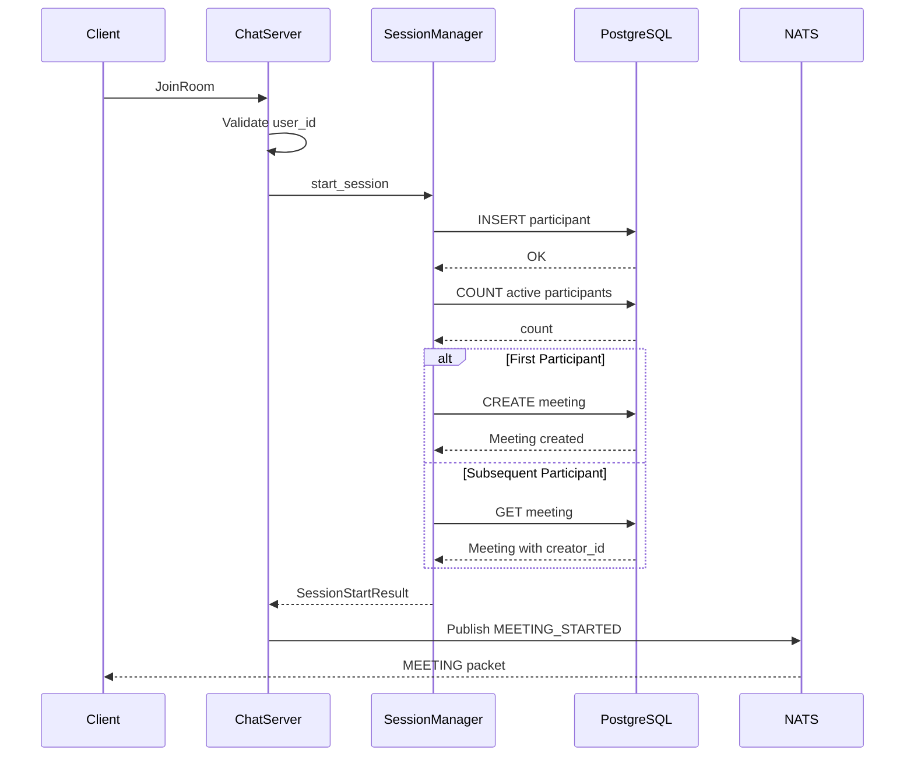
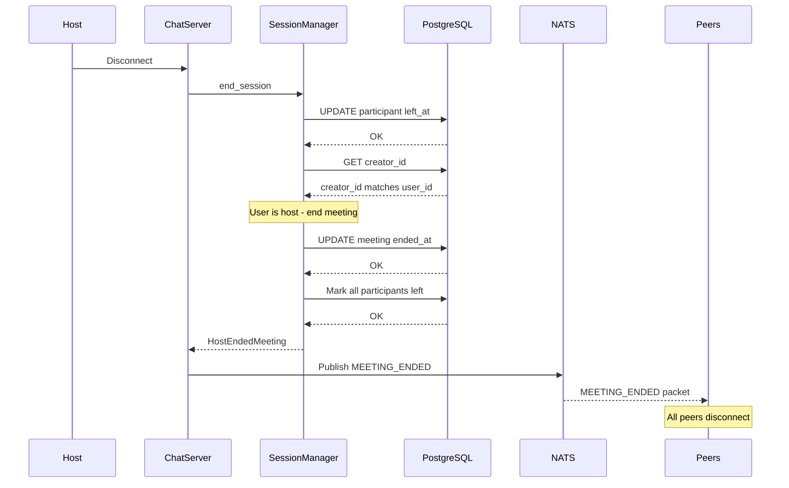
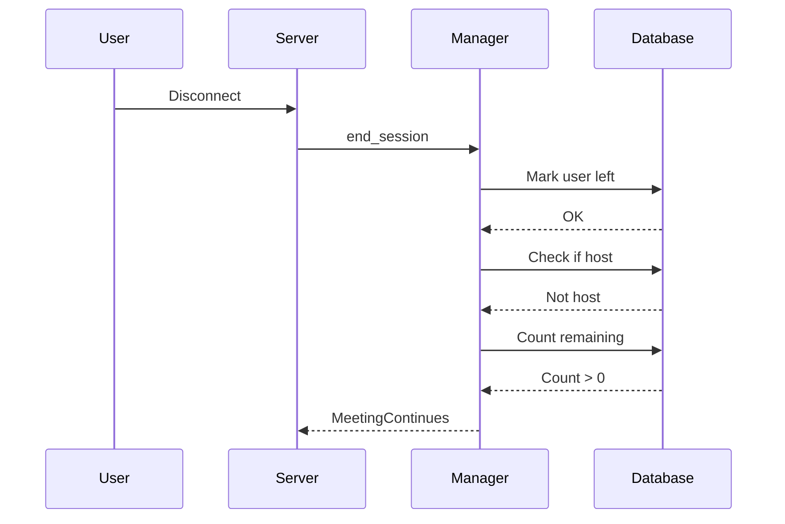
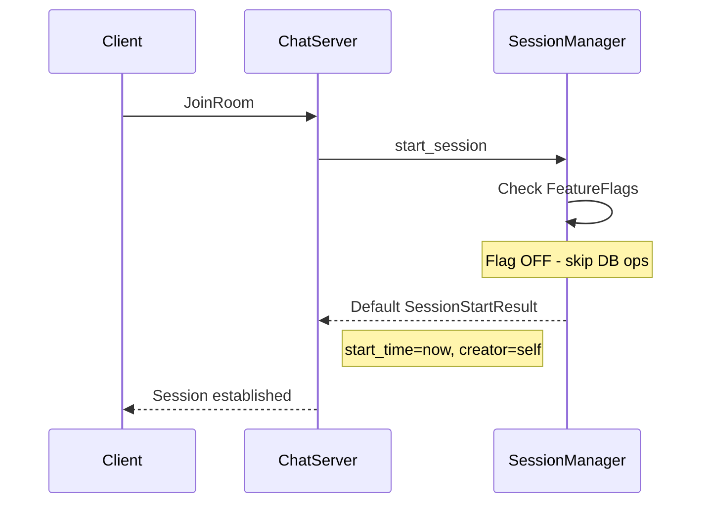

# Meeting Ownership Design Document

> **Status**: Feature Flag OFF (`FEATURE_MEETING_MANAGEMENT=false`)
>
> This feature is currently disabled in production. All meeting management 
> logic is bypassed when the flag is off, reverting to legacy stateless behavior 
> where any participant can join/leave without ownership tracking.

---

## 1. Functional Requirements

### 1.1 Meeting Creation
- When the **first participant** joins a room, a Meeting record is created
- The first participant becomes the **creator/host** of the meeting
- Meeting start time is recorded at creation

### 1.2 Ownership Tracking
- The `creator_id` field identifies the meeting host
- All subsequent joiners receive the same `creator_id` in their session info
- Ownership is immutable for the duration of the meeting

### 1.3 Host Departure Behavior
- When the **host leaves**, the meeting ends for **all participants**
- A `MEETING_ENDED` packet is broadcast to all connected clients
- All participant sessions are marked as left in the database

### 1.4 Regular Participant Departure
- When a **non-host participant** leaves, the meeting continues
- Their session is marked with a `left_at` timestamp
- Remaining participants are unaffected

### 1.5 Last Participant Departure
- When the **last remaining participant** leaves (regardless of host status)
- The meeting is automatically ended
- Meeting record is updated with `ended_at` timestamp

### 1.6 Participant Rejoining
- Participants can rejoin an active meeting
- Their join timestamp is reset, `left_at` is cleared
- They still receive the original `creator_id` from the meeting

---

## 2. Quality Attributes

### 2.1 Consistency
- **Database as single source of truth**: No in-memory HashMaps for session state
- All session state persisted in PostgreSQL
- Works correctly across multiple server instances (horizontal scaling)

### 2.2 Availability
- Feature flag allows instant rollback to legacy behavior
- When disabled, no database operations occur for meeting management
- Zero-downtime toggle via environment variable

### 2.3 Fault Tolerance
- Edge case handling when meeting doesn't exist but participants do
- Graceful cleanup of stale entries via `CleanupFailedJoin` message
- Race condition protection between join task spawning and failure

### 2.4 Testability
- Override mechanism for feature flag in tests
- Serial test execution to prevent database state conflicts
- Comprehensive unit and integration tests

### 2.5 Security
- Reserved system email (`SYSTEM_USER_EMAIL`) cannot be used as user ID
- Validation occurs synchronously before async task spawning
- Prevents impersonation of system-level messages

---

## 3. Core Entities

### 3.1 Meeting
Represents a video call session with lifecycle tracking.

| Field | Type | Description |
|-------|------|-------------|
| id | SERIAL | Primary key |
| room_id | VARCHAR(255) | Unique room identifier |
| started_at | TIMESTAMPTZ | When meeting began |
| ended_at | TIMESTAMPTZ | When meeting ended (NULL if active) |
| creator_id | VARCHAR(255) | User ID of the meeting host |
| created_at | TIMESTAMPTZ | Record creation time |
| updated_at | TIMESTAMPTZ | Last modification time |
| deleted_at | TIMESTAMPTZ | Soft delete marker |

### 3.2 SessionParticipant
Tracks individual participant presence in meetings.

| Field | Type | Description |
|-------|------|-------------|
| id | SERIAL | Primary key |
| room_id | VARCHAR(255) | Room identifier |
| user_id | VARCHAR(255) | Participant identifier |
| joined_at | TIMESTAMPTZ | Join timestamp |
| left_at | TIMESTAMPTZ | Leave timestamp (NULL if active) |
| created_at | TIMESTAMPTZ | Record creation time |

### 3.3 SessionStartResult
Returned when a session starts successfully.

| Field | Type | Description |
|-------|------|-------------|
| start_time_ms | u64 | Meeting start time (Unix ms) |
| is_first_participant | bool | True if creator |
| creator_id | String | Host user ID |

### 3.4 SessionEndResult
Enum describing what happened when a session ends.

| Variant | Description |
|---------|-------------|
| MeetingContinues { remaining_count } | Non-host left |
| HostEndedMeeting | Host left, meeting terminated |
| LastParticipantLeft | Final participant left |

### 3.5 MeetingPacket (Protobuf)
Wire protocol for meeting lifecycle events.

| Field | Type | Description |
|-------|------|-------------|
| event_type | MeetingEventType | STARTED/ENDED/JOINED/LEFT |
| room_id | string | Room identifier |
| start_time_ms | uint64 | Meeting start time |
| message | string | Human-readable message |
| creator_id | string | Host user ID |
| participant_count | int64 | Current participant count |

---

## 4. Data Flow

### 4.1 Join Flow (Feature Flag ON)



### 4.2 Leave Flow (Host Leaves)



### 4.3 Leave Flow (Regular Participant)



### 4.4 Feature Flag OFF Flow



---

## 5. Identified Risks

### 5.1 High Priority

| Risk | Description | Mitigation |
|------|-------------|------------|
| **Data Loss on Host Disconnect** | Network issues causing unintended meeting termination | Consider adding grace period before ending meeting |
| **Race Condition on First Join** | Multiple users joining simultaneously could both become "first" | Database upsert with `ON CONFLICT` handles this |
| **Stale active_subs Entry** | Failed spawn task leaves entry blocking future joins | `CleanupFailedJoin` message cleans up stale entries |

### 5.2 Medium Priority

| Risk | Description | Mitigation |
|------|-------------|------------|
| **Host Impersonation** | User could try to claim host status | Host is immutable, set only on meeting creation |
| **Database Bottleneck** | All session state requires DB round-trips | Consider caching for read-heavy operations |
| **Migration Complexity** | Enabling feature flag on existing rooms | Rooms without meetings continue with legacy behavior |

### 5.3 Low Priority

| Risk | Description | Mitigation |
|------|-------------|------------|
| **Orphaned Meetings** | Server crash leaves meeting in active state | Background cleanup job (future enhancement) |
| **Timezone Issues** | Different server timezones | All timestamps use UTC (TIMESTAMPTZ) |
| **Large Room Scaling** | Many participants in single room | Database indexes on room_id optimize queries |

---

## 6. Future Enhancements (Out of Scope)

- **Host Transfer**: Allow host to transfer ownership to another participant
- **Co-hosts**: Multiple users with host privileges
- **Waiting Room**: Host approval before participant joins
- **Reconnection Grace Period**: Allow host to reconnect before ending meeting

---

## 7. Feature Flag Configuration

```bash
# Enable meeting management (default: false)
export FEATURE_MEETING_MANAGEMENT=true
```

**Current Status**: The feature flag is **OFF** in all environments.

When enabled, the system will:
- Track meeting creation and ownership
- Persist participant sessions to PostgreSQL
- End meetings when host leaves
- Broadcast meeting lifecycle events

When disabled (current state), the system:
- Skips all database operations
- Returns default session info (user is always "creator")
- Does not track or end meetings
- Maintains backward compatibility with legacy behavior

