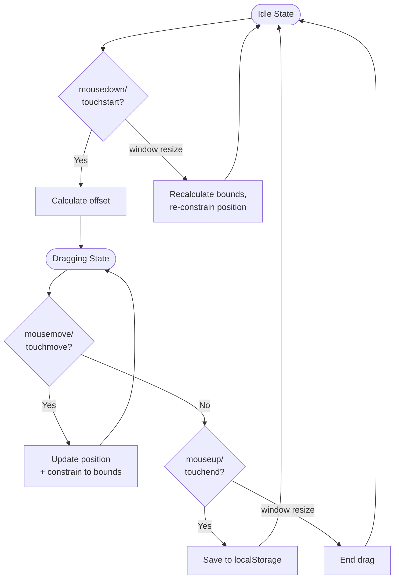

# Draggable Host Video Component

**Status**: Draft  
**Date**: 2025-10-02  
**Component**: yew-ui Host Video  

## Overview

Enable drag-and-drop repositioning of the host video component (currently fixed at bottom-right) to allow users to move it anywhere within the viewport without obscuring meeting content.

## Current State

- **Location**: `yew-ui/src/components/host.rs` (rendered in `AttendantsComponent`)
- **Positioning**: CSS absolute positioning (bottom-right corner)
- **Desktop**: `bottom: 16px; right: 16px;` 
- **Mobile**: `bottom: 78px; right: 8px;` (smaller, accounts for controls)

## Requirements

### Functional
1. Drag component to any position within viewport
2. Enforce boundary constraints (never outside window)
3. Persist position to localStorage across sessions
4. Position remains stable when peers join/leave
5. Support mouse (desktop) and touch (mobile) events

### Quality Attributes
- Smooth 60fps drag performance
- No interference with scroll gestures on mobile
- Clear visual feedback for draggability

## Technical Design

### Architecture

**Create new `DraggableHost` wrapper component**:
- Wraps existing `Host` component
- Encapsulates all drag logic and state
- Handles localStorage persistence
- Renders `Host` component with positioning applied

**Component hierarchy**:
```
AttendantsComponent
  └── DraggableHost (new)
       └── Host (existing)
```

**Rationale**: 
- Keeps drag logic isolated (single responsibility)
- AttendantsComponent stays cleaner (already 991 lines, should stay under 300)
- Easier to test drag functionality in isolation
- Reusable wrapper pattern

**Responsibilities**:
- `DraggableHost`: Drag state, events, persistence, positioning
- `Host`: Media encoding, device selection, video display (unchanged)
- `AttendantsComponent`: Meeting orchestration, peer management (unchanged)

### State Management

**DraggableHost component state**:
- `position: Option<(f64, f64)>` - None = default, Some = custom (x,y)
- `is_dragging: bool` - Drag state flag
- `drag_offset: Option<(f64, f64)>` - Offset from click to element origin
- `element_size: Option<(f64, f64)>` - Cached for boundary calculations

**Props from AttendantsComponent**: Pass through all existing Host props (client, mic_enabled, video_enabled, etc.)

### Event Handling

**New Msg variants**:
- `StartDragHost(MouseEvent)` / `StartDragHostTouch(TouchEvent)`
- `DragHost(MouseEvent)` / `DragHostTouch(TouchEvent)` 
- `EndDragHost`
- `WindowResized`

**Event flow**:



**Drag handle**: Video/placeholder area only (buttons excluded)

### Boundary Constraints

Clamp position to viewport bounds:
```rust
constrained_x = x.max(0.0).min(window_width - element_width)
constrained_y = y.max(0.0).min(window_height - element_height)
```

Apply constraints:
- Real-time during drag (every mousemove/touchmove)
- After window resize
- When loading from localStorage

### Position Persistence

**localStorage key**: `"videocall_host_position"`

**Value structure**:
```json
{
  "x": 100.0,
  "y": 200.0,
  "viewport": {"width": 1920, "height": 1080}
}
```

**Load logic**:
1. Read from localStorage on mount
2. Validate position within current viewport
3. If viewport changed >20%, reset to default
4. Default = calculated from bottom-right corner

**Save logic**: On drag end only (not during drag for performance)

## Edge Cases

| Edge Case | Solution |
|-----------|----------|
| Drag outside viewport | Real-time constraint during mousemove/touchmove |
| Window resize during drag | End drag, recalculate position |
| Peer joins/leaves | Position state independent of peer list |
| Multi-touch gestures | Detect `touches.length > 1`, cancel drag |
| Device rotation | Treat as resize, revalidate position |
| localStorage disabled | Gracefully degrade, use session position only |
| Drag on buttons | Event listeners only on video/placeholder |
| CSS transitions during drag | Disable transitions while dragging |

## Implementation Plan

### Phase 1: Create DraggableHost Component
- Create new file: `yew-ui/src/components/draggable_host.rs`
- Define component structure and state
- Add `Msg` variants for drag events
- Implement boundary constraint function
- Create localStorage helpers

### Phase 2: Event Handlers
- Implement drag start/move/end for mouse and touch
- Add window resize listener
- Wire up event listeners to wrapper div
- Pass through props to Host component

### Phase 3: Integration & Polish
- Update AttendantsComponent to use DraggableHost instead of Host
- localStorage save/load with validation
- Visual feedback (cursor change, hover states)
- Disable CSS transitions during drag
- Mobile testing and refinements

## Testing

### Critical Paths
1. Drag to various positions, verify constraints
2. Reload page, verify position restored
3. Resize window, verify position stays in bounds
4. Peer join/leave, verify position stable
5. Mobile touch drag without scroll conflicts

### Browser Coverage
- Desktop: Chrome, Firefox, Safari
- Mobile: iOS Safari, Android Chrome

## Design Decisions

### 1. Drag Handle
**Options**: Entire component | Video/placeholder only | Explicit handle icon  
**Decision Needed**: Recommend video/placeholder only (keeps buttons clickable)

### 2. Reset Mechanism  
**Options**: Double-click to reset | Right-click menu | No reset | Settings button  
**Decision Needed**: Recommend double-click (discoverable, non-intrusive)

### 3. Mobile Behavior
**Options**: Immediate drag | 300ms long-press delay | Specific handle area  
**Decision Needed**: Start with immediate drag, add delay if scroll conflicts occur

### 4. Visual Indicator
**Options**: Cursor change on hover | Drag icon | First-load animation | None  
**Decision Needed**: Recommend cursor change (standard UX)

### 5. Z-Index During Drag
**Options**: Keep current (10) | Increase temporarily | Increase permanently  
**Decision Needed**: Keep current (should be sufficient)

