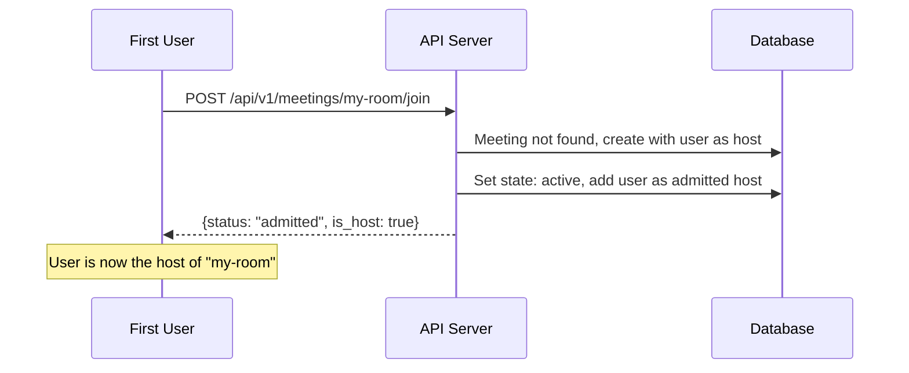
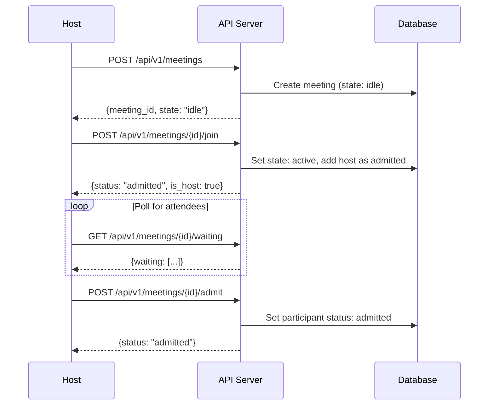
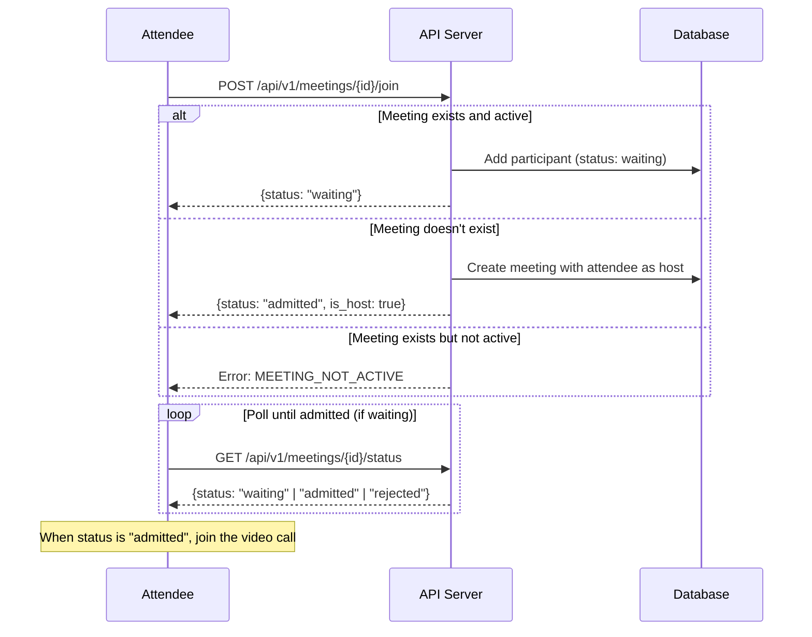

# Meeting API Documentation

This document describes the Meeting API endpoints for creating meetings with host-controlled admission (wait room functionality).

> **See Also**: [Meeting Ownership & Workflow](MEETING_OWNERSHIP.md) for a comprehensive guide to the ownership model, meeting lifecycle, and user workflows.

## Overview

The Meeting API implements a host-controlled meeting flow similar to Google Meet:

- **Host** creates a meeting and receives a meeting URL
- **Host** must join the meeting to activate it
- **Attendees** enter a wait room when they join
- **Host** admits or rejects attendees from the wait room
- **Attendees** can only participate after being admitted

## Authentication

All endpoints require authentication via the `email` cookie, which is set after OAuth login with Google.

```bash
-H "Cookie: email=user@example.com"
```

## Meeting States

| State | Description |
|-------|-------------|
| `idle` | Meeting created but host hasn't joined yet |
| `active` | Host has joined, meeting is in progress |
| `ended` | Meeting has ended (host left or all participants left) |

> **Note:** A meeting automatically transitions to `ended` when:
> - The host leaves the meeting, OR
> - All admitted participants have left the meeting

## Participant Status

| Status | Description |
|--------|-------------|
| `waiting` | In wait room, pending host approval |
| `admitted` | Approved by host, can participate |
| `rejected` | Denied entry by host |
| `left` | Previously in meeting, now left |

---

## API Endpoints

### List Meetings (My Meetings)

Lists all meetings **owned by the authenticated user** (excludes deleted meetings, includes ended meetings).

This endpoint powers the "My Meetings" section in the UI, showing only meetings where the user is the owner (`creator_id` matches the user's email).

```
GET /api/v1/meetings
```

**Query Parameters:**
| Parameter | Type | Default | Description |
|-----------|------|---------|-------------|
| `limit` | integer | 20 | Maximum number of meetings to return (1-100) |
| `offset` | integer | 0 | Number of meetings to skip for pagination |

**Response (200 OK):**
```json
{
  "meetings": [
    {
      "meeting_id": "standup-2024",
      "host": "host@example.com",
      "state": "active",
      "has_password": false,
      "created_at": 1706918400,
      "participant_count": 3
    },
    {
      "meeting_id": "weekly-sync",
      "host": "host@example.com",
      "state": "ended",
      "has_password": false,
      "created_at": 1706832000,
      "participant_count": 0
    }
  ],
  "total": 2,
  "limit": 20,
  "offset": 0
}
```

> **Note**: Ended meetings remain in the list until the owner explicitly deletes them. This allows owners to rejoin or restart meetings with the same ID.

**Errors:**
| Status | Code | Description |
|--------|------|-------------|
| 401 | `UNAUTHORIZED` | No email cookie |

---

### Create Meeting

Creates a new meeting. The authenticated user becomes the host.

```
POST /api/v1/meetings
```

**Request Body:**
```json
{
  "meeting_id": "my-meeting",      // Optional - auto-generated if omitted
  "attendees": ["user@example.com"], // Optional - pre-registered attendees
  "password": "secret123"           // Optional - meeting password
}
```

**Response (201 Created):**
```json
{
  "meeting_id": "my-meeting",
  "host": "host@example.com",
  "created_timestamp": 1706918400,
  "state": "idle",
  "attendees": ["user@example.com"],
  "has_password": true
}
```

**Errors:**
| Status | Code | Description |
|--------|------|-------------|
| 401 | `UNAUTHORIZED` | No email cookie |
| 400 | `INVALID_MEETING_ID` | Invalid ID format |
| 400 | `TOO_MANY_ATTENDEES` | More than 100 attendees |
| 409 | `MEETING_EXISTS` | Meeting ID already taken |

---

### Get Meeting Info

Retrieves meeting information and your participation status.

```
GET /api/v1/meetings/{meeting_id}
```

**Response (200 OK):**
```json
{
  "meeting_id": "my-meeting",
  "state": "active",
  "host": "host@example.com",
  "has_password": false,
  "your_status": {
    "email": "attendee@example.com",
    "status": "waiting",
    "is_host": false,
    "joined_at": 1706918500,
    "admitted_at": null
  }
}
```

---

### Delete Meeting (Owner Only)

Soft-deletes a meeting. Only the meeting owner can delete their meetings.

- Sets `deleted_at` timestamp (soft delete)
- Meeting no longer appears in "My Meetings" list
- The meeting ID can be reused by any user after deletion

```
DELETE /api/v1/meetings/{meeting_id}
```

**Response (200 OK):**
```json
{
  "message": "Meeting deleted successfully",
  "meeting_id": "my-meeting"
}
```

**Errors:**
| Status | Code | Description |
|--------|------|-------------|
| 401 | `UNAUTHORIZED` | No email cookie |
| 403 | `FORBIDDEN` | Not the meeting owner |
| 404 | `MEETING_NOT_FOUND` | Meeting does not exist |

---

### Join Meeting

Request to join a meeting. If the meeting doesn't exist, it will be **automatically created** with the joining user as the owner/host.

- **First user to join** becomes the host and the meeting is created
- **Hosts** are auto-admitted and activate the meeting
- **Attendees** (non-hosts) enter the wait room

```
POST /api/v1/meetings/{meeting_id}/join
```

**Response (200 OK):**
```json
{
  "email": "attendee@example.com",
  "status": "waiting",
  "is_host": false,
  "joined_at": 1706918500,
  "admitted_at": null
}
```

**For hosts, the response shows:**
```json
{
  "email": "host@example.com",
  "status": "admitted",
  "is_host": true,
  "joined_at": 1706918400,
  "admitted_at": 1706918400
}
```

**Errors:**
| Status | Code | Description |
|--------|------|-------------|
| 400 | `MEETING_NOT_ACTIVE` | Meeting exists but host hasn't joined yet |

> **Note:** If the meeting doesn't exist, it will be created automatically with the joining user as the host. The `MEETING_NOT_FOUND` error is no longer returned from this endpoint.

---

### Get Waiting Room (Host Only)

Lists all participants waiting to be admitted.

```
GET /api/v1/meetings/{meeting_id}/waiting
```

**Response (200 OK):**
```json
{
  "meeting_id": "my-meeting",
  "waiting": [
    {
      "email": "attendee1@example.com",
      "status": "waiting",
      "is_host": false,
      "joined_at": 1706918500,
      "admitted_at": null
    },
    {
      "email": "attendee2@example.com",
      "status": "waiting",
      "is_host": false,
      "joined_at": 1706918510,
      "admitted_at": null
    }
  ]
}
```

**Errors:**
| Status | Code | Description |
|--------|------|-------------|
| 403 | `NOT_HOST` | Only the host can view the waiting room |

---

### Admit Participant (Host Only)

Admits a participant from the wait room into the meeting.

```
POST /api/v1/meetings/{meeting_id}/admit
```

**Request Body:**
```json
{
  "email": "attendee@example.com"
}
```

**Response (200 OK):**
```json
{
  "email": "attendee@example.com",
  "status": "admitted",
  "is_host": false,
  "joined_at": 1706918500,
  "admitted_at": 1706918600
}
```

**Errors:**
| Status | Code | Description |
|--------|------|-------------|
| 403 | `NOT_HOST` | Only the host can admit participants |
| 404 | `PARTICIPANT_NOT_FOUND` | Participant not in waiting room |

---

### Admit All Participants (Host Only)

Admits all participants currently in the wait room at once. Useful when multiple people are waiting to join.

```
POST /api/v1/meetings/{meeting_id}/admit-all
```

**Response (200 OK):**
```json
{
  "admitted_count": 3,
  "admitted": [
    {
      "email": "attendee1@example.com",
      "status": "admitted",
      "is_host": false,
      "joined_at": 1706918500,
      "admitted_at": 1706918600
    },
    {
      "email": "attendee2@example.com",
      "status": "admitted",
      "is_host": false,
      "joined_at": 1706918510,
      "admitted_at": 1706918600
    },
    {
      "email": "attendee3@example.com",
      "status": "admitted",
      "is_host": false,
      "joined_at": 1706918520,
      "admitted_at": 1706918600
    }
  ]
}
```

**Errors:**
| Status | Code | Description |
|--------|------|-------------|
| 403 | `NOT_HOST` | Only the host can admit participants |
| 404 | `MEETING_NOT_FOUND` | Meeting does not exist |

---

### Reject Participant (Host Only)

Rejects a participant from the wait room.

```
POST /api/v1/meetings/{meeting_id}/reject
```

**Request Body:**
```json
{
  "email": "attendee@example.com"
}
```

**Response (200 OK):**
```json
{
  "email": "attendee@example.com",
  "status": "rejected",
  "is_host": false,
  "joined_at": 1706918500,
  "admitted_at": null
}
```

---

### Get My Status

Check your current status in a meeting. Useful for polling while in wait room.

```
GET /api/v1/meetings/{meeting_id}/status
```

**Response (200 OK):**
```json
{
  "email": "attendee@example.com",
  "status": "admitted",
  "is_host": false,
  "joined_at": 1706918500,
  "admitted_at": 1706918600
}
```

**Errors:**
| Status | Code | Description |
|--------|------|-------------|
| 404 | `NOT_IN_MEETING` | Haven't requested to join |

---

### Leave Meeting

Leave a meeting. The meeting automatically ends when:
- The host leaves, OR
- All admitted participants have left

When a participant leaves, the `participant_count` is updated immediately in the database.

```
POST /api/v1/meetings/{meeting_id}/leave
```

**Response (200 OK):**
```json
{
  "email": "attendee@example.com",
  "status": "left",
  "is_host": false,
  "joined_at": 1706918500,
  "admitted_at": 1706918600
}
```

**Errors:**
| Status | Code | Description |
|--------|------|-------------|
| 404 | `NOT_IN_MEETING` | Not a participant in this meeting |

---

### Get Participants

Lists all admitted participants currently in the meeting.

```
GET /api/v1/meetings/{meeting_id}/participants
```

**Response (200 OK):**
```json
[
  {
    "email": "host@example.com",
    "status": "admitted",
    "is_host": true,
    "joined_at": 1706918400,
    "admitted_at": 1706918400
  },
  {
    "email": "attendee@example.com",
    "status": "admitted",
    "is_host": false,
    "joined_at": 1706918500,
    "admitted_at": 1706918600
  }
]
```

---

## Usage Flows

### Ad-hoc Meeting Flow (Recommended)

The simplest way to start a meeting - just join any meeting ID. If it doesn't exist, you become the host.



### Scheduled Meeting Flow (Pre-create)

For scheduled meetings, explicitly create the meeting first with attendee list.



### Attendee Flow



---

## Example: Complete Meeting Session

```bash
# 1. Host creates meeting
curl -X POST http://localhost:8080/api/v1/meetings \
  -H "Content-Type: application/json" \
  -H "Cookie: email=host@example.com" \
  -d '{"meeting_id": "standup-2024"}'

# Response: {"meeting_id":"standup-2024","host":"host@example.com","state":"idle",...}

# 2. Host joins meeting (activates it)
curl -X POST http://localhost:8080/api/v1/meetings/standup-2024/join \
  -H "Cookie: email=host@example.com"

# Response: {"email":"host@example.com","status":"admitted","is_host":true,...}

# 3. Attendee tries to join
curl -X POST http://localhost:8080/api/v1/meetings/standup-2024/join \
  -H "Cookie: email=alice@example.com"

# Response: {"email":"alice@example.com","status":"waiting","is_host":false,...}

# 4. Host checks waiting room
curl http://localhost:8080/api/v1/meetings/standup-2024/waiting \
  -H "Cookie: email=host@example.com"

# Response: {"meeting_id":"standup-2024","waiting":[{"email":"alice@example.com",...}]}

# 5a. Host admits Alice individually
curl -X POST http://localhost:8080/api/v1/meetings/standup-2024/admit \
  -H "Content-Type: application/json" \
  -H "Cookie: email=host@example.com" \
  -d '{"email": "alice@example.com"}'

# Response: {"email":"alice@example.com","status":"admitted",...}

# 5b. Or host admits ALL waiting participants at once
curl -X POST http://localhost:8080/api/v1/meetings/standup-2024/admit-all \
  -H "Cookie: email=host@example.com"

# Response: {"admitted_count":2,"admitted":[{"email":"alice@example.com",...},{"email":"bob@example.com",...}]}

# 6. Alice checks her status (polling)
curl http://localhost:8080/api/v1/meetings/standup-2024/status \
  -H "Cookie: email=alice@example.com"

# Response: {"email":"alice@example.com","status":"admitted",...}
# Alice can now join the video call!

# 7. When done, participants leave (participant count updates automatically)
curl -X POST http://localhost:8080/api/v1/meetings/standup-2024/leave \
  -H "Cookie: email=alice@example.com"

# 8. Host leaves (ends the meeting immediately)
#    Note: Meeting also ends automatically if all participants leave before the host
curl -X POST http://localhost:8080/api/v1/meetings/standup-2024/leave \
  -H "Cookie: email=host@example.com"
```

---

## Database Schema

### meetings table (updated)

| Column | Type | Description |
|--------|------|-------------|
| id | SERIAL | Primary key |
| room_id | VARCHAR(255) | Unique meeting identifier |
| creator_id | VARCHAR(255) | Host email |
| state | VARCHAR(50) | `idle`, `active`, `ended` |
| password_hash | VARCHAR(255) | Argon2 hashed password |
| attendees | JSONB | Pre-registered attendees |
| started_at | TIMESTAMPTZ | When meeting started |
| ended_at | TIMESTAMPTZ | When meeting ended |

### meeting_participants table (new)

| Column | Type | Description |
|--------|------|-------------|
| id | SERIAL | Primary key |
| meeting_id | INTEGER | Foreign key to meetings |
| email | VARCHAR(255) | Participant email |
| status | VARCHAR(50) | `waiting`, `admitted`, `rejected`, `left` |
| is_host | BOOLEAN | Whether this is the host |
| is_required | BOOLEAN | Required attendance |
| joined_at | TIMESTAMPTZ | When joined/entered wait room |
| admitted_at | TIMESTAMPTZ | When admitted by host |
| left_at | TIMESTAMPTZ | When left the meeting |
