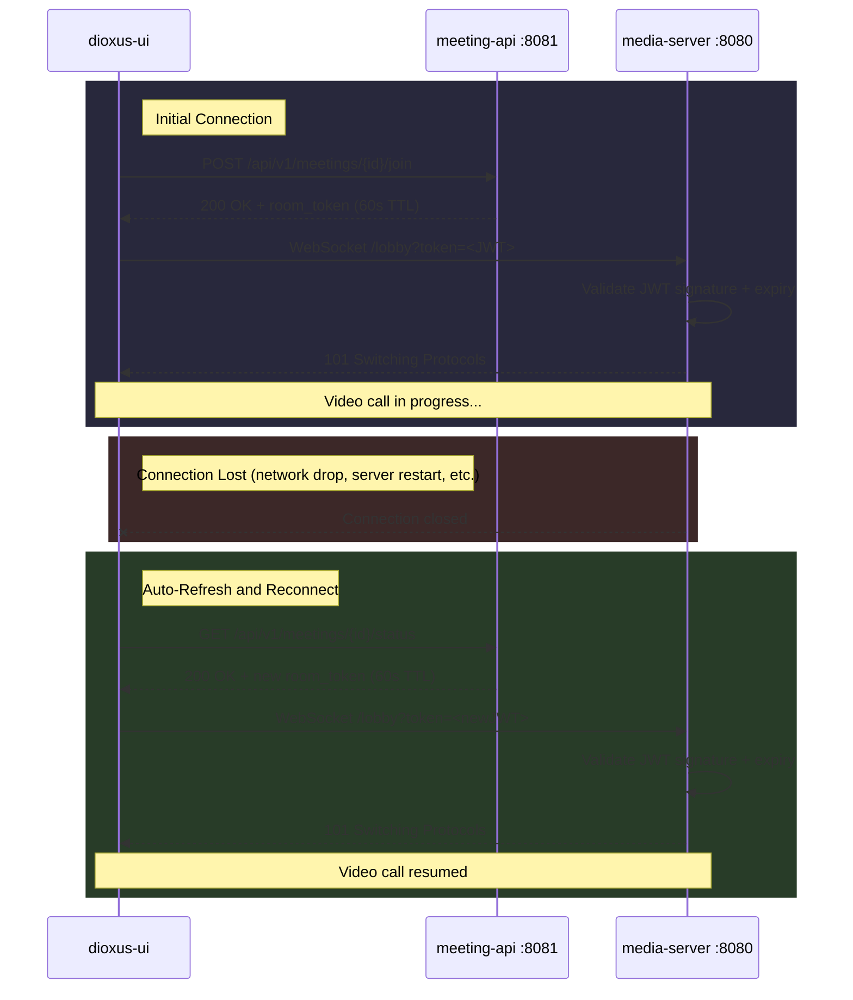
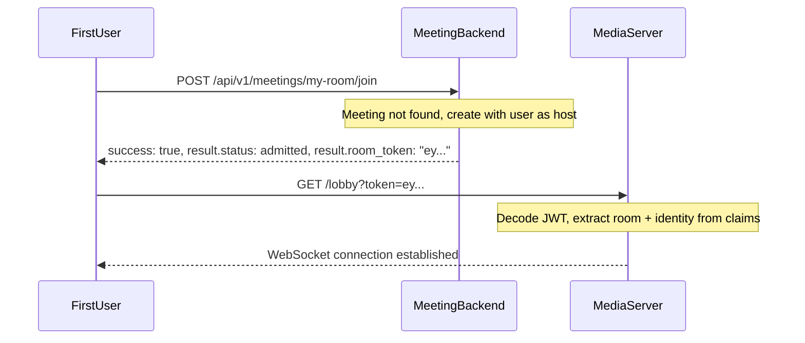
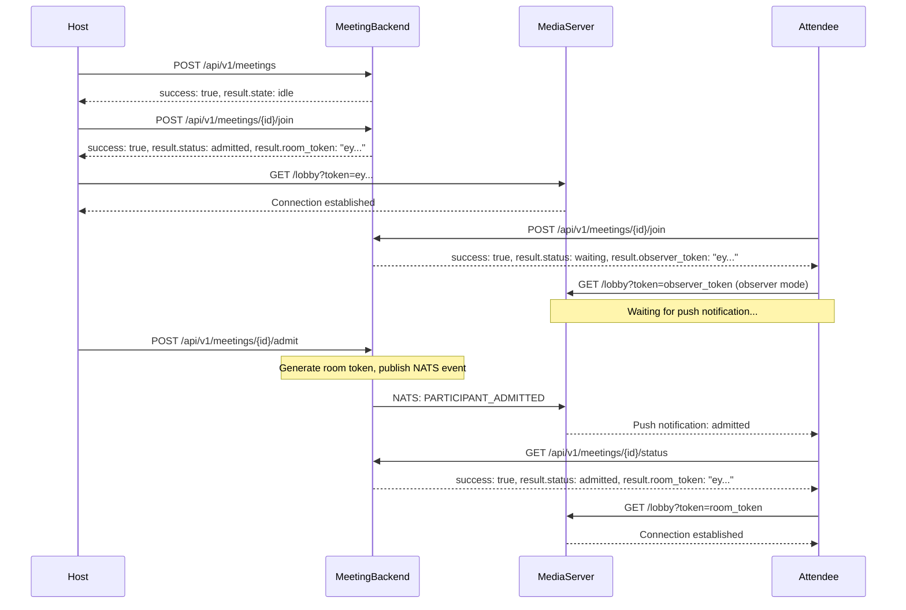
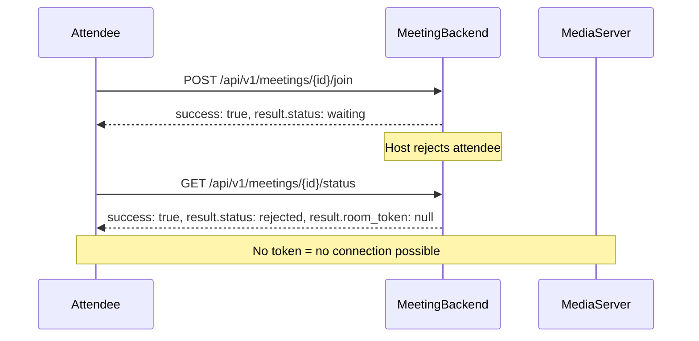

# Meeting API Documentation

This document describes the Meeting Backend API endpoints for creating meetings, managing the waiting room, and issuing room access tokens.

> **See Also**: [Meeting Ownership & Architecture](MEETING_OWNERSHIP.md) for the system architecture, two-service model, token flow, and meeting lifecycle.

## Overview

The Meeting Backend is a **separate microservice** (its own binary, process, and port) that handles all meeting business logic. It issues signed JWT room access tokens that clients use to connect to the Media Server.

The meeting flow:

1. **Host** creates a meeting (or one is auto-created on first join)
2. **Host** joins the meeting, activating it and receiving a **room access token**
3. **Attendees** request to join and enter the waiting room
4. **Host** admits or rejects attendees
5. **Admitted attendees** receive a push notification via the media server connection, then fetch their **room access token** via `GET /status`
6. **Clients connect** to the Media Server using their room access token
7. The Media Server **rejects** any connection without a valid, signed token (when `FEATURE_MEETING_MANAGEMENT=true`)

## Shared Types Crate

All request types, response types, error types, and JWT claims are defined in the `videocall-meeting-types` crate. This crate is framework-agnostic (no actix-web, no database types) and serves as the single source of truth for the API contract.

Key types:

| Type | Location | Description |
|------|----------|-------------|
| `APIResponse<A>` | `responses.rs` | Envelope: `{ "success": bool, "result": A }` |
| `APIError` | `error.rs` | Error payload with `code`, `message`, `engineering_error` |
| `CreateMeetingRequest` | `requests.rs` | Request body for meeting creation |
| `JoinMeetingRequest` | `requests.rs` | Request body for joining a meeting |
| `AdmitRequest` | `requests.rs` | Request body for admit/reject |
| `ListMeetingsQuery` | `requests.rs` | Query parameters for listing meetings |
| `ParticipantStatusResponse` | `responses.rs` | Canonical participant shape (used across multiple endpoints) |
| `RoomAccessTokenClaims` | `token.rs` | JWT claims for room access tokens |

### Response Envelope

Every endpoint returns an `APIResponse<T>` envelope:

```json
{ "success": true,  "result": { ... } }
{ "success": false, "result": { "code": "MEETING_NOT_FOUND", "message": "..." } }
```

All success and error examples below show the full envelope.

## Authentication

All meeting-api endpoints (except OAuth login/callback and logout) require a valid **signed session JWT**.

### How to authenticate

Pass the session JWT in the `Authorization` header:

```bash
-H "Authorization: Bearer <session_jwt>"
```

The session JWT is obtained after a successful OAuth login via `GET /login`. The OAuth callback issues the token, and all subsequent API calls must include it in the `Authorization: Bearer` header.

> **Browser note**: The web UI (`dioxus-ui`) uses an `HttpOnly` session cookie that the browser sends automatically. This is an implementation detail of the browser client -- for API testing, CLI tools, mobile apps, and all documentation examples, always use the `Authorization: Bearer` header.

### Local development (no OAuth)

For local development without an OAuth provider, the meeting-api auto-logs in a synthetic user via `DEV_USER`. Both `docker-compose.yaml` and `start_dev.sh` ship a default `DEV_USER=dev@local.test:Dev User`, so this works out of the box; override the env var if you need a different identity (format: `email:display_name`). When OAuth is disabled and `DEV_USER` is set, the meeting-api exposes:

```
GET /api/v1/dev/auto-login
```

This endpoint issues a signed session JWT in a `Set-Cookie` header and 302-redirects to `/`. The browser UI calls it automatically, but for curl / Postman you can fetch it once and extract the cookie:

```bash
# Get a session token via dev auto-login (no OAuth required).
# -s -o /dev/null silences the redirect body; -c saves cookies.
curl -s -o /dev/null -c /tmp/cookies.txt http://localhost:8081/api/v1/dev/auto-login

# Extract the JWT value from the Netscape-format cookie file.
# The default cookie name is "session"; substitute your COOKIE_NAME if customized.
SESSION=$(awk '$6 == "session" {print $7}' /tmp/cookies.txt)
curl -H "Authorization: Bearer $SESSION" http://localhost:8081/api/v1/meetings
```

> **Safety**: The `/api/v1/dev/auto-login` endpoint returns `404 Not Found` when OAuth is enabled (`OAUTH_CLIENT_ID` set) or when `DEV_USER` is unset. It is inert in production.

### Session JWT Claims

The session JWT contains these claims:

| Claim | Description |
|-------|-------------|
| `sub` | User email (identity principal) |
| `name` | Display name |
| `exp` | Expiration (Unix timestamp) |
| `iat` | Issued-at (Unix timestamp) |
| `iss` | `"videocall-meeting-backend"` |

> **Note**: The session JWT authenticates requests to the Meeting Backend only. To connect to the Media Server, clients must present a separate **room access token** (JWT) issued by the Meeting Backend when a participant is admitted to a meeting.

### CORS

The Meeting Backend supports cross-origin requests with credentials. Set `CORS_ALLOWED_ORIGIN` to the exact frontend origin in production (e.g. `https://app.videocall.rs`). An empty or unset value is **rejected at startup** unless `DEV_USER` is active (local dev); only then does the server mirror the request `Origin`. This fail-closed guard (issue #1751) prevents an empty origin list from producing universal credentialed CORS. See [Meeting Ownership & Architecture](MEETING_OWNERSHIP.md#cors-and-deployment-topology) for deployment recommendations.

## Room Access Token

The room access token is a signed JWT (HMAC-SHA256) that authorizes a client to connect to the Media Server for a specific room. See [Meeting Ownership & Architecture](MEETING_OWNERSHIP.md#room-access-token) for the full token specification.

Key points:
- Issued when a participant's status becomes `admitted`
- Scoped to a specific room and participant
- Contains identity, room, host status, and display name
- **Meeting-scoped lifetime**: tokens default to `TOKEN_TTL_SECS=86400` (24 hours). TTL must cover both the longest expected meeting and connection re-election — short TTLs cause cached tokens in WT/WS URLs to expire mid-meeting and strand users. See [discussion #562](https://github01.hclpnp.com/labs-projects/videocall/discussions/562). Tokens are scoped to a single room + participant identity; a leak grants only meeting admission for that one user/room for the TTL duration.
- Delivered in the `room_token` field of API responses
- A fresh token is generated on every call to `GET /api/v1/meetings/{id}/status` when the participant is admitted

### Token Lifecycle and Auto-Refresh

The following diagram shows the complete lifecycle of a room access token, including the automatic refresh flow when a media server connection is lost:


```mermaid
sequenceDiagram
    participant UI as dioxus-ui
    participant API as meeting-api :8081
    participant MS as media-server :8080

    rect rgb(40, 40, 60)
    note right of UI: Initial Connection
    UI->>API: POST /api/v1/meetings/{id}/join
    API-->>UI: 200 OK + room_token (60s TTL)
    UI->>MS: WebSocket /lobby?token=<JWT>
    MS->>MS: Validate JWT signature + expiry
    MS-->>UI: 101 Switching Protocols
    note over UI, MS: Video call in progress...
    end

    rect rgb(60, 40, 40)
    note right of UI: Connection Lost (network drop, server restart, etc.)
    MS--xUI: Connection closed
    end

    rect rgb(40, 60, 40)
    note right of UI: Auto-Refresh and Reconnect
    UI->>API: GET /api/v1/meetings/{id}/status
    API-->>UI: 200 OK + new room_token (60s TTL)
    UI->>MS: WebSocket /lobby?token=<newJWT>
    MS->>MS: Validate JWT signature + expiry
    MS-->>UI: 101 Switching Protocols
    note over UI, MS: Video call resumed
    end
```

**Why single-burner tokens?**

- **Security**: Even if a token is intercepted, it expires in 60 seconds and cannot be reused for long
- **Revocation**: No need for a token revocation list; expired tokens are automatically invalid
- **Simplicity**: The media server only needs to validate the JWT signature and expiry, with no database lookup required

**Error handling on the media server:**

| Token Error | HTTP Response | Description |
|-------------|---------------|-------------|
| Expired | `401 Unauthorized` | Token was valid but has expired. Client should fetch a fresh token. |
| Invalid signature | `403 Forbidden` | Token has been tampered with. This incident is logged. |
| Missing | `401 Unauthorized` | No token provided. Use `/lobby?token=<JWT>`. |
| Room join denied | `403 Forbidden` | Token does not grant room join permission. |

## Meeting States

| State | Description |
|-------|-------------|
| `idle` | Nobody is present: created and not started yet, or everyone left |
| `active` | Someone is present, room access token issued, meeting is in progress |
| `ended` | Meeting has ended |

> **Note:** A meeting automatically transitions to `ended` when:
> - The last present host leaves and `end_on_host_leave` is on, OR
> - The last admitted participant leaves with REST `/leave`
>
> Otherwise it goes `idle` once nobody is present.

## Participant Status

| Status | Description |
|--------|-------------|
| `waiting_for_meeting` | Meeting exists but is not yet active (host hasn't joined). Observer token provided for push notifications. |
| `waiting` | In waiting room, pending approval. No room token issued. Observer token provided for push notifications. |
| `admitted` | Approved by host. Room access token available. |
| `rejected` | Denied entry by host. |
| `left` | Previously in meeting, now left. |

## Meeting passwords

A meeting created with a `password` stores an Argon2 hash in `meetings.password_hash`
and reports `has_password: true` on every listing. **The password is verified
server-side on every join path** (issue #1613); it is not a client-side hint.

| Endpoint | Enforced? | Notes |
|----------|-----------|-------|
| `POST /api/v1/meetings/{id}/join` — meeting owner (`creator_id`) | **Exempt** | Ownership already grants strictly more authority than the password (PATCH settings, end, delete), so the owner is not asked for it. This also keeps a meeting with a corrupt stored hash recoverable. |
| `POST /api/v1/meetings/{id}/join` — anyone else | **Yes** | Includes co-hosts and a transfer-host target, who are not the `creator_id`. |
| `POST /api/v1/meetings/{id}/join-guest` | **Yes** | Checked after the `allow_guests` gate. |
| `POST /api/v1/meetings/{id}/admit`, `/admit-all` | Inherited | These are `UPDATE ... WHERE status = 'waiting'`; they cannot create a participant row, so they can only admit somebody who already cleared the gate on join. |
| `GET /api/v1/meetings/{id}/status`, `/guest-status` | Inherited | Only mint a `room_token` for an existing `admitted` row, which only a cleared join can produce. |

**Entry, not continued presence.** The password gates *becoming* a participant.
Once a row is `admitted`, `GET /status` and `GET /guest-status` re-mint a
`room_token` for it on demand without re-verifying the password, and the
transport presence heal (`db_participants::record_present`) restores
a `left` row to `admitted` — it mints no token itself, but it restores the state
those endpoints mint from, and it too runs no password check. Neither is a
bypass: both require a row that only a cleared join could have created, and the
heal additionally requires `admitted_at IS NOT NULL` plus a live transport
connection, which needs a valid room token.

The consequence worth stating plainly is that adding or changing a password
mid-meeting evicts nobody already inside. That is deliberate — the host has
`POST /kick` — but "enforced on every join path" means exactly what it says and
no more.

**Client contract.** Send the plaintext in the `password` field of the join body.
On mismatch the server answers `403` with one of two codes:

| Status | Code | Meaning | Client action |
|--------|------|---------|---------------|
| 403 | `MEETING_PASSWORD_REQUIRED` | Meeting has a password; the request carried none | Prompt for a password, retry the same join |
| 403 | `INVALID_MEETING_PASSWORD` | The supplied password did not verify | Re-prompt |
| 429 | `TOO_MANY_PASSWORD_ATTEMPTS` | This client burned its failed-attempt budget for this meeting | Back off ~1 minute, then re-prompt |

| 503 | `VERIFIER_OVERLOADED` | Server at its bounded verification capacity; request shed rather than queued | Retry after a short delay |

> **Note:** a join that also carries a `display_name` passes through the older
> per-user rename limiter first, so a client sending one may see
> `429 RATE_LIMIT_EXCEEDED` instead of `429 TOO_MANY_PASSWORD_ATTEMPTS`. Both are
> 429 and both reject before any hashing. `POST /join-guest` has no rename
> limiter, so it is governed purely by the password throttle.

Both are `403`, not `401` — the caller's identity is established; what they lack
is a resource credential. (A `401` would also trip the UI's session-refresh
retry.) Splitting the two codes discloses only that the meeting has a password,
which `has_password` already publishes on every listing.

**Fail closed.** If `password_hash` cannot be parsed as a PHC string (corrupt
column, foreign algorithm, partial write), the join is **denied** with
`INVALID_MEETING_PASSWORD` — never treated as "this meeting has no password".
The two causes are deliberately indistinguishable on the wire; operators get the
real reason from the server log.

**Throttled and bounded.** Failed verifications are capped at 5 per 60 s per
`(client IP, meeting)` pair — scoped that way so one attacker cannot lock a
meeting for everybody. The client address is the rightmost `X-Forwarded-For`
entry (appended by the nginx ingress, so entries an attacker prepends are
ignored), falling back to the transport peer address. A request that cannot be
attributed to an address is served but not throttled, because collapsing
unattributable callers into one shared bucket would itself be a denial of
service.

Verification runs on tokio's blocking pool behind a semaphore sized to the CPU
allocation (at most 4 concurrent, ~19 MiB each), so a burst of joins cannot
stall the single-worker async runtime or exhaust the container's memory limit.
Requests that wait more than 10 s for a permit are shed with
`503 VERIFIER_OVERLOADED` rather than queueing without bound. A shed does **not**
count against the failed-attempt budget — the password was never evaluated, so
billing it would turn server overload into a client lockout.

The window is **tumbling**, not sliding: the budget refills in one step at the
boundary, so a client can spend two budgets in a short span straddling it. The
semaphore, not this counter, is what bounds CPU.

The throttle is **in-process**. That is sufficient at the current
`replicaCount: 1`; scaling the service out multiplies the per-instance budget by
the replica count and would need a shared store or an edge limiter.

## Timestamps

Timestamps in API responses use two different units depending on the field:

- **Meeting timestamps** (`created_at`, `started_at`, `ended_at`) are **Unix milliseconds**.
- **Participant timestamps** (`joined_at`, `admitted_at`) are **Unix seconds**.

---

## API Endpoints

All endpoints are served by the **meeting-api on port 8081** (both local development and production).

The UI's `apiBaseUrl` should point to `http://localhost:8081` for local development (this is the default in `docker-compose.yaml`). The media server (WebSocket/WebTransport) runs separately on port 8080.

### List Meetings (My Meetings)

Lists meetings the authenticated user owns, has participated in, or is a live co-host of (excludes deleted meetings, includes ended meetings).

```
GET /api/v1/meetings
```

**Query Parameters:**

| Parameter | Type | Default | Description |
|-----------|------|---------|-------------|
| `limit` | integer | 20 | Maximum number of meetings to return (1-100) |
| `offset` | integer | 0 | Number of meetings to skip for pagination |

**Response (200 OK):**
```json
{
  "success": true,
  "result": {
    "meetings": [
      {
        "meeting_id": "standup-2024",
        "host": "host@example.com",
        "state": "active",
        "has_password": false,
        "created_at": 1706918400000,
        "participant_count": 3,
        "started_at": 1706918400000,
        "ended_at": null,
        "waiting_count": 1
      }
    ],
    "total": 1,
    "limit": 20,
    "offset": 0
  }
}
```

> **Rust type**: `APIResponse<ListMeetingsResponse>` (each entry is a `MeetingSummary`)

> **Note**: Ended meetings remain in the list until the owner explicitly deletes them. This allows owners to rejoin or restart meetings with the same ID.

**Errors:**

| Status | Code | Description |
|--------|------|-------------|
| 401 | `UNAUTHORIZED` | Invalid or missing session |

**Error example (401):**
```json
{
  "success": false,
  "result": {
    "code": "UNAUTHORIZED",
    "message": "Authentication required."
  }
}
```

---

### Home Feed

Meetings the authenticated user owns, has been admitted into, or is a live co-host of, deduplicated to one row per meeting, ordered by `last_active_at` descending. Powers the home page.

```
GET /api/v1/meetings/feed
```

**Query Parameters:**

| Parameter | Type | Default | Description |
|-----------|------|---------|-------------|
| `limit` | integer | 200 | Maximum number of meetings to return (1-200) |

**Response (200 OK):**
```json
{
  "success": true,
  "result": {
    "meetings": [
      {
        "meeting_id": "standup-2024",
        "state": "active",
        "last_active_at": 1706918400000,
        "created_at": 1706918000000,
        "is_owner": false,
        "is_co_host": true,
        "participant_count": 3,
        "waiting_count": 0
      }
    ]
  }
}
```

> **Rust type**: `APIResponse<ListFeedResponse>` (each entry is a `MeetingFeedSummary`)

- `is_co_host`: `true` when the caller holds a live (unsuspended) `meeting_co_hosts` entry for that meeting — independent of `is_owner`, and of whether the caller is currently present. `#[serde(default, skip_serializing_if = "std::ops::Not::not")]`, so it is omitted from the wire (and decodes to `false`) whenever it doesn't apply.

**Errors:**

| Status | Code | Description |
|--------|------|-------------|
| 401 | `UNAUTHORIZED` | Invalid or missing session |

---

### Create Meeting

Creates a new meeting. The authenticated user becomes the host. The meeting starts in `idle` state.

```
POST /api/v1/meetings
```

**Request Body:**
```json
{
  "meeting_id": "my-meeting",
  "attendees": ["user@example.com"],
  "password": "secret123"
}
```

| Field | Type | Required | Description |
|-------|------|----------|-------------|
| `meeting_id` | string | No | Meeting identifier. Auto-generated (12 chars) if omitted. |
| `attendees` | string[] | No | Pre-registered attendee emails (max 100). |
| `password` | string | No | Meeting password (hashed with Argon2 before storage). Enforced server-side on every non-owner join — see [Meeting passwords](#meeting-passwords). An empty string is treated as "no password". |
| `co_hosts` | string[] | No | User IDs saved as persistent co-hosts (max 100, trimmed and deduplicated; the creator or a `guest:` ID is a 400). Echoed back as `co_hosts` in the response. See [Co-Hosts](#co-hosts). |

**Response (201 Created):**
```json
{
  "success": true,
  "result": {
    "meeting_id": "my-meeting",
    "host": "host@example.com",
    "created_at": 1706918400000,
    "state": "idle",
    "attendees": ["user@example.com"],
    "has_password": true
  }
}
```

> **Rust type**: `APIResponse<CreateMeetingResponse>`

**Errors:**

| Status | Code | Description |
|--------|------|-------------|
| 401 | `UNAUTHORIZED` | Invalid or missing session |
| 400 | `INVALID_MEETING_ID` | Invalid ID format |
| 400 | `TOO_MANY_ATTENDEES` | More than 100 attendees |
| 409 | `MEETING_EXISTS` | Meeting ID already taken |

**Error example (409):**
```json
{
  "success": false,
  "result": {
    "code": "MEETING_EXISTS",
    "message": "Meeting with ID 'my-meeting' already exists"
  }
}
```

---

### Get Meeting Info

Retrieves meeting information and your participation status.

```
GET /api/v1/meetings/{meeting_id}
```

**Response (200 OK):**
```json
{
  "success": true,
  "result": {
    "meeting_id": "my-meeting",
    "state": "active",
    "host": "host@example.com",
    "host_display_name": "Alice",
    "has_password": false,
    "viewer_is_owner": false,
    "viewer_can_edit_options": true,
    "your_status": {
      "email": "attendee@example.com",
      "display_name": "Bob",
      "status": "waiting",
      "is_host": false,
      "joined_at": 1706918500,
      "admitted_at": null,
      "room_token": null
    }
  }
}
```

> **Rust type**: `APIResponse<MeetingInfoResponse>` (with nested `ParticipantStatusResponse`)

- `viewer_is_owner` (issue #2702): `true` when `creator_id == authenticated_user_id`. **Server-computed** — the authoritative trust signal for owner-only affordances (co-host management, password, delete, end-for-everyone). `#[serde(default)]`, so an older server omitting it decodes to `false`.
- `viewer_can_edit_options` (issue #2702): whether the caller may `PATCH` this meeting's OPTIONS (see below) — `true` for the owner, a live co-host, or a present host of the active meeting (e.g. a `transfer-host` target). `#[serde(default)]`.

**Errors:**

| Status | Code | Description |
|--------|------|-------------|
| 401 | `UNAUTHORIZED` | Invalid or missing session |
| 404 | `MEETING_NOT_FOUND` | Meeting does not exist |

---

### Update Meeting Options

Changes meeting OPTIONS: the waiting room, `admitted_can_admit`, `end_on_host_leave`, `allow_guests`, the recording/chat policy flags, and the meeting password.

```
PATCH /api/v1/meetings/{meeting_id}
```

**Request body** (all fields optional; only present fields change):
```json
{
  "waiting_room_enabled": false,
  "admitted_can_admit": true,
  "end_on_host_leave": false,
  "allow_guests": false,
  "recording_allowed_for_all": false,
  "chat_allowed_for_all": true,
  "password": "new-password",
  "remove_password": false
}
```

**Authorization**: allowed for the owner, a live (unsuspended) co-host entry, or anyone currently a present host of the active meeting (e.g. a `transfer-host` target) — see `viewer_can_edit_options` above. `password` / `remove_password` are the exception: they stay **owner-only**. A non-owner sending either is rejected with `403 NOT_OWNER` before any hashing or DB write — nothing in the request is applied, even other, otherwise-valid fields in the same body. Granting/revoking co-hosts, ending the meeting for everyone (`/end`), and deleting it (`DELETE`) stay owner-only; listing co-hosts uses this same broader rule (see [Co-Hosts](#co-hosts)).

Turning `waiting_room_enabled` off admits the participants `/admit-all` would; `waiting` rows whose lease expired stay `waiting` (see [Get Waiting Room](#get-waiting-room)).

**Response (200 OK):** `APIResponse<MeetingInfoResponse>` — same shape as [Get Meeting Info](#get-meeting-info).

**Errors:**

| Status | Code | Description |
|--------|------|-------------|
| 401 | `UNAUTHORIZED` | Invalid or missing session |
| 403 | `NOT_OWNER` | `password` or `remove_password` sent by a non-owner |
| 403 | `NOT_HOST` | Caller is none of: owner, live co-host, present host of the active meeting |
| 404 | `MEETING_NOT_FOUND` | Meeting does not exist (or was soft-deleted) |

---

### Delete Meeting (Owner Only)

Soft-deletes a meeting. Only the meeting owner can delete their meetings.

- Sets `deleted_at` timestamp (soft delete)
- Meeting no longer appears in "My Meetings" list
- The meeting ID can be reused by any user after deletion

```
DELETE /api/v1/meetings/{meeting_id}
```

**Response (200 OK):**
```json
{
  "success": true,
  "result": {
    "message": "Meeting 'my-meeting' has been deleted"
  }
}
```

> **Rust type**: `APIResponse<DeleteMeetingResponse>`

**Errors:**

| Status | Code | Description |
|--------|------|-------------|
| 401 | `UNAUTHORIZED` | Invalid or missing session |
| 403 | `NOT_OWNER` | Not the meeting owner |
| 404 | `MEETING_NOT_FOUND` | Meeting does not exist |

---

### Join Meeting

Request to join a meeting. If the meeting doesn't exist, it will be **automatically created** with the joining user as the owner/host.

- **First user to join** becomes the host; the meeting is created and activated
- **Hosts** are auto-admitted and receive a `room_token` immediately
- **Attendees** (non-hosts) enter the waiting room (no `room_token` until admitted)
- **A live co-host** (issue #2702) skips the waiting room like a host, including
  starting or restarting a meeting that is idle or ended — see
  [Co-Hosts](#co-hosts)
- **Password-protected meetings** require `password` from every joiner except the
  meeting owner — see [Meeting passwords](#meeting-passwords)

```
POST /api/v1/meetings/{meeting_id}/join
```

**Request Body (optional):**
```json
{
  "display_name": "Alice",
  "password": "secret123"
}
```

| Field | Type | Required | Description |
|-------|------|----------|-------------|
| `display_name` | string | No | Display name shown in the meeting UI. |
| `password` | string | Conditional | Required when the meeting's `has_password` is `true` **and** the caller is not the meeting owner. Omitted or `null` otherwise. |

**Response for hosts (200 OK):**
```json
{
  "success": true,
  "result": {
    "email": "host@example.com",
    "display_name": "Alice",
    "status": "admitted",
    "is_host": true,
    "joined_at": 1706918400,
    "admitted_at": 1706918400,
    "room_token": "eyJhbGciOiJIUzI1NiIs..."
  }
}
```

**Response for attendees in waiting room (200 OK):**
```json
{
  "success": true,
  "result": {
    "email": "attendee@example.com",
    "display_name": "Bob",
    "status": "waiting",
    "is_host": false,
    "joined_at": 1706918500,
    "admitted_at": null,
    "room_token": null,
    "observer_token": "eyJhbGciOiJIUzI1NiIs..."
  }
}
```

**Response when meeting is not yet active (200 OK):**
```json
{
  "success": true,
  "result": {
    "email": "attendee@example.com",
    "display_name": "Bob",
    "status": "waiting_for_meeting",
    "is_host": false,
    "joined_at": 1706918500,
    "admitted_at": null,
    "room_token": null,
    "observer_token": "eyJhbGciOiJIUzI1NiIs...",
    "waiting_room_enabled": true,
    "host_display_name": null
  }
}
```

> **Rust type**: `APIResponse<ParticipantStatusResponse>`

The `room_token` is only present when `status` is `"admitted"`. Attendees receive push notifications via their media server connection (using the `observer_token`) when their status changes. The `observer_token` allows waiting participants to connect to the media server in observer mode to receive these notifications.

> **Note:** When the meeting exists but the host hasn't joined yet, a `waiting_for_meeting` status is returned instead of an error. The client can use the `observer_token` to listen for a `MEETING_ACTIVATED` push notification.

**Errors:**

| Status | Code | Description |
|--------|------|-------------|
| 401 | `UNAUTHORIZED` | Invalid or missing session |
| 403 | `MEETING_PASSWORD_REQUIRED` | Meeting has a password; request carried none |
| 403 | `INVALID_MEETING_PASSWORD` | Supplied password did not verify |
| 429 | `TOO_MANY_PASSWORD_ATTEMPTS` | Failed-password budget exhausted for this client + meeting |
| 503 | `VERIFIER_OVERLOADED` | Password verifier at capacity; retry shortly |
| 403 | `JOINING_NOT_ALLOWED` | Host has left and no one can admit new participants |
| 400 | `MEETING_NOT_ACTIVE` | Meeting has ended and this caller cannot restart it |
| 429 | `RATE_LIMIT_EXCEEDED` | Display-name change budget exhausted (only when `display_name` is sent) |

> **Note:** If the meeting doesn't exist, it is created automatically with the joining user as the host.

---

### Get Waiting Room

Lists all participants waiting to be admitted. Any admitted participant can view the waiting room.

```
GET /api/v1/meetings/{meeting_id}/waiting
```

**Response (200 OK):**
```json
{
  "success": true,
  "result": {
    "meeting_id": "my-meeting",
    "waiting": [
      {
        "email": "attendee1@example.com",
        "display_name": "Bob",
        "status": "waiting",
        "is_host": false,
        "joined_at": 1706918500,
        "admitted_at": null,
        "room_token": null
      },
      {
        "email": "attendee2@example.com",
        "display_name": "Charlie",
        "status": "waiting",
        "is_host": false,
        "joined_at": 1706918510,
        "admitted_at": null,
        "room_token": null
      }
    ]
  }
}
```

> **Rust type**: `APIResponse<WaitingRoomResponse>` (each entry is a `ParticipantStatusResponse`)

A `waiting` row is listed only while its waiting-room lease is live: `presence_seen_at` is `NULL` (no [Presence Keepalive](#presence-keepalive) since the `/join` or `/join-guest` that queued it, which clears it) or within `PRESENCE_LEASE_SECS` (90 s). A client that renews and then stops drops out within 90 s of its last renewal; its row stays `waiting` and is listed again on its next renewal. `waiting_count` (meeting info, meeting list, feed, joined list), `/admit`, `/admit-all` and turning the waiting room off use the same rule; the three admit paths clear `presence_seen_at`, so an admitted participant who never connects counts as present only through the 60 s connect window. `/leave` still removes a waiting row at once. The list is ordered by arrival (`joined_at`, then row id): re-joining while listed keeps `joined_at`, any other entry into the waiting room (from another status, or after the lease lapsed) resets it, and a keepalive never changes it.

**Errors:**

| Status | Code | Description |
|--------|------|-------------|
| 401 | `UNAUTHORIZED` | Invalid or missing session |
| 403 | `NOT_HOST` | Requester is not an admitted participant |
| 404 | `MEETING_NOT_FOUND` | Meeting does not exist |

---

### Admit Participant

Admits a participant from the waiting room. Any admitted participant can admit others. A room access token is generated for the admitted participant.

```
POST /api/v1/meetings/{meeting_id}/admit
```

**Request Body:**
```json
{
  "email": "attendee@example.com"
}
```

**Response (200 OK):**
```json
{
  "success": true,
  "result": {
    "email": "attendee@example.com",
    "display_name": "Bob",
    "status": "admitted",
    "is_host": false,
    "joined_at": 1706918500,
    "admitted_at": 1706918600,
    "room_token": null
  }
}
```

> **Rust type**: `APIResponse<ParticipantStatusResponse>`

The admitted participant receives a `PARTICIPANT_ADMITTED` push notification via their media server connection and then fetches their `room_token` via `GET /status`. The `room_token` is `null` in the admit response because the token is delivered to the participant, not to the admitter.

**Errors:**

| Status | Code | Description |
|--------|------|-------------|
| 401 | `UNAUTHORIZED` | Invalid or missing session |
| 403 | `NOT_HOST` | Requester is not an admitted participant |
| 404 | `PARTICIPANT_NOT_FOUND` | Participant not in the [waiting list](#get-waiting-room), including a `waiting` row whose lease expired |
| 404 | `MEETING_NOT_FOUND` | Meeting does not exist |

---

### Admit All Participants

Admits all participants currently in the [waiting list](#get-waiting-room) at once; `waiting` rows whose lease expired are skipped and stay `waiting`. Room access tokens are generated for each admitted participant.

```
POST /api/v1/meetings/{meeting_id}/admit-all
```

**Response (200 OK):**
```json
{
  "success": true,
  "result": {
    "admitted_count": 2,
    "admitted": [
      {
        "email": "attendee1@example.com",
        "display_name": "Bob",
        "status": "admitted",
        "is_host": false,
        "joined_at": 1706918500,
        "admitted_at": 1706918600,
        "room_token": null
      },
      {
        "email": "attendee2@example.com",
        "display_name": "Charlie",
        "status": "admitted",
        "is_host": false,
        "joined_at": 1706918510,
        "admitted_at": 1706918600,
        "room_token": null
      }
    ]
  }
}
```

> **Rust type**: `APIResponse<AdmitAllResponse>` (each entry is a `ParticipantStatusResponse`)

**Errors:**

| Status | Code | Description |
|--------|------|-------------|
| 401 | `UNAUTHORIZED` | Invalid or missing session |
| 403 | `NOT_HOST` | Requester is not an admitted participant |
| 404 | `MEETING_NOT_FOUND` | Meeting does not exist |

---

### Reject Participant

Rejects a participant from the waiting room.

```
POST /api/v1/meetings/{meeting_id}/reject
```

**Request Body:**
```json
{
  "email": "attendee@example.com"
}
```

**Response (200 OK):**
```json
{
  "success": true,
  "result": {
    "email": "attendee@example.com",
    "display_name": "Bob",
    "status": "rejected",
    "is_host": false,
    "joined_at": 1706918500,
    "admitted_at": null,
    "room_token": null
  }
}
```

> **Rust type**: `APIResponse<ParticipantStatusResponse>`

**Errors:**

| Status | Code | Description |
|--------|------|-------------|
| 401 | `UNAUTHORIZED` | Invalid or missing session |
| 403 | `NOT_HOST` | Requester is not an admitted participant |
| 404 | `PARTICIPANT_NOT_FOUND` | Participant not in waiting room |

---

### Get My Status

Check your current status in a meeting. While clients can poll this endpoint, the primary notification mechanism is push via NATS events through the media server connection. When status becomes `admitted`, the response includes the `room_token` needed to connect to the Media Server.

```
GET /api/v1/meetings/{meeting_id}/status
```

**Response when waiting (200 OK):**
```json
{
  "success": true,
  "result": {
    "email": "attendee@example.com",
    "display_name": "Bob",
    "status": "waiting",
    "is_host": false,
    "joined_at": 1706918500,
    "admitted_at": null,
    "room_token": null
  }
}
```

**Response when admitted (200 OK):**
```json
{
  "success": true,
  "result": {
    "email": "attendee@example.com",
    "display_name": "Bob",
    "status": "admitted",
    "is_host": false,
    "joined_at": 1706918500,
    "admitted_at": 1706918600,
    "room_token": "eyJhbGciOiJIUzI1NiIs..."
  }
}
```

> **Rust type**: `APIResponse<ParticipantStatusResponse>`

The client should use the `room_token` to connect to the Media Server immediately upon receiving it.

**Errors:**

| Status | Code | Description |
|--------|------|-------------|
| 401 | `UNAUTHORIZED` | Invalid or missing session |
| 404 | `NOT_IN_MEETING` | Haven't requested to join |

---

### Leave Meeting

Leave a meeting. The meeting automatically ends when:
- The last present host leaves and `end_on_host_leave` is on, OR
- All admitted participants have left

```
POST /api/v1/meetings/{meeting_id}/leave
```

**Response (200 OK):**
```json
{
  "success": true,
  "result": {
    "email": "attendee@example.com",
    "display_name": "Bob",
    "status": "left",
    "is_host": false,
    "joined_at": 1706918500,
    "admitted_at": 1706918600,
    "room_token": null
  }
}
```

> **Rust type**: `APIResponse<ParticipantStatusResponse>`

**Errors:**

| Status | Code | Description |
|--------|------|-------------|
| 401 | `UNAUTHORIZED` | Invalid or missing session |
| 404 | `NOT_IN_MEETING` | Not a participant in this meeting |

---

### Presence Keepalive

Renews the caller's own presence lease directly, without a relay transport
session. Exists for the manual pre-join lobby: a client that has admitted
itself with `/join` but has not yet connected to the Media Server has no
`live_session_id`, and the REST admission alone only covers
`PRESENCE_CONNECT_WINDOW_SECS` (60 s) — a user who lingers on the lobby card
picking a camera, or an owner reviewing settings before entering, would
otherwise have their lease lapse and get swept: the meeting ends (host,
`end_on_host_leave`) or goes idle, and waiting-room joins can be refused by
the host-presence guard, even though the user is right there. Call this on
an interval under the lease window — every ~30 s — for as long as the lobby
is shown, and stop once the transport connects and heartbeats take over.
It also keeps a `waiting` row in the [waiting list](#get-waiting-room); call
it on the same cadence while the waiting page is shown.

```
POST /api/v1/meetings/{meeting_id}/presence/keepalive
POST /api/v1/meetings/{meeting_id}/presence/keepalive-guest
```

`keepalive` authenticates like every other participant endpoint (session
cookie or room-token Bearer via `AuthUser`); `keepalive-guest` authenticates
exactly like `leave-guest` / `guest-status` (observer-token Bearer via
`GuestObserver`, rejecting a token issued for a different meeting).

Both touch only the caller's own row, and only when it is not left, the
meeting has not ended, and it is either `waiting` or `admitted` with no live
session (`live_session_id` is `0` or `NULL`) — a session a relay has already
reported present is renewed by its heartbeat, never by this endpoint. A
single `UPDATE`; no meeting row lock, no NATS publish, nothing broadcast to
other participants.

No per-user rate limit: unlike a display-name change (which broadcasts to
every participant and is rate-limited to bound that fan-out), a keepalive
publishes nothing and updates one indexed row, so there is no cost for a
client calling it faster than its intended cadence to amplify.

**Response (200 OK):**
```json
{
  "success": true,
  "result": null
}
```

> **Rust type**: `APIResponse<()>`

**Errors:**

| Status | Code | Description |
|--------|------|-------------|
| 401 | `UNAUTHORIZED` | Invalid or missing session / guest token |
| 404 | `MEETING_NOT_FOUND` | No such meeting |
| 404 | `PARTICIPANT_NOT_FOUND` | Caller has no row eligible for renewal — neither waiting nor admitted, already has a live session, or the meeting ended. A waiting row survives an end, so its 404 clears if the meeting restarts. |

---

### Get Participants

Lists all admitted participants currently in the meeting.

```
GET /api/v1/meetings/{meeting_id}/participants
```

**Response (200 OK):**
```json
{
  "success": true,
  "result": [
    {
      "email": "host@example.com",
      "display_name": "Alice",
      "status": "admitted",
      "is_host": true,
      "in_call": true,
      "joined_at": 1706918400,
      "admitted_at": 1706918400,
      "room_token": null
    },
    {
      "email": "attendee@example.com",
      "display_name": "Bob",
      "status": "admitted",
      "is_host": false,
      "in_call": false,
      "joined_at": 1706918500,
      "admitted_at": 1706918600,
      "room_token": null
    }
  ]
}
```

> **Rust type**: `APIResponse<Vec<ParticipantStatusResponse>>`
>
> **Note**: The `room_token` field is `null` in participant listings. Tokens are only delivered to the participant themselves via `POST /join` or `GET /status`.
>
> **`in_call`** (every `ParticipantStatusResponse`): `true` only while the participant is `admitted`, a relay has reported their transport session present since their last REST join or admit, and their presence lease was renewed within `PRESENCE_LEASE_SECS` (90 s); an admitted participant still in the pre-join lobby reads `false`. `false` means "not confirmed live", not "absent": a repeat REST `/join` (e.g. a second tab) or a lost relay `PRESENT` reads `false` until they are re-admitted (a repeat `/join` puts a waiting-room meeting's attendee back in `waiting`, which a relay report never restores) and a relay next reports a session of theirs present, which heartbeats alone do not do. It does not use the presence-pipeline health fallback, so once heartbeats stop reaching the database each participant reads `false` when their lease lapses, even while presence counts fall back to latch semantics. After a meeting ends it can still read `true` until the relay's `LEFT` arrives or the lease lapses (at most 90 s, since ended meetings get no renewals).

**Errors:**

| Status | Code | Description |
|--------|------|-------------|
| 401 | `UNAUTHORIZED` | Invalid or missing session |
| 404 | `MEETING_NOT_FOUND` | Meeting does not exist |
| 404 | `NOT_IN_MEETING` | Caller is neither the owner nor a participant admitted into, or left from, the current instance |

---

### Co-Hosts

The **owner** (`creator_id`) is permanent. The **host role** (`meeting_participants.is_host`) is per instance and may be held by several participants at once. A **co-host** is a user the owner designated in `meeting_co_hosts`: `persistent: true` entries apply to every future instance, `persistent: false` entries are deleted when a new instance starts: the meeting ends, or someone starts an `idle` meeting that nobody is present in.

A co-host joining an **active** meeting skips the waiting room and is admitted with `is_host: true` (the meeting password still applies). A co-host admitted any other way (`/admit`, `/admit-all`, turning the waiting room off) becomes host when their transport connects. A co-host who transfers host away or is kicked has their entry **suspended**: re-joining does not make them host again until the next instance or until the owner grants them again. **Grant and revoke** authorize on `creator_id` (`403 NOT_OWNER` otherwise) and return the updated list. **List** (`GET`) is broader: the owner, a live co-host, or a present host of the active meeting (`403 NOT_HOST` otherwise) — the same rule [Update Meeting Options](#update-meeting-options) uses.

**Starting or restarting the meeting.** A live, unsuspended, PERSISTENT co-host joining a meeting that is NOT active — idle, or ended (including one ended by `end_on_host_leave`) — starts a new instance exactly like the owner's join, skipping the waiting room and the `end_on_host_leave` "ended is terminal" rule, and is admitted as host. An instance-only (`persistent: false`) co-host does NOT trigger this: their own entry would be deleted the instant the new instance starts, so they follow the plain-participant path instead. A suspended entry (kicked, or transferred host away) also does not trigger it, and stays suspended through `/end` — only a real new instance lifts a suspension. Guests can never be co-hosts (rejected at grant time). Co-host matching (grant, join, list, feed, search, options) is case-insensitive: the stored `user_id` is canonicalized to lowercase. Ids returned to clients — the co-host list, and the `HOST_GRANTED` / `HOST_REVOKED` events — use the participant's real-case id once they have joined, not the lowercase storage key.

When the owner arrives at an instance a co-host already started, their first join of that instance makes them host too (alongside the co-host — this system allows several simultaneous hosts) — UNLESS the owner already joined this exact instance and transferred host away, in which case rejoining does not reclaim it (today's rule for a mid-instance rejoin). meeting-api tells the two apart by comparing the owner's participant row's `admitted_at` against the meeting's `started_at`: both `upsert_host` and `admit_creator_preserve_host` stamp `admitted_at = NOW()` on every admission, and starting a new instance refreshes `started_at` to that same transaction's `NOW()`, so an owner row with no `admitted_at`, or one from before the current `started_at`, has not been admitted into the current instance under any activation kind.

The meeting ends on `end_on_host_leave` only when the **last present host** leaves. meeting-api decides this from the database, for both REST `/leave` and transport disconnects (see [Transport presence and deploy order](#transport-presence-and-deploy-order)), and broadcasts `MEETING_ENDED`.

```
GET  /api/v1/meetings/{meeting_id}/co-hosts
POST /api/v1/meetings/{meeting_id}/co-hosts          {"user_id": "a@example.com", "persist": true}   # persist optional
POST /api/v1/meetings/{meeting_id}/co-hosts/revoke   {"user_id": "a@example.com"}
```

**Response (200 OK):**
```json
{
  "success": true,
  "result": {
    "co_hosts": [
      { "user_id": "a@example.com", "persistent": true, "is_present_host": true, "display_name": "Ann",
        "designated": true, "suspended": false },
      { "user_id": "t@example.com", "persistent": false, "is_present_host": true,
        "designated": false, "suspended": false }
    ]
  }
}
```

> **Rust types**: `GrantCoHostRequest`, `RevokeCoHostRequest`, `APIResponse<ListCoHostsResponse>`

- **List** returns the entries, then any present non-owner host without an entry (e.g. a transfer-host target) with `designated: false`.
- **Grant** upserts the entry and lifts a suspension. `persist: true` saves the co-host for future instances, `persist: false` limits them to the running instance, and an absent (or `null`) `persist` keeps an existing entry's setting — a NEW entry is then **persistent** by default. In an active meeting an admitted, present target becomes host at once (`HOST_GRANTED`). A target in the waiting room stays there and becomes host once admitted and connected. An explicit instance-only (`persist: false`) grant on a meeting that is not active is a 400.
- **Revoke** deletes the entry and demotes the target if they hold the host role (any non-owner host, including a transfer target), broadcasting `HOST_REVOKED`. `404 CO_HOST_NOT_FOUND` for a user who is neither.
- Only the owner may kick another host or a designated co-host; nobody may kick the owner. A kicked host loses the role (`HOST_REVOKED`); kicking a user with no participant row is `404 PARTICIPANT_NOT_FOUND`, and `PARTICIPANT_KICKED` is published only when someone admitted was kicked.
- `HOST_GRANTED` / `HOST_REVOKED` are published only when the host role actually changes, never for a repeat join.

**Errors:**

| Status | Code | Description |
|--------|------|-------------|
| 400 | `BAD_REQUEST` | Empty, over 254 chars, the owner, a `guest:` ID, over 100 entries, or an instance-only grant on a non-active meeting |
| 403 | `NOT_OWNER` | Grant or revoke by a non-owner |
| 403 | `NOT_HOST` | List by someone who is none of: owner, live co-host, present host |
| 404 | `MEETING_NOT_FOUND` | Meeting does not exist |
| 404 | `CO_HOST_NOT_FOUND` | Revoke target is neither a co-host nor a host |
| 409 | `LAST_PRESENT_HOST` | Revoke would leave the active meeting with no present host |

#### Transport presence and deploy order

Each relay reports, in order and from a single publisher, every participant session it starts or stops counting as present, on `internal.participant_presence` (`{room_id, user_id, session_id, present}`). meeting-api applies a departure only for the participant's live session (`meeting_participants.live_session_id`: set by the latest presence report, reset by every REST join, admit and leave), and ignores a presence report for a session it already saw leave (`left_session_ids`). A departure from before a rejoin therefore cannot mark the participant left or end the meeting. A row written before this tracking existed accepts any departure, so meetings in progress across the deploy keep working.

Presence is a **lease**, not a latch. Every `PRESENCE_HEARTBEAT_INTERVAL_SECS` (30 s) each relay publishes `internal.participant_presence_heartbeat` (`{room_id, sessions: [{user_id, session_id}]}`, at most 256 sessions per message) for the sessions it reports present; one meeting-api replica (queue group `meeting-api-presence-heartbeat`) renews `presence_seen_at` for every admitted, non-tombstoned session it lists for a participant, whether or not that session is the recorded `live_session_id` — a `live_session_id` of `0` (a REST join, admit or leave reset it) or a different, non-tombstoned session is not necessarily abandoned: a relay mid-reconnect-grace can still list a session for it, and a REST call and a live transport session can legitimately be in flight at once for the same user (a second tab or device hitting `/join` while the first stays fully connected). A heartbeat never changes `live_session_id` itself (except adopting a `NULL` row, written by a meeting-api that predates presence tracking) — only a confirmed `PRESENT` report does — because the heartbeat and `LEFT`/`PRESENT` NATS consumers do not preserve relative order under backlog: if a heartbeat could adopt a session onto the row, a `LEFT` for that same session applied afterward would then match and wrongly depart it. A participant counts as present (feeds, settings, idle, end-on-host-leave, the instance boundary) while admitted and either reported within `PRESENCE_LEASE_SECS` (90 s, three heartbeats) or admitted over REST within `PRESENCE_CONNECT_WINDOW_SECS` (60 s) with no session reported yet.

The [Presence Keepalive](#presence-keepalive) endpoints are a third way `presence_seen_at` is renewed, alongside a relay heartbeat: a client sitting in the manual pre-join lobby has no live session for a relay to heartbeat on its behalf, so it renews its own lease directly. The lease check itself does not care which of the two set `presence_seen_at` — a fresh timestamp is a fresh timestamp regardless of `live_session_id` — so the 60 s connect window only ever covers a client that never gets the chance to call either one (it died, or its network dropped, before its first keepalive or its transport's first heartbeat).

Each meeting-api replica sweeps every 30 s, starting one lease after it starts: a participant whose lease ran out (their relay crashed or was killed, their client died before connecting, or an admitted waiter never came) is marked left — keeping its `live_session_id` rather than resetting it, so a later heartbeat or `PRESENT` for that exact session restores the row within the same instance — and the meeting ends if they were its last present host with `end_on_host_leave`, or goes idle if nobody is left. One replica sweeps per tick (`pg_try_advisory_lock`); a row's failure is logged and skipped rather than aborting the batch.

A relay's "room became empty" report only idles a meeting nobody is present in, since the relay sees just its own binary's copy of the room. A new instance (non-owner hosts demoted with `HOST_REVOKED`, the previous instance's admitted participants marked left, instance-only co-hosts removed, suspensions lifted) starts only from `ended`, or when nobody is present, whether the meeting is `idle` or still `active`. A transport reconnecting with a room token from an earlier instance, or to an ended meeting, is never counted or promoted.

##### The heartbeat watermark and degraded (latch) mode

A lease is only as trustworthy as the pipeline that renews it. `presence_heartbeat_watermark` is a singleton row holding the newest time **any** meeting-api replica successfully applied a heartbeat batch — not per meeting, per relay's own connectivity to *some* meeting-api. `db::participants::presence_healthy(pool, nats)` is `true` only when that watermark is fresher than two heartbeat intervals (60 s) **and** the calling replica's own NATS client reports `Connected` (vacuously `true` when no client was even passed in, which is what lets tests exercise routes without wiring a live NATS connection). Every lease-based "nobody present" decision — `present_sql` and everything built on it: `set_idle`, `start_instance_in`, `count_present_hosts`, the waiting-room host guard, and every participant/waiting count — takes this as a parameter and is computed through it, never through a hardcoded assumption of health.

When unhealthy, `present_sql` falls back to latch semantics (`admitted AND left_at IS NULL`, no freshness check at all) and the sweeper (`spawn_presence_sweeper`) skips its tick entirely. This is what keeps a NATS outage, a lagging heartbeat consumer, or a relay fleet that does not yet send heartbeats from departing every connected participant, ending every `end_on_host_leave` meeting, and starting spurious new instances the moment leases would otherwise lapse. Recovery is automatic and non-destructive: once heartbeats resume reaching the database the watermark goes fresh again, normal sweeping resumes, and any row the sweeper wrongly departed while unhealthy — its `live_session_id` was kept, not reset — comes back the moment its own session's heartbeat or `PRESENT` report is seen again, provided the meeting has not ended and no new instance has started since.

**Deploy the relays before meeting-api, and roll back in the reverse order.** Relays publish both the legacy `internal.participant_left` / `internal.participant_present` subjects and the current `internal.participant_presence`; an old meeting-api reads only the legacy pair, so a closed tab does not end an `end_on_host_leave` meeting and no co-hosts exist while it is running. The other deploy order runs the new meeting-api, which reads only `internal.participant_presence`, against old relays that never publish it and that end the meeting whenever a host disconnects, even with co-hosts present.

Rolling relays back to a pre-heartbeat version is **safe** against a meeting-api build that has the watermark: heartbeats simply stop, the watermark goes stale within 60 s, and every presence decision degrades to latch (`admitted AND left_at IS NULL`) instead of sweeping everyone — the same outcome as a genuine NATS outage. It is not safe against a meeting-api build that predates the watermark, which sweeps unconditionally on a lapsed lease with no watermark to consult; roll meeting-api back first, or accept that participants on old-relay rooms will be swept once their lease runs out.

**Known limitation: the watermark is global, not per-relay.** One row answers "has *a* heartbeat reached *some* meeting-api", not "is *this specific* relay's heartbeat path healthy". If one relay's own heartbeat publish path breaks (a bug, a stuck queue, a misconfigured subject) while every other relay in the fleet keeps heartbeating normally, the watermark stays fresh — because it truthfully reflects that *the pipeline as a whole* is fine — and every presence decision keeps using strict lease semantics. That one broken relay's participants still lose their lease after `PRESENCE_LEASE_SECS` and get swept, exactly as if their relay had crashed, because nothing in this design distinguishes "the whole pipeline is down" from "one relay's path is down". Detecting the latter would need a per-relay (or per-room) freshness signal instead of a single global row; nothing here provides one.

### Recordings

```
POST /api/v1/meetings/{meeting_id}/recordings                       Body: {"attempt_id": "<uuid>"}
POST /api/v1/meetings/{meeting_id}/recordings/{recording_id}/stop   Body: the lease secret, text/plain
```

Register grants a recording lease (issue 2856). The caller must be an admitted participant who has not left, not a guest, and a host or co-host unless `recording_allowed_for_all` is on; the meeting must not be ended. A request that carries a session cookie also needs an `Origin` from `CORS_ALLOWED_ORIGIN`. The `200` result is `{recording_id, lease_secret, epoch, version}` with `Cache-Control: no-store`. Repeating the same `attempt_id` while the lease is active returns the same `recording_id` with a new secret; the old secret stops working.

Stop takes no session or Bearer credential: the secret is the only one. It answers `204` whether or not a lease matched, including when rate-limited (30 per known client address and 600 in total per minute per replica) or on a database error, so `204` does not mean the lease ended. A body over 256 bytes gets `413`.

After every change meeting-api publishes `RECORDING_STATE` on `room.{meeting_id}.system`: `recording_epoch` and `recording_state` `{version, entries: [{recording_id, revoked}]}`, with no user ids or secrets. On the wire `recording_id` is the UUID's 16 raw bytes; the register response carries it as a hyphenated string. A permitted register deletes the meeting's leases granted more than 90 s ago.

**Errors (register):**

| Status | Code | Description |
|--------|------|-------------|
| 401 | `UNAUTHORIZED` | No valid user credential; guest tokens are refused here |
| 403 | `BAD_ORIGIN` | Session cookie without an allowed `Origin` |
| 403 | `NOT_ADMITTED` | Caller is not an admitted participant, or has left |
| 403 | `NOT_PERMITTED` | Non-host while `recording_allowed_for_all` is off |
| 403 | `MEETING_ENDED` | Meeting has ended |
| 404 | `MEETING_NOT_FOUND` | Meeting does not exist |
| 409 | `USER_CAP` | Caller already holds an active lease from another attempt |
| 409 | `MEETING_CAP` | Five active non-host leases already; hosts are exempt |
| 429 | `RATE_LIMITED` | 6 registers per user per fixed minute per replica, or (non-hosts only) more than 20 permitted attempts per meeting in a two-bucket sliding minute, hosts' attempts included |

---

## Connecting to the Media Server

After receiving a `room_token`, the client connects to the Media Server using the **token-based endpoint**:

```
GET /lobby?token=<room_access_token>
```

- **WebSocket**: `ws://host:8080/lobby?token=<JWT>`
- **WebTransport**: `https://host:4433/lobby?token=<JWT>`

The identity (email) and room are extracted from the JWT claims (`sub` and `room`). There are no email or room parameters in the URL -- the **token is the sole source of truth**.

The Media Server:
1. Validates the JWT signature using the shared `JWT_SECRET`
2. Checks the `exp` claim (rejects expired tokens)
3. Verifies `room_join == true`
4. Extracts `sub` (identity), `room` (room ID), `is_host`, and `display_name`
5. Establishes the WebSocket or WebTransport connection
6. **Rejects the connection** if the token is missing, invalid, or expired

### Deprecated Endpoint

The legacy path-based endpoint is still available for backward compatibility:

```
GET /lobby/{email}/{room}
```

This endpoint is **deprecated** and only works when `FEATURE_MEETING_MANAGEMENT=false`. When meeting management is enabled, it returns **HTTP 410 Gone**. Clients should migrate to the token-based endpoint above.

---

## Usage Flows

### Ad-hoc Meeting Flow

The simplest way to start a meeting -- just join any meeting ID. If it doesn't exist, you become the host and receive a token immediately.


```mermaid
sequenceDiagram
    participant U as FirstUser
    participant MB as MeetingBackend
    participant MS as MediaServer

    U->>MB: POST /api/v1/meetings/my-room/join
    Note over MB: Meeting not found, create with user as host
    MB-->>U: success: true, result.status: admitted, result.room_token: "ey..."

    U->>MS: GET /lobby?token=ey...
    Note over MS: Decode JWT, extract room + identity from claims
    MS-->>U: WebSocket connection established
```

### Scheduled Meeting Flow

For scheduled meetings, explicitly create the meeting first.


```mermaid
sequenceDiagram
    participant H as Host
    participant MB as MeetingBackend
    participant MS as MediaServer
    participant A as Attendee

    H->>MB: POST /api/v1/meetings
    MB-->>H: success: true, result.state: idle

    H->>MB: POST /api/v1/meetings/{id}/join
    MB-->>H: success: true, result.status: admitted, result.room_token: "ey..."

    H->>MS: GET /lobby?token=ey...
    MS-->>H: Connection established

    A->>MB: POST /api/v1/meetings/{id}/join
    MB-->>A: success: true, result.status: waiting, result.observer_token: "ey..."

    A->>MS: GET /lobby?token=observer_token (observer mode)
    Note over A,MS: Waiting for push notification...

    H->>MB: POST /api/v1/meetings/{id}/admit
    Note over MB: Generate room token, publish NATS event
    MB->>MS: NATS: PARTICIPANT_ADMITTED
    MS-->>A: Push notification: admitted

    A->>MB: GET /api/v1/meetings/{id}/status
    MB-->>A: success: true, result.status: admitted, result.room_token: "ey..."

    A->>MS: GET /lobby?token=room_token
    MS-->>A: Connection established
```

### Rejected Attendee Flow

A rejected attendee never receives a token and cannot connect to the Media Server.


```mermaid
sequenceDiagram
    participant A as Attendee
    participant MB as MeetingBackend
    participant MS as MediaServer

    A->>MB: POST /api/v1/meetings/{id}/join
    MB-->>A: success: true, result.status: waiting

    Note over MB: Host rejects attendee

    A->>MB: GET /api/v1/meetings/{id}/status
    MB-->>A: success: true, result.status: rejected, result.room_token: null

    Note over A,MS: No token = no connection possible
```

---

## Example: Complete Meeting Session

```bash
# Meeting API runs on port 8081 (both local dev and production).
# Media Server (WebSocket/WebTransport) runs on port 8080.
#
# Replace $HOST_TOKEN and $ATTENDEE_TOKEN with session JWTs obtained after OAuth login.

# 1. Host creates meeting
curl -X POST http://localhost:8081/api/v1/meetings \
  -H "Content-Type: application/json" \
  -H "Authorization: Bearer $HOST_TOKEN" \
  -d '{"meeting_id": "standup-2024"}'

# Response:
# {"success":true,"result":{"meeting_id":"standup-2024","host":"host@example.com",
#   "created_at":1706918400000,"state":"idle","attendees":[],"has_password":false}}

# 2. Host joins meeting (activates it, receives room token)
curl -X POST http://localhost:8081/api/v1/meetings/standup-2024/join \
  -H "Authorization: Bearer $HOST_TOKEN"

# Response:
# {"success":true,"result":{"email":"host@example.com","display_name":null,
#   "status":"admitted","is_host":true,"joined_at":1706918400,
#   "admitted_at":1706918400,"room_token":"eyJhbGciOiJIUzI1NiIs..."}}

# 3. Host connects to Media Server with the room token
#    (In practice, the client UI does this automatically)
#    WebSocket: ws://localhost:8080/lobby?token=eyJhbGciOiJIUzI1NiIs...

# 4. Attendee tries to join
curl -X POST http://localhost:8081/api/v1/meetings/standup-2024/join \
  -H "Authorization: Bearer $ATTENDEE_TOKEN" \
  -H "Content-Type: application/json" \
  -d '{"display_name": "Alice"}'

# Response:
# {"success":true,"result":{"email":"alice@example.com","display_name":"Alice",
#   "status":"waiting","is_host":false,"joined_at":1706918500,
#   "admitted_at":null,"room_token":null}}

# 5. Host checks waiting room
curl http://localhost:8081/api/v1/meetings/standup-2024/waiting \
  -H "Authorization: Bearer $HOST_TOKEN"

# Response:
# {"success":true,"result":{"meeting_id":"standup-2024",
#   "waiting":[{"email":"alice@example.com","display_name":"Alice",...}]}}

# 6. Host admits Alice
curl -X POST http://localhost:8081/api/v1/meetings/standup-2024/admit \
  -H "Content-Type: application/json" \
  -H "Authorization: Bearer $HOST_TOKEN" \
  -d '{"email": "alice@example.com"}'

# 7. Alice receives a push notification and fetches her room token
curl http://localhost:8081/api/v1/meetings/standup-2024/status \
  -H "Authorization: Bearer $ATTENDEE_TOKEN"

# Response:
# {"success":true,"result":{"email":"alice@example.com","display_name":"Alice",
#   "status":"admitted","is_host":false,"joined_at":1706918500,
#   "admitted_at":1706918600,"room_token":"eyJhbGciOiJIUzI1NiIs..."}}

# 8. Alice connects to Media Server with her room token
#    WebSocket: ws://localhost:8080/lobby?token=eyJhbGciOiJIUzI1NiIs...

# 9. When done, participants leave
curl -X POST http://localhost:8081/api/v1/meetings/standup-2024/leave \
  -H "Authorization: Bearer $ATTENDEE_TOKEN"

# 10. Host leaves (ends the meeting)
curl -X POST http://localhost:8081/api/v1/meetings/standup-2024/leave \
  -H "Authorization: Bearer $HOST_TOKEN"
```

---

## Database Schema

All tables are owned by the Meeting Backend. The Media Server does not access them.

### meetings table

| Column | Type | Description |
|--------|------|-------------|
| id | SERIAL | Primary key |
| room_id | VARCHAR(255) | Unique meeting identifier |
| creator_id | VARCHAR(255) | Host email |
| state | VARCHAR(50) | `idle`, `active`, `ended` |
| password_hash | VARCHAR(255) | Argon2 hashed password |
| attendees | JSONB | Pre-registered attendees |
| started_at | TIMESTAMPTZ | When meeting started |
| ended_at | TIMESTAMPTZ | When meeting ended |
| deleted_at | TIMESTAMPTZ | Soft delete timestamp |
| host_display_name | VARCHAR(255) | Cached host display name |

### meeting_participants table

Single source of truth for participant state. Replaces the legacy `session_participants` table.

| Column | Type | Description |
|--------|------|-------------|
| id | SERIAL | Primary key |
| meeting_id | INTEGER | Foreign key to meetings |
| email | VARCHAR(255) | Participant email |
| display_name | VARCHAR(255) | Participant's chosen display name |
| status | VARCHAR(50) | `waiting`, `admitted`, `rejected`, `left` |
| is_host | BOOLEAN | Whether this participant holds the host role (several may) |
| joined_at | TIMESTAMPTZ | When joined/entered waiting room |
| admitted_at | TIMESTAMPTZ | When admitted by host |
| left_at | TIMESTAMPTZ | When left the meeting |

### meeting_co_hosts table

| Column | Type | Description |
|--------|------|-------------|
| meeting_id | INTEGER | Foreign key to meetings (`ON DELETE CASCADE`); primary key with `user_id` |
| user_id | VARCHAR(255) | Designated co-host |
| persistent | BOOLEAN | Saved for future instances, or this instance only |
| suspended | BOOLEAN | Set by transfer-host or kick; cleared at the next instance or on re-grant |
| added_by | VARCHAR(255) | Owner who designated them |

---

## Testing

Both the Meeting Backend and the Media Server have comprehensive test suites. All tests run via a single entry point.

### Running Tests

```bash
# Run all backend tests (requires Docker for integration tests)
make tests_run

# Tear down test containers
make tests_down
```

`make tests_run` performs the following in order:
1. `cargo fmt --check` (workspace-wide)
2. `cargo clippy -- -D warnings` (workspace-wide)
3. `cargo machete` (unused dependency check)
4. Docker integration tests (both `meeting-api` and `videocall-api` against PostgreSQL)
