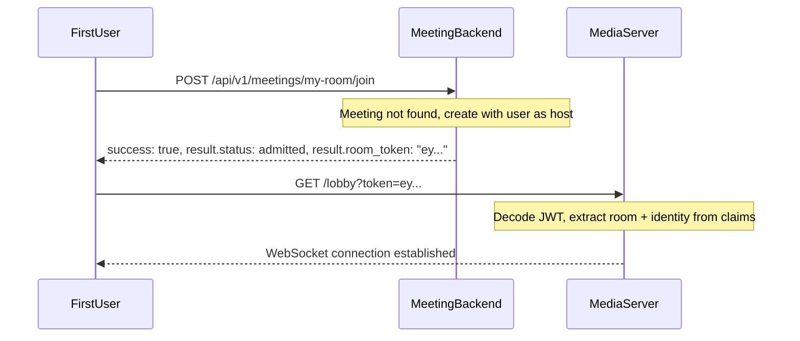

# Meeting API Documentation

This document describes the Meeting Backend API endpoints for creating meetings, managing the waiting room, and issuing room access tokens.

> **See Also**: [Meeting Ownership & Architecture](MEETING_OWNERSHIP.md) for the system architecture, two-service model, token flow, and meeting lifecycle.

## Overview

The Meeting Backend is a **separate microservice** (its own binary, process, and port) that handles all meeting business logic. It issues signed JWT room access tokens that clients use to connect to the Media Server.

The meeting flow:

1. **Host** creates a meeting (or one is auto-created on first join)
2. **Host** joins the meeting, activating it and receiving a **room access token**
3. **Attendees** request to join and enter the waiting room
4. **Host** admits or rejects attendees
5. **Admitted attendees** receive a **room access token** via status polling
6. **Clients connect** to the Media Server using their room access token
7. The Media Server **rejects** any connection without a valid, signed token (when `FEATURE_MEETING_MANAGEMENT=true`)

## Shared Types Crate

All request types, response types, error types, and JWT claims are defined in the `videocall-meeting-types` crate. This crate is framework-agnostic (no actix-web, no database types) and serves as the single source of truth for the API contract.

Key types:

| Type | Location | Description |
|------|----------|-------------|
| `APIResponse<A>` | `responses.rs` | Envelope: `{ "success": bool, "result": A }` |
| `APIError` | `error.rs` | Error payload with `code`, `message`, `engineering_error` |
| `CreateMeetingRequest` | `requests.rs` | Request body for meeting creation |
| `JoinMeetingRequest` | `requests.rs` | Request body for joining a meeting |
| `AdmitRequest` | `requests.rs` | Request body for admit/reject |
| `ListMeetingsQuery` | `requests.rs` | Query parameters for listing meetings |
| `ParticipantStatusResponse` | `responses.rs` | Canonical participant shape (used across multiple endpoints) |
| `RoomAccessTokenClaims` | `token.rs` | JWT claims for room access tokens |

### Response Envelope

Every endpoint returns an `APIResponse<T>` envelope:

```json
{ "success": true,  "result": { ... } }
{ "success": false, "result": { "code": "MEETING_NOT_FOUND", "message": "..." } }
```

All success and error examples below show the full envelope.

## Authentication

All endpoints require a **signed session JWT**, issued by the Meeting Backend after a successful OAuth login. The session token can be delivered in two ways:

1. **HttpOnly cookie** (web browsers): After OAuth login, the server sets `Set-Cookie: session=<JWT>; HttpOnly; Secure; SameSite=Lax`. The browser sends it automatically with every request. JavaScript cannot read it, which prevents XSS token theft.

2. **Authorization header** (non-browser clients): `Authorization: Bearer <session_jwt>`. Use this for CLI tools, mobile apps, or API testing.

```bash
# Option 1: Cookie (set automatically by the browser after OAuth login)
-H "Cookie: session=<session_jwt>"

# Option 2: Bearer header (for curl, mobile, CLI)
-H "Authorization: Bearer <session_jwt>"
```

### Session JWT Claims

The session JWT contains these claims:

| Claim | Description |
|-------|-------------|
| `sub` | User email (identity principal) |
| `name` | Display name |
| `exp` | Expiration (Unix timestamp) |
| `iat` | Issued-at (Unix timestamp) |
| `iss` | `"videocall-meeting-backend"` |

> **Note**: The session JWT authenticates requests to the Meeting Backend only. To connect to the Media Server, clients must present a separate **room access token** (JWT) issued by the Meeting Backend when a participant is admitted to a meeting.

## Room Access Token

The room access token is a signed JWT (HMAC-SHA256) that authorizes a client to connect to the Media Server for a specific room. See [Meeting Ownership & Architecture](MEETING_OWNERSHIP.md#room-access-token) for the full token specification.

Key points:
- Issued when a participant's status becomes `admitted`
- Scoped to a specific room and participant
- Contains identity, room, host status, and display name
- Has a configurable TTL (expiration applies to initial connection only)
- Delivered in the `room_token` field of API responses

## Meeting States

| State | Description |
|-------|-------------|
| `idle` | Meeting created but host hasn't joined yet |
| `active` | Host has joined, room access token issued, meeting is in progress |
| `ended` | Meeting has ended (host left or all participants left) |

> **Note:** A meeting automatically transitions to `ended` when:
> - The host leaves the meeting, OR
> - All admitted participants have left the meeting

## Participant Status

| Status | Description |
|--------|-------------|
| `waiting` | In waiting room, pending approval. No room token issued. |
| `admitted` | Approved by host. Room access token available. |
| `rejected` | Denied entry by host. |
| `left` | Previously in meeting, now left. |

## Timestamps

All timestamps in API responses are **Unix seconds** (not milliseconds). This applies to `created_at`, `started_at`, `ended_at`, `joined_at`, and `admitted_at`.

---

## API Endpoints

All endpoints are served by the Meeting Backend on its own port (default: 8081).

### List Meetings (My Meetings)

Lists all meetings **owned by the authenticated user** (excludes deleted meetings, includes ended meetings).

```
GET /api/v1/meetings
```

**Query Parameters:**

| Parameter | Type | Default | Description |
|-----------|------|---------|-------------|
| `limit` | integer | 20 | Maximum number of meetings to return (1-100) |
| `offset` | integer | 0 | Number of meetings to skip for pagination |

**Response (200 OK):**
```json
{
  "success": true,
  "result": {
    "meetings": [
      {
        "meeting_id": "standup-2024",
        "host": "host@example.com",
        "state": "active",
        "has_password": false,
        "created_at": 1706918400,
        "participant_count": 3,
        "started_at": 1706918400,
        "ended_at": null,
        "waiting_count": 1
      }
    ],
    "total": 1,
    "limit": 20,
    "offset": 0
  }
}
```

> **Rust type**: `APIResponse<ListMeetingsResponse>` (each entry is a `MeetingSummary`)

> **Note**: Ended meetings remain in the list until the owner explicitly deletes them. This allows owners to rejoin or restart meetings with the same ID.

**Errors:**

| Status | Code | Description |
|--------|------|-------------|
| 401 | `UNAUTHORIZED` | Invalid or missing session |

**Error example (401):**
```json
{
  "success": false,
  "result": {
    "code": "UNAUTHORIZED",
    "message": "Authentication required."
  }
}
```

---

### Create Meeting

Creates a new meeting. The authenticated user becomes the host. The meeting starts in `idle` state.

```
POST /api/v1/meetings
```

**Request Body:**
```json
{
  "meeting_id": "my-meeting",
  "attendees": ["user@example.com"],
  "password": "secret123"
}
```

| Field | Type | Required | Description |
|-------|------|----------|-------------|
| `meeting_id` | string | No | Meeting identifier. Auto-generated (12 chars) if omitted. |
| `attendees` | string[] | No | Pre-registered attendee emails (max 100). |
| `password` | string | No | Meeting password (hashed with Argon2 before storage). |

**Response (201 Created):**
```json
{
  "success": true,
  "result": {
    "meeting_id": "my-meeting",
    "host": "host@example.com",
    "created_at": 1706918400,
    "state": "idle",
    "attendees": ["user@example.com"],
    "has_password": true
  }
}
```

> **Rust type**: `APIResponse<CreateMeetingResponse>`

**Errors:**

| Status | Code | Description |
|--------|------|-------------|
| 401 | `UNAUTHORIZED` | Invalid or missing session |
| 400 | `INVALID_MEETING_ID` | Invalid ID format |
| 400 | `TOO_MANY_ATTENDEES` | More than 100 attendees |
| 409 | `MEETING_EXISTS` | Meeting ID already taken |

**Error example (409):**
```json
{
  "success": false,
  "result": {
    "code": "MEETING_EXISTS",
    "message": "Meeting with ID 'my-meeting' already exists"
  }
}
```

---

### Get Meeting Info

Retrieves meeting information and your participation status.

```
GET /api/v1/meetings/{meeting_id}
```

**Response (200 OK):**
```json
{
  "success": true,
  "result": {
    "meeting_id": "my-meeting",
    "state": "active",
    "host": "host@example.com",
    "host_display_name": "Alice",
    "has_password": false,
    "your_status": {
      "email": "attendee@example.com",
      "display_name": "Bob",
      "status": "waiting",
      "is_host": false,
      "joined_at": 1706918500,
      "admitted_at": null,
      "room_token": null
    }
  }
}
```

> **Rust type**: `APIResponse<MeetingInfoResponse>` (with nested `ParticipantStatusResponse`)

**Errors:**

| Status | Code | Description |
|--------|------|-------------|
| 401 | `UNAUTHORIZED` | Invalid or missing session |
| 404 | `MEETING_NOT_FOUND` | Meeting does not exist |

---

### Delete Meeting (Owner Only)

Soft-deletes a meeting. Only the meeting owner can delete their meetings.

- Sets `deleted_at` timestamp (soft delete)
- Meeting no longer appears in "My Meetings" list
- The meeting ID can be reused by any user after deletion

```
DELETE /api/v1/meetings/{meeting_id}
```

**Response (200 OK):**
```json
{
  "success": true,
  "result": {
    "message": "Meeting 'my-meeting' has been deleted"
  }
}
```

> **Rust type**: `APIResponse<DeleteMeetingResponse>`

**Errors:**

| Status | Code | Description |
|--------|------|-------------|
| 401 | `UNAUTHORIZED` | Invalid or missing session |
| 403 | `NOT_OWNER` | Not the meeting owner |
| 404 | `MEETING_NOT_FOUND` | Meeting does not exist |

---

### Join Meeting

Request to join a meeting. If the meeting doesn't exist, it will be **automatically created** with the joining user as the owner/host.

- **First user to join** becomes the host; the meeting is created and activated
- **Hosts** are auto-admitted and receive a `room_token` immediately
- **Attendees** (non-hosts) enter the waiting room (no `room_token` until admitted)

```
POST /api/v1/meetings/{meeting_id}/join
```

**Request Body (optional):**
```json
{
  "display_name": "Alice"
}
```

**Response for hosts (200 OK):**
```json
{
  "success": true,
  "result": {
    "email": "host@example.com",
    "display_name": "Alice",
    "status": "admitted",
    "is_host": true,
    "joined_at": 1706918400,
    "admitted_at": 1706918400,
    "room_token": "eyJhbGciOiJIUzI1NiIs..."
  }
}
```

**Response for attendees (200 OK):**
```json
{
  "success": true,
  "result": {
    "email": "attendee@example.com",
    "display_name": "Bob",
    "status": "waiting",
    "is_host": false,
    "joined_at": 1706918500,
    "admitted_at": null,
    "room_token": null
  }
}
```

> **Rust type**: `APIResponse<ParticipantStatusResponse>`

The `room_token` is only present when `status` is `"admitted"`. Attendees in the waiting room must poll `GET /status` until they receive their token.

**Errors:**

| Status | Code | Description |
|--------|------|-------------|
| 401 | `UNAUTHORIZED` | Invalid or missing session |
| 400 | `MEETING_NOT_ACTIVE` | Meeting exists but host hasn't joined yet |

> **Note:** If the meeting doesn't exist, it is created automatically with the joining user as the host.

---

### Get Waiting Room

Lists all participants waiting to be admitted. Any admitted participant can view the waiting room.

```
GET /api/v1/meetings/{meeting_id}/waiting
```

**Response (200 OK):**
```json
{
  "success": true,
  "result": {
    "meeting_id": "my-meeting",
    "waiting": [
      {
        "email": "attendee1@example.com",
        "display_name": "Bob",
        "status": "waiting",
        "is_host": false,
        "joined_at": 1706918500,
        "admitted_at": null,
        "room_token": null
      },
      {
        "email": "attendee2@example.com",
        "display_name": "Charlie",
        "status": "waiting",
        "is_host": false,
        "joined_at": 1706918510,
        "admitted_at": null,
        "room_token": null
      }
    ]
  }
}
```

> **Rust type**: `APIResponse<WaitingRoomResponse>` (each entry is a `ParticipantStatusResponse`)

**Errors:**

| Status | Code | Description |
|--------|------|-------------|
| 401 | `UNAUTHORIZED` | Invalid or missing session |
| 403 | `NOT_HOST` | Requester is not an admitted participant |
| 404 | `MEETING_NOT_FOUND` | Meeting does not exist |

---

### Admit Participant

Admits a participant from the waiting room. Any admitted participant can admit others. A room access token is generated for the admitted participant.

```
POST /api/v1/meetings/{meeting_id}/admit
```

**Request Body:**
```json
{
  "email": "attendee@example.com"
}
```

**Response (200 OK):**
```json
{
  "success": true,
  "result": {
    "email": "attendee@example.com",
    "display_name": "Bob",
    "status": "admitted",
    "is_host": false,
    "joined_at": 1706918500,
    "admitted_at": 1706918600,
    "room_token": null
  }
}
```

> **Rust type**: `APIResponse<ParticipantStatusResponse>`

The admitted participant picks up their `room_token` on their next `GET /status` poll. The `room_token` is `null` in the admit response because the token is delivered to the participant, not to the admitter.

**Errors:**

| Status | Code | Description |
|--------|------|-------------|
| 401 | `UNAUTHORIZED` | Invalid or missing session |
| 403 | `NOT_HOST` | Requester is not an admitted participant |
| 404 | `PARTICIPANT_NOT_FOUND` | Participant not in waiting room |
| 404 | `MEETING_NOT_FOUND` | Meeting does not exist |

---

### Admit All Participants

Admits all participants currently in the waiting room at once. Room access tokens are generated for each admitted participant.

```
POST /api/v1/meetings/{meeting_id}/admit-all
```

**Response (200 OK):**
```json
{
  "success": true,
  "result": {
    "admitted_count": 2,
    "admitted": [
      {
        "email": "attendee1@example.com",
        "display_name": "Bob",
        "status": "admitted",
        "is_host": false,
        "joined_at": 1706918500,
        "admitted_at": 1706918600,
        "room_token": null
      },
      {
        "email": "attendee2@example.com",
        "display_name": "Charlie",
        "status": "admitted",
        "is_host": false,
        "joined_at": 1706918510,
        "admitted_at": 1706918600,
        "room_token": null
      }
    ]
  }
}
```

> **Rust type**: `APIResponse<AdmitAllResponse>` (each entry is a `ParticipantStatusResponse`)

**Errors:**

| Status | Code | Description |
|--------|------|-------------|
| 401 | `UNAUTHORIZED` | Invalid or missing session |
| 403 | `NOT_HOST` | Requester is not an admitted participant |
| 404 | `MEETING_NOT_FOUND` | Meeting does not exist |

---

### Reject Participant

Rejects a participant from the waiting room.

```
POST /api/v1/meetings/{meeting_id}/reject
```

**Request Body:**
```json
{
  "email": "attendee@example.com"
}
```

**Response (200 OK):**
```json
{
  "success": true,
  "result": {
    "email": "attendee@example.com",
    "display_name": "Bob",
    "status": "rejected",
    "is_host": false,
    "joined_at": 1706918500,
    "admitted_at": null,
    "room_token": null
  }
}
```

> **Rust type**: `APIResponse<ParticipantStatusResponse>`

**Errors:**

| Status | Code | Description |
|--------|------|-------------|
| 401 | `UNAUTHORIZED` | Invalid or missing session |
| 403 | `NOT_HOST` | Requester is not an admitted participant |
| 404 | `PARTICIPANT_NOT_FOUND` | Participant not in waiting room |

---

### Get My Status

Check your current status in a meeting. This is the primary polling endpoint for attendees in the waiting room. When status becomes `admitted`, the response includes the `room_token` needed to connect to the Media Server.

```
GET /api/v1/meetings/{meeting_id}/status
```

**Response when waiting (200 OK):**
```json
{
  "success": true,
  "result": {
    "email": "attendee@example.com",
    "display_name": "Bob",
    "status": "waiting",
    "is_host": false,
    "joined_at": 1706918500,
    "admitted_at": null,
    "room_token": null
  }
}
```

**Response when admitted (200 OK):**
```json
{
  "success": true,
  "result": {
    "email": "attendee@example.com",
    "display_name": "Bob",
    "status": "admitted",
    "is_host": false,
    "joined_at": 1706918500,
    "admitted_at": 1706918600,
    "room_token": "eyJhbGciOiJIUzI1NiIs..."
  }
}
```

> **Rust type**: `APIResponse<ParticipantStatusResponse>`

The client should use the `room_token` to connect to the Media Server immediately upon receiving it.

**Errors:**

| Status | Code | Description |
|--------|------|-------------|
| 401 | `UNAUTHORIZED` | Invalid or missing session |
| 404 | `NOT_IN_MEETING` | Haven't requested to join |

---

### Leave Meeting

Leave a meeting. The meeting automatically ends when:
- The host leaves, OR
- All admitted participants have left

```
POST /api/v1/meetings/{meeting_id}/leave
```

**Response (200 OK):**
```json
{
  "success": true,
  "result": {
    "email": "attendee@example.com",
    "display_name": "Bob",
    "status": "left",
    "is_host": false,
    "joined_at": 1706918500,
    "admitted_at": 1706918600,
    "room_token": null
  }
}
```

> **Rust type**: `APIResponse<ParticipantStatusResponse>`

**Errors:**

| Status | Code | Description |
|--------|------|-------------|
| 401 | `UNAUTHORIZED` | Invalid or missing session |
| 404 | `NOT_IN_MEETING` | Not a participant in this meeting |

---

### Get Participants

Lists all admitted participants currently in the meeting.

```
GET /api/v1/meetings/{meeting_id}/participants
```

**Response (200 OK):**
```json
{
  "success": true,
  "result": [
    {
      "email": "host@example.com",
      "display_name": "Alice",
      "status": "admitted",
      "is_host": true,
      "joined_at": 1706918400,
      "admitted_at": 1706918400,
      "room_token": null
    },
    {
      "email": "attendee@example.com",
      "display_name": "Bob",
      "status": "admitted",
      "is_host": false,
      "joined_at": 1706918500,
      "admitted_at": 1706918600,
      "room_token": null
    }
  ]
}
```

> **Rust type**: `APIResponse<Vec<ParticipantStatusResponse>>`
>
> **Note**: The `room_token` field is `null` in participant listings. Tokens are only delivered to the participant themselves via `POST /join` or `GET /status`.

**Errors:**

| Status | Code | Description |
|--------|------|-------------|
| 401 | `UNAUTHORIZED` | Invalid or missing session |
| 404 | `MEETING_NOT_FOUND` | Meeting does not exist |

---

## Connecting to the Media Server

After receiving a `room_token`, the client connects to the Media Server using the **token-based endpoint**:

```
GET /lobby?token=<room_access_token>
```

- **WebSocket**: `ws://host:8080/lobby?token=<JWT>`
- **WebTransport**: `https://host:4433/lobby?token=<JWT>`

The identity (email) and room are extracted from the JWT claims (`sub` and `room`). There are no email or room parameters in the URL -- the **token is the sole source of truth**.

The Media Server:
1. Validates the JWT signature using the shared `JWT_SECRET`
2. Checks the `exp` claim (rejects expired tokens)
3. Verifies `room_join == true`
4. Extracts `sub` (identity), `room` (room ID), `is_host`, and `display_name`
5. Establishes the WebSocket or WebTransport connection
6. **Rejects the connection** if the token is missing, invalid, or expired

### Deprecated Endpoint

The legacy path-based endpoint is still available for backward compatibility:

```
GET /lobby/{email}/{room}
```

This endpoint is **deprecated** and only works when `FEATURE_MEETING_MANAGEMENT=false`. When meeting management is enabled, it returns **HTTP 410 Gone**. Clients should migrate to the token-based endpoint above.

---

## Usage Flows

### Ad-hoc Meeting Flow

The simplest way to start a meeting -- just join any meeting ID. If it doesn't exist, you become the host and receive a token immediately.



### Scheduled Meeting Flow

For scheduled meetings, explicitly create the meeting first.


### Rejected Attendee Flow

A rejected attendee never receives a token and cannot connect to the Media Server.


---

## Example: Complete Meeting Session

```bash
# Meeting Backend runs on port 8081
# Media Server runs on port 8080
#
# SESSION_TOKEN is a signed session JWT obtained after OAuth login.
# In a browser, this is stored as an HttpOnly cookie and sent automatically.
# For curl testing, use the Authorization header.

# 1. Host creates meeting
curl -X POST http://localhost:8081/api/v1/meetings \
  -H "Content-Type: application/json" \
  -H "Authorization: Bearer $SESSION_TOKEN" \
  -d '{"meeting_id": "standup-2024"}'

# Response:
# {"success":true,"result":{"meeting_id":"standup-2024","host":"host@example.com",
#   "created_at":1706918400,"state":"idle","attendees":[],"has_password":false}}

# 2. Host joins meeting (activates it, receives room token)
curl -X POST http://localhost:8081/api/v1/meetings/standup-2024/join \
  -H "Authorization: Bearer $SESSION_TOKEN"

# Response:
# {"success":true,"result":{"email":"host@example.com","display_name":null,
#   "status":"admitted","is_host":true,"joined_at":1706918400,
#   "admitted_at":1706918400,"room_token":"eyJhbGciOiJIUzI1NiIs..."}}

# 3. Host connects to Media Server with the room token
#    (In practice, the client UI does this automatically)
#    WebSocket: ws://localhost:8080/lobby?token=eyJhbGciOiJIUzI1NiIs...

# 4. Attendee tries to join (using their own session token)
curl -X POST http://localhost:8081/api/v1/meetings/standup-2024/join \
  -H "Authorization: Bearer $ALICE_SESSION_TOKEN" \
  -H "Content-Type: application/json" \
  -d '{"display_name": "Alice"}'

# Response:
# {"success":true,"result":{"email":"alice@example.com","display_name":"Alice",
#   "status":"waiting","is_host":false,"joined_at":1706918500,
#   "admitted_at":null,"room_token":null}}

# 5. Host checks waiting room
curl http://localhost:8081/api/v1/meetings/standup-2024/waiting \
  -H "Authorization: Bearer $SESSION_TOKEN"

# Response:
# {"success":true,"result":{"meeting_id":"standup-2024",
#   "waiting":[{"email":"alice@example.com","display_name":"Alice",...}]}}

# 6. Host admits Alice
curl -X POST http://localhost:8081/api/v1/meetings/standup-2024/admit \
  -H "Content-Type: application/json" \
  -H "Authorization: Bearer $SESSION_TOKEN" \
  -d '{"email": "alice@example.com"}'

# 7. Alice polls and receives her room token
curl http://localhost:8081/api/v1/meetings/standup-2024/status \
  -H "Authorization: Bearer $ALICE_SESSION_TOKEN"

# Response:
# {"success":true,"result":{"email":"alice@example.com","display_name":"Alice",
#   "status":"admitted","is_host":false,"joined_at":1706918500,
#   "admitted_at":1706918600,"room_token":"eyJhbGciOiJIUzI1NiIs..."}}

# 8. Alice connects to Media Server with her room token
#    WebSocket: ws://localhost:8080/lobby?token=eyJhbGciOiJIUzI1NiIs...

# 9. When done, participants leave
curl -X POST http://localhost:8081/api/v1/meetings/standup-2024/leave \
  -H "Authorization: Bearer $ALICE_SESSION_TOKEN"

# 10. Host leaves (ends the meeting)
curl -X POST http://localhost:8081/api/v1/meetings/standup-2024/leave \
  -H "Authorization: Bearer $SESSION_TOKEN"
```

---

## Database Schema

All tables are owned by the Meeting Backend. The Media Server does not access them.

### meetings table

| Column | Type | Description |
|--------|------|-------------|
| id | SERIAL | Primary key |
| room_id | VARCHAR(255) | Unique meeting identifier |
| creator_id | VARCHAR(255) | Host email |
| state | VARCHAR(50) | `idle`, `active`, `ended` |
| password_hash | VARCHAR(255) | Argon2 hashed password |
| attendees | JSONB | Pre-registered attendees |
| started_at | TIMESTAMPTZ | When meeting started |
| ended_at | TIMESTAMPTZ | When meeting ended |
| deleted_at | TIMESTAMPTZ | Soft delete timestamp |
| host_display_name | VARCHAR(255) | Cached host display name |

### meeting_participants table

Single source of truth for participant state. Replaces the legacy `session_participants` table.

| Column | Type | Description |
|--------|------|-------------|
| id | SERIAL | Primary key |
| meeting_id | INTEGER | Foreign key to meetings |
| email | VARCHAR(255) | Participant email |
| display_name | VARCHAR(255) | Participant's chosen display name |
| status | VARCHAR(50) | `waiting`, `admitted`, `rejected`, `left` |
| is_host | BOOLEAN | Whether this is the host |
| joined_at | TIMESTAMPTZ | When joined/entered waiting room |
| admitted_at | TIMESTAMPTZ | When admitted by host |
| left_at | TIMESTAMPTZ | When left the meeting |

---

## Testing

Both the Meeting Backend and the Media Server have comprehensive test suites. All tests run via a single entry point.

### Running Tests

```bash
# Run all backend tests (requires Docker for integration tests)
make tests_run

# Tear down test containers
make tests_down
```

`make tests_run` performs the following in order:
1. `cargo fmt --check` (workspace-wide)
2. `cargo clippy -- -D warnings` (workspace-wide)
3. `cargo machete` (unused dependency check)
4. Docker integration tests (both `meeting-api` and `videocall-api` against PostgreSQL)

### Test Coverage

The test suite includes **101 tests** across both crates:

#### Meeting Backend (49+ tests: 30 unit + 25 integration)

| Category | Tests |
|----------|-------|
| **Meeting CRUD** | Create meeting success, auto-generate ID, duplicate ID, too many attendees, get meeting success, not found, list meetings with pagination, delete success, not owner (403) |
| **Participant Flow** | Host joins and activates + receives token, attendee waits, meeting not active, leave success, get status success, get participants |
| **Waiting Room** | Get waiting room, admit success, admit not found, admit all, reject |
| **Session Auth (AuthUser)** | Valid session cookie, valid Bearer token, missing credentials (401), invalid JWT (401), expired JWT (401), wrong secret (401), cookie precedence over Bearer, session cookie among multiple cookies |
| **Session Token** | Round-trip, wrong secret fails, expired fails, iat is set |
| **Room Token Generation** | Round-trip validation, issuer correctness, expiration TTL, room_join flag |
| **Error Responses** | 401/403/404/409 codes, engineering_error field |
| **Ad-hoc Join** | Auto-creates meeting, issued token is valid JWT |
| **Meeting ID Validation** | Alphanumeric, hyphens, underscores, rejects special chars, rejects empty/too-long, generated IDs are unique and valid |

#### Media Server (52 tests: 44 unit + 8 JWT integration)

| Category | Tests |
|----------|-------|
| **JWT Validation (unit)** | decode_room_token: valid/expired/wrong secret/room_join=false/garbage. validate_room_token (deprecated): valid/room mismatch/identity mismatch |
| **JWT Integration (WebSocket)** | Token endpoint (`/lobby?token=`): valid connects, expired rejected, room_join=false rejected, invalid signature rejected, garbage rejected, identity extracted from JWT. Deprecated endpoint (`/lobby/{email}/{room}`): FF=off allows, FF=on returns 410 Gone |
| **Session Management** | Start/end session, system email rejection, protobuf packet builders |
| **Chat Server** | Join room success, system email rejection, join without session, cleanup retry |
| **WebSocket Lifecycle** | End-to-end meeting lifecycle over WebSocket |
| **WebTransport** | Meeting lifecycle, relay between two clients, lobby isolation |
| **Metrics** | 19 tests covering metrics export, session tracking, health packets, cleanup |
| **Packet Handling** | Packet classification, RTT detection |

### CI/CD

Tests run automatically on pull requests that modify:
- `actix-api/**` - Media Server source code
- `meeting-api/**` - Meeting Backend source code
- `dbmate/**` - Database migrations
- `videocall-types/**` - Shared types (media/transport)
- `videocall-meeting-types/**` - Shared types (meeting API)
- `protobuf/**` - Protocol buffers
- `docker/**` - Docker configuration

See `.github/workflows/cargo-test.yaml` for the full workflow configuration.
