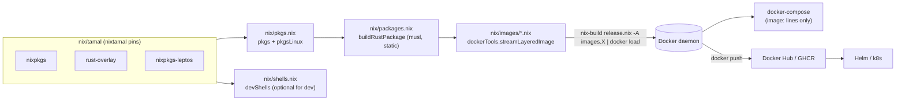
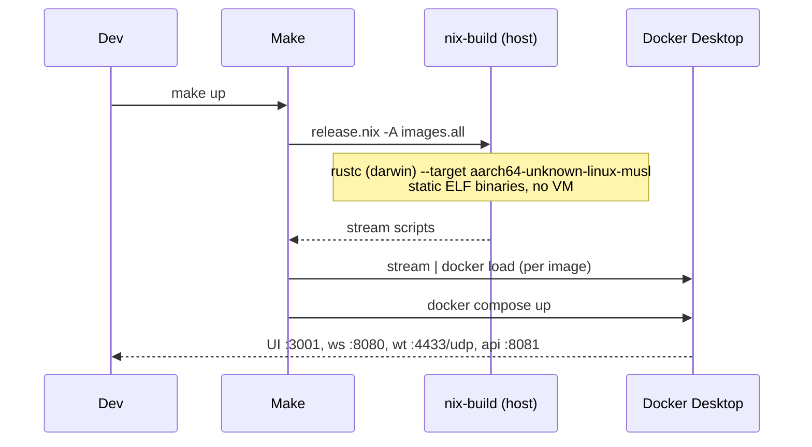

# Nix Build Architecture

**Status:** approved design, staged rollout in progress
**Replaces:** `flake.nix` / `flake.lock`, all dev Dockerfiles, and eventually every Dockerfile in the repo.

## Why

The previous setup ran Nix *inside* Docker: each dev service was a `nixos/nix` container that
bind-mounted the repo, kept a private copy of the Nix store in a `nix-store-*` volume, and ran
`nix develop /app#backend-dev --command cargo watch …` at startup. That meant:

- the entire Rust build was containerized (slow on macOS, no benefit anywhere),
- every service duplicated a multi-GB Nix store into a Docker volume,
- three compose stacks and CI each maintained their own Dockerfile variants of the same idea.

This design inverts it. **Nix builds artifacts; Docker only runs them.**

Goals:

1. **No flakes.** Native Nix entry points: `default.nix`, `shell.nix`, `release.nix`.
2. **No Dockerfiles.** Every app image is a `dockerTools` derivation; docker-compose consumes
   `image:` lines only.
3. **Local dev needs no Docker at all.** `make dev` runs the entire stack — middleware included —
   as native processes under process-compose (see Developer workflow); services hot-reload under
   `cargo watch`. `shell.nix` provides the pinned toolchains.
4. **`make` drives everything** — the dev stack, images, tests, pin updates.
5. **CI publishes the exact same derivations** it would build locally.

## The model

Straight from the [nix.dev Docker tutorial](https://nix.dev/tutorials/nixos/building-and-running-docker-images.html):
the *host* package set assembles the image, and only the *payload* comes from a Linux package set.

```nix
{ pkgs      ? import <nixpkgs> { }
, pkgsLinux ? import <nixpkgs> { system = "x86_64-linux"; }
}:
pkgs.dockerTools.buildImage {
  name = "hello-docker";
  config = { Cmd = [ "${pkgsLinux.hello}/bin/hello" ]; };
}
```

A Docker image is a Linux filesystem. On a Linux host, `pkgsLinux` is just the native package set.
On macOS the tutorial's answer is *"cross compile to Linux by replacing `pkgsLinux.hello` with
`pkgs.pkgsCross.musl64.hello`"* — no VM, no remote builder, Docker Desktop only runs the result.

In our tree the split lives in `nix/pkgs.nix` and resolves per host:

| Host | `pkgs` (assembles images, runs tools) | `pkgsLinux` (payload) |
|---|---|---|
| `aarch64-darwin` (dev Macs) | native darwin | **cross** `aarch64-unknown-linux-musl` |
| `x86_64-linux` (CI `ubuntu-latest`) | native linux | **native** `x86_64-unknown-linux-musl` |
| `aarch64-linux` (CI arm runners) | native linux | **native** `aarch64-unknown-linux-musl` |

Rust makes the macOS cross leg cheap: `rust-overlay` ships prebuilt `std` for
`*-unknown-linux-musl` that runs on Darwin, so no cross `rustc` is ever bootstrapped — only a C
cross-compiler for the `-sys` crates (built once, then cached).

Static musl binaries keep the images minimal: payload + `cacert` + `tzdata`, nothing else.



### Why `streamLayeredImage`

`streamLayeredImage` (not `buildLayeredImage`): its output is a *script* that emits the image
tarball when run, so image assembly happens host-side at `docker load` time. This sidesteps
`dockerTools`-under-`pkgsCross` issues ([nixpkgs#266840](https://github.com/NixOS/nixpkgs/issues/266840))
and keeps multi-hundred-MB tarballs out of the Nix store:

```console
$ $(nix-build release.nix -A images.websocket-server --no-out-link) | docker load
```

## Dependency pinning — nixtamal

[nixtamal](https://nixtamal.toast.al/) replaces `flake.lock`. The manifest is declarative KDL at
`nix/tamal/manifest.kdl`; `nixtamal lock` writes `lock.json` and a bootstrap `default.nix`; all
three are committed. Nix code consumes pins as:

```nix
inputs = import ./nix/tamal { };
pkgs   = import inputs.nixpkgs { … };
```

Three inputs (the same ones the flake had, minus flake-utils, which is flake-only):

| Input | Why |
|---|---|
| `nixpkgs` | everything |
| `nixpkgs-leptos` | older tree that still has `cargo-leptos` 0.2.42 (leptos 0.5.x needs 0.2.x) |
| `rust-overlay` | pinned Rust toolchains: stable 1.93.1, nightly 2024-11-01, musl + wasm targets |

**Contributors never need nixtamal** — evaluating pins requires plain Nix only. The tool is needed
to *update* pins: `make pins-update` (= `nixtamal refresh && nixtamal lock`).

## File layout

```
default.nix                    # entry point: { shells, packages, images }
shell.nix                      # -> (import ./default.nix {}).shells.default
release.nix                    # CI/deploy surface: one attr per artifact
nix/
  tamal/                       # nixtamal: manifest.kdl, lock.json, default.nix (all committed)
  pkgs.nix                     # the pkgs/pkgsLinux split (table above)
  rust.nix                     # toolchains + makeRustPlatform wiring
  shells.nix                   # devShells (ported verbatim from the old flake) + shells.dev
  dev-stack.nix                # native dev stack: process-compose config + middleware wrappers
  packages.nix                 # buildRustPackage per service + dioxus dist
  images/common.nix            # shared streamLayeredImage helper
  images/<service>.nix         # one file per image
  dioxus-ui-component-tests.sh
```

## Image inventory

| release.nix attr | Payload | Feeds |
|---|---|---|
| `images.websocket-server` | `websocket_server` bin, :8080 | compose `websocket-api` |
| `images.webtransport-server` | `webtransport_server` bin, UDP :4433 + health :5321 | compose `webtransport-api` |
| `images.metrics-server` | `metrics_server` bin, :9091 | compose `metrics-api` |
| `images.server-stats` | `metrics_server_snapshot` bin, :9092 | compose `server-stats-api` |
| `images.meeting-api` | `meeting-api` bin + dbmate + migrations; Cmd = `startup.sh && meeting-api` | compose `meeting-api`, Docker Hub |
| `images.bot` | `bot` bin | compose `synthetic-clients` |
| `images.dioxus-ui` | trunk `dist/` + Caddy + entrypoint writing `config.js` from env | compose `dioxus-ui`, Docker Hub |
| `images.media-server` | ALL actix binaries + dbmate (Cmd `websocket_server`) | Docker Hub `videocall-media-server` → helm websocket + webtransport charts |

(The leptos `website` image is deferred to Stage 3 — cargo-leptos 0.2.x + nightly under the musl
cross set is its own project. `make dev-website` covers local hacking; `docker/Dockerfile.website`
and its publish workflow stay untouched until then.)

Notes:

- The wasm in `dioxus-ui` is **arch-neutral** — built by the host toolchain targeting
  `wasm32-unknown-unknown` (trunk, tailwindcss, wasm-bindgen-cli 0.2.108, binaryen); only the web
  server comes from the Linux set. That server is **Caddy** (static Go binary), not nginx:
  cross-nginx drags in cross-perl, which does not build at the current nixpkgs pin. The Caddyfile
  replicates `nginx.conf` (SPA `try_files` fallback + no-cache headers).
- `media-server` exists for prod parity: helm's websocket and webtransport charts both point at one
  `securityunion/videocall-media-server` image with different commands, exactly like the old
  `Dockerfile.actix`.
- Build metadata (`GIT_SHA`, `GIT_BRANCH`, `BUILD_TIMESTAMP`) is pinned in the derivations — the
  `build.rs` files already prefer env vars and fall back gracefully, and unpinned values would
  break reproducibility.

## Developer workflow

The dev loop is docker-compose-shaped but containerless:
[process-compose](https://github.com/F1bonacc1/process-compose) — the supervisor the
services-flake/devenv ecosystems build on — runs the *whole* stack as native host processes.
`nix/dev-stack.nix` generates the process-compose config: postgres (`postgresql_16`, initdb'd into
`.data/postgres`, trust auth on 127.0.0.1) and NATS (`nats-server -js`) come straight from
nixpkgs; a health-gated one-shot creates the app database (the role `POSTGRES_DB` played in the
container); the Rust services run under `cargo watch`; the UI runs under `trunk serve`; prometheus
and grafana run natively with the *same* configs as the container stack, rewritten from container
DNS to localhost at nix build time so they can't drift.

Env for every process is layered *built-in defaults* < `.env` < `.env.local` (both
untracked; `.env.local` for secrets/personal overrides).

```console
$ make dev               # everything: TUI, health-gated deps, hot reload, zero Docker
$ make dev-middleware    # only postgres/nats/prometheus/grafana …
$ make dev-websocket     # … then hack one service per terminal (works with rustup too)
```

Dependency semantics match compose exactly: `meeting-api` waits for
`postgres-init: process_completed_successfully` + `nats: process_healthy` (readiness probes:
`pg_isready`, NATS `/healthz`), like `depends_on: condition: service_healthy`.

Full stack from the real images (this is where Docker comes in):

```console
$ make images            # nix-build all image derivations, docker load each
$ make up                # docker compose up (image: lines only)
```

Sequence for a full-stack run on a Mac:



## CI

Runners are Linux, so `pkgsLinux` evaluates **natively** — CI never cross-compiles. All workflows
use the same tutorial flow as `make image-*`:

```yaml
- uses: cachix/install-nix-action@v31                  # upstream Nix, official installer
- uses: cachix/cachix-action@v16
  with: { name: videocall-rs, authToken: "${{ secrets.CACHIX_AUTH_TOKEN }}" }
- run: $(nix-build release.nix -A images.meeting-api --no-out-link) | docker load
- run: docker tag … && docker push …                   # same :branch-sha8 / :latest / :pr-N scheme
```

### Caching: crane + cachix, nothing else

Dependency compilation is split from member compilation by [crane](https://github.com/ipetkov/crane)
(nixtamal-pinned, flake-free import):

- `packages.nativeDeps` — deps of the three shipped native crates, compiled for musl once.
  Its drv hash is immune to source edits and `gitSha`/`buildTimestamp` (probe-verified), so it
  only rebuilds on `Cargo.lock`/manifest/toolchain changes.
- `packages.wasmDeps` — deps of the three trunk invocations (UI + two workers), each with that
  invocation's exact feature set, in ONE derivation. Not a chain: crane's `buildDepsOnly`
  hard-codes `cargoArtifacts = null`, silently discarding chained predecessors. Verified at the
  cargo unit-hash level: the artifact holds all three web-sys variants trunk requests, and the
  trunk build compiles zero dependencies.
- `packages.ciWarm` — the two deps artifacts plus every static runtime payload (caddy, busybox,
  dbmate + its Go toolchain, musl tzdata/cacert) that public caches don't carry.

All of it is served by **cachix** (`videocall-rs.cachix.org`, public reads, token-gated writes):
`cachix-action` pushes every path a job builds *or restores*, and nix substitutes naturally
during any build — CI on any branch, PRs, and developer machines share one org-wide cache. The
member crates a commit touches are the only compilation a warm run performs.

Measured: image legs 23-38 min (before) → **2m24s-4m50s** (warm cachix), vs ~10 min wall for the
docker-era 4-job matrix.

Two dead ends, documented so they stay dead:
- **magic-nix-cache**: throttled by the GitHub cache API and self-disabling; zero uploads.
- **GHA store snapshots (cache-nix-action)**: restored files under the *running* nix daemon,
  whose open SQLite db never registered them — nix planned full 1566-drv rebuilds right after
  "successful" 1.6 GB restores. Every leg was secretly cold until cachix replaced it.

Test workflows run through the pinned shells (`nix-shell default.nix -A shells.…`); path filters
watch `default.nix`, `release.nix`, `nix/**` instead of `flake.*`.

## Staged migration

| Stage | Work | Dockerfiles removed |
|---|---|---|
| 0 | This document | — |
| 1 | tamal pins, `default.nix`/`release.nix`/`shell.nix`, all app images, compose rewiring, Makefile, README | `docker/Dockerfile.{actix,dioxus,website}.dev` |
| 2 | GitHub Actions: publish from `release.nix`, tests via `nix-shell` | `Dockerfile.actix`, `Dockerfile.meeting-api`, `Dockerfile.dioxus`, `docker/Dockerfile.website` |
| 3 | Fringe: videocall-cli, engineering-vlog, protobuf codegen, neteq example, leptos website image | the rest — after this, zero Dockerfiles in the repo |

### Where Docker still legitimately lives

Dev and integration testing are now **zero-docker** (`make dev`, `make tests_run` — middleware
comes from nixpkgs under process-compose). Docker remains only where containers *are* the
deliverable:

- `docker/docker-compose.yaml` (`make up`) — prod-parity full-container smoke run. This is now
  the only image-runtime check: e2e went native (`e2eStack` in `nix/dev-stack.nix`), which tests
  the same nix-built payloads (release dist, server binaries) but no longer exercises image
  assembly or entrypoints — that residual risk is carried by `docker-build-check` (assembly)
  and `make up` (runtime).
- CI publish (`docker load`/`push` of nix-built images) — could go daemon-less with skopeo later.
- Stage-3 stragglers above, each still Dockerfile-built until nixified.

## Risks & mitigations

1. **`aws-lc-sys` under cross.** rustls 0.23 defaults pull `aws-lc-rs` (C + perlasm + bindgen)
   because `actix-api` enables `ring` without `default-features = false`. If the cross build trips
   here, set `default-features = false` on the rustls/quinn deps to unify on `ring` —
   behavior-neutral, the code already selects the ring backend.
2. **First cross build on a Mac is slow.** Hydra doesn't cache `pkgsCross`, so the musl cross-gcc
   builds once (tens of minutes), then lives in the store. Escape hatch if ever needed:
   zig-as-cross-linker (the `cargo-zigbuild` pattern).
3. **dioxus-ui vendoring.** Trunk must run offline over `importCargoLock`-vendored deps and build
   two extra wasm workers (`worker_decoder`, `neteq_worker`). Contained: it replicates exactly what
   `Dockerfile.dioxus` did, and wasm has no cross dimension.
4. **cargo-leptos 0.2.x + nightly + musl.** If the website build fights the cross target, the
   website image slips to Stage 3 without blocking anything else.
