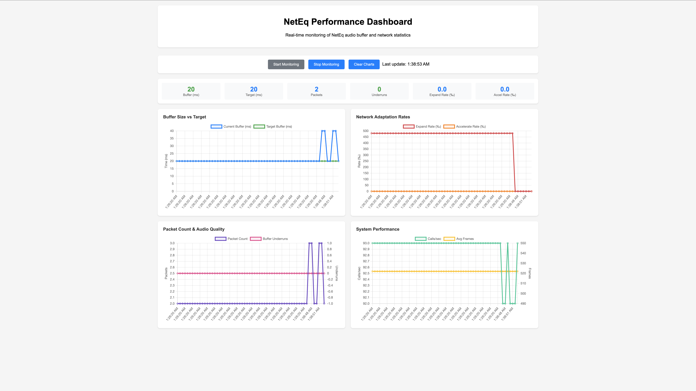

# NetEq Performance Dashboard

A real-time web dashboard for monitoring NetEq audio buffer and network statistics.

## Quick Start

### Complete Example with Rust Server

Here's a complete workflow using the native Rust server:

```bash
# Terminal 1: Start the dashboard server
cargo run --bin dashboard_server

# Terminal 2: Start NetEq player with stats
RUST_LOG=info cargo run --example neteq_player --features=native -- \
  --json-stats \
  --reorder-window-ms 50 \
  --min-delay-ms 100 \
  --volume 0.5 \
  ~/path/to/your/audio.wav

# Or test with NetEQ bypass mode for A/B comparison:
RUST_LOG=info cargo run --release --example neteq_player --features=native -- \
  --json-stats \
  --no-neteq \
  --reorder-window-ms 50 \
  --volume 0.5 \
  ~/Downloads/BundyBests2.wav

# Open browser to: http://localhost:8000/dashboard.html
```

### 1. Run NetEq Player with JSON Stats

```bash
# Start the NetEq player with JSON statistics output
RUST_LOG=info cargo run --example neteq_player --features=native -- \
  --json-stats \
  --reorder-window-ms 200 \
  --min-delay-ms 100 \
  --volume 0.5 \
  ~/path/to/your/audio.wav
```

### 2. Start the Dashboard Server

In a new terminal, choose one of these options:

#### Option A: Rust Axum Server (Recommended)
```bash
# Start the built-in Rust server
cargo run --bin dashboard_server --features=native

# Or with custom port
cargo run --bin dashboard_server --features=native -- --port 8080
```

### 3. Open the Dashboard

Open your browser and go to: http://localhost:8000/dashboard.html

Click "Start Monitoring" to begin real-time visualization.

## What You'll See


*Real-time NetEq performance monitoring with interactive charts*

### Key Metrics

- **Buffer Size**: Current audio buffer size vs target (should stay close to target)
- **Expand Rate**: How often NetEq stretches audio to fill gaps (lower is better)
- **Accelerate Rate**: How often NetEq speeds up audio to catch up (lower is better) 
- **Packet Count**: Number of packets in NetEq's buffer
- **Underruns**: Buffer underrun events (should be 0)
- **Reorder Rate**: Percentage of packets arriving out of order (‰)
- **Reordered Packets**: Total count of packets that arrived out of sequence
- **Max Reorder Distance**: Maximum sequence number gap for reordered packets

### Charts

1. **Buffer Size vs Target**: Shows how well NetEq maintains its target buffer size
2. **Network Adaptation Rates**: Shows expand/accelerate rates indicating network issues
3. **Packet Count & Audio Quality**: Shows packet availability and underrun events
4. **Packet Reordering Analysis**: Shows reordering rate and maximum reorder distance
5. **System Performance**: Shows callback frequency and frame processing
6. **Packet Sequence & Timestamps**: Scatter plot showing RTP sequence vs timestamp order

### Health Indicators

- **Green**: Good performance
- **Red**: Issues detected (buffer at 0ms, underruns occurring)
- **Blue**: Normal operation

## Interpreting the Data

### Buffer Behavior
- **Ideal**: Buffer size stays near target (e.g., 20ms ± 20%)
- **Problem**: Frequent drops to 0ms indicate packet delivery issues
- **Problem**: High variability suggests network jitter

### Expand Rate
- **Good**: < 50‰ (per-myriad)
- **Concerning**: > 200‰ 
- **Problem**: > 500‰ (like the ~480‰ you observed)

High expand rates mean NetEq is frequently stretching audio, indicating:
- Packets arriving late
- Packet loss
- Network jitter exceeding NetEq's adaptive capabilities

### Buffer Underruns
- **Ideal**: 0 underruns
- **Problem**: Any underruns mean audio dropouts/glitches

## Troubleshooting Audio Issues

Based on the dashboard data:

1. **High Expand Rate (like your 480‰)**:
   - Reduce network simulation parameters
   - Check packet timing in producer thread
   - Increase initial buffer warmup

2. **Frequent 0ms Buffer**:
   - Packets not arriving fast enough
   - Producer thread timing issues
   - Network simulation too aggressive

3. **Buffer Underruns**:
   - NetEq completely out of data
   - Critical timing issue
   - Need immediate investigation

## Command Line Options

```bash
cargo run --example neteq_player --features=native -- \
  --json-stats                    # Enable JSON output for dashboard
  --reorder-window-ms 50          # Packet reordering simulation (0-200ms)
  --max-jitter-ms 20              # Additional jitter simulation (0-500ms)
  --volume 0.0                    # Audio volume (0.0=mute, 1.0=full, 2.0=200%)
  --min-delay-ms 100              # Minimum delay for NetEQ buffer (0-500ms)
  --no-neteq                      # Bypass NetEQ and decode directly (A/B testing)
  path/to/audio.wav
```

### NetEQ Bypass Mode

Use `--no-neteq` to disable NetEQ processing and decode Opus packets directly:

- **Purpose**: A/B testing to measure NetEQ's impact on audio quality
- **Behavior**: Packets are decoded immediately upon arrival without jitter buffering
- **Use Case**: Compare audio quality with/without NetEQ under identical network conditions
- **Limitations**: No reordering correction, no adaptive algorithms, no concealment

### Minimum Delay Configuration

Use `--min-delay-ms` to set the minimum jitter buffer delay:

- **Default**: 0ms (adaptive based on network conditions)
- **Low values (0-50ms)**: More responsive but less resilient to jitter
- **Medium values (50-150ms)**: Balanced performance for most networks
- **High values (150-500ms)**: More robust against severe jitter but higher latency
- **Effect**: Higher minimum delay provides more time to reorder packets and handle network variations
- **Trade-off**: Latency vs. audio quality under poor network conditions

## Interpreting Reordering Data

### Reorder Rate
- **Good**: < 10‰ (less than 1% of packets reordered)
- **Concerning**: 10-50‰
- **Problem**: > 50‰ indicates significant network issues

### Packet Sequence Chart
- **Ideal**: Points form a smooth ascending line
- **Reordering**: Points appear below the expected sequence line
- **Gaps**: Missing points indicate packet loss
- **Clusters**: Grouped points suggest bursty reordering

## Files Generated

- `neteq_stats.jsonl`: Real-time statistics in JSON Lines format
- Console logs: Human-readable statistics

## Tips

- Start with no network simulation to establish baseline
- Gradually increase jitter/reordering to test resilience
- Use dashboard to tune NetEq parameters
- Monitor expand rate as primary health indicator
- Keep buffer size stable and near target
- Use `--volume 0.0` to mute audio for silent performance testing
- Use `--volume 0.1` for quiet monitoring while analyzing data
- **For reordering tests**: Use `--min-delay-ms 100` to give NetEQ time to reorder packets
- **Higher min-delay-ms** reduces reorder rate but increases latency
- **Compare bypass mode** with different min-delay-ms values to measure NetEQ benefits 
