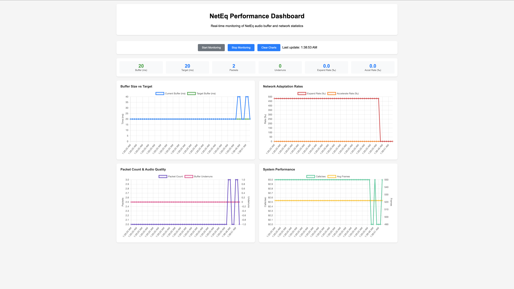

# Rust NetEQ — Adaptive Jitter Buffer for Real-Time Audio

Part of the **[videocall.rs](https://github.com/security-union/videocall-rs)** real-time communication stack.

> **Project status:** early preview – API is settling, performance tuning in progress.

Rust NetEQ is a pure-Rust, libWebRTC-inspired jitter buffer designed for professional, low-latency audio applications. It smooths out bursty networks, conceals packet loss, and keeps playback on time so that downstream DSP or audio renderers can focus on sound, not sockets.

## Why Rust NetEQ?

* **Latency you control** – adaptive target delay with hard minimum/maximum bounds.
* **Rock-solid ordering** – duplicate detection, re-sequencing, and smart flushing protect against wild packet arrival patterns.
* **Seamless playout** – accelerate, pre-emptive expand, and classical expand algorithms reduce audible artifacts without introducing heavy CPU cost.
* **Actionable metrics** – detailed runtime statistics make debugging network conditions trivial.
* **Zero unsafe ✨** – implemented in 100 % safe Rust; integrates into `no_std` builds that provide an allocator.

## At a Glance

```toml
[dependencies]
neteq = "0.1"
```

Insert RTP payloads as they arrive, call `get_audio()` every 10 ms, and let the buffer handle the rest.  Full runnable snippets live in the [examples](examples) directory — open `basic_usage.rs` first.

## Feature Highlights

| Category             | What you get                                                    |
|----------------------|-----------------------------------------------------------------|
| Delay management     | Quantile-based estimator, exponential smoothing                 |
| Time-stretching      | Accelerate • Pre-emptive Expand • Classical Expand              |
| Buffer housekeeping  | Age trimming • Overflow flush • Duplicate suppression           |
| Statistics           | Per-frame network & lifetime counters for observability         |
| Configuration        | Sample-rate aware, channel agnostic, compile-time feature flags |


## Architecture Overview

```
┌─────────────────┐    ┌─────────────────┐    ┌─────────────────┐
│   AudioPacket   │    │  PacketBuffer   │    │  DelayManager   │
│                 │───▶│                 │───▶│                 │
│ • RTP Header    │    │ • Ordered Queue │    │ • Adaptive      │
│ • Audio Data    │    │ • Duplicate Det │    │ • Statistics    │
│ • Timestamps    │    │ • Smart Flush   │    │ • Target Delay  │
└─────────────────┘    └─────────────────┘    └─────────────────┘
                                   │
                                   ▼
┌─────────────────┐    ┌─────────────────┐    ┌─────────────────┐
│ TimeStretching  │    │     NetEQ       │    │   Statistics    │
│                 │◀───│                 │───▶│                 │
│ • Accelerate    │    │ • Decision      │    │ • Network Stats │
│ • Preemptive    │    │ • Decode        │    │ • Lifetime      │
│ • Expand        │    │ • Control       │    │ • Operations    │
└─────────────────┘    └─────────────────┘    └─────────────────┘
```

Each 10 ms tick NetEQ decides between **Normal**, **Accelerate**, **Pre-emptive Expand**, or **Expand** based on buffer fullness and arrival trends.  Decisions and their rationale are exposed through the statistics API for post-analysis.

## Examples

| Example              | Highlights                                              |
|----------------------|---------------------------------------------------------|
| `basic_usage.rs`     | Minimal integration loop                                |
| `neteq_player.rs`    | WAV replay with user-defined jitter & re-ordering knobs |

Run any example with

```bash
cargo run --release --example basic_usage
```

## Performance Dashboard

Monitor NetEq performance in real-time with our interactive web dashboard. Track buffer health, network adaptation rates, and audio quality metrics.

📊 **[Complete Dashboard Setup Guide →](DASHBOARD_README.md)**



Key features:
- Real-time buffer size vs target monitoring
- Network adaptation rate visualization  
- Audio quality metrics and underrun detection
- Configurable volume control for silent testing
- Native Rust axum web server

## Roadmap

1. Advanced concealment (pitch-based PLC)
2. Voice Activity Detection integration
3. Multi-codec framing helpers (Opus, LC3 …)
4. SIMD accelerations for time-stretch routines

Contributions are welcome — please skim the [CONTRIBUTING.md](CONTRIBUTING.md) first.

## License

MIT OR Apache-2.0

## License and Attribution

This project is licensed under MIT OR Apache-2.0.

### WebRTC Attribution

This NetEQ implementation is algorithmically inspired by and compatible with the WebRTC NetEQ jitter buffer. The original WebRTC project is:
- Copyright (c) 2011, The WebRTC project authors
- Licensed under the 3-clause BSD license  
- Available at: https://webrtc.googlesource.com/src/

This Rust implementation is an independent rewrite and is not a derivative work of the WebRTC source code.

