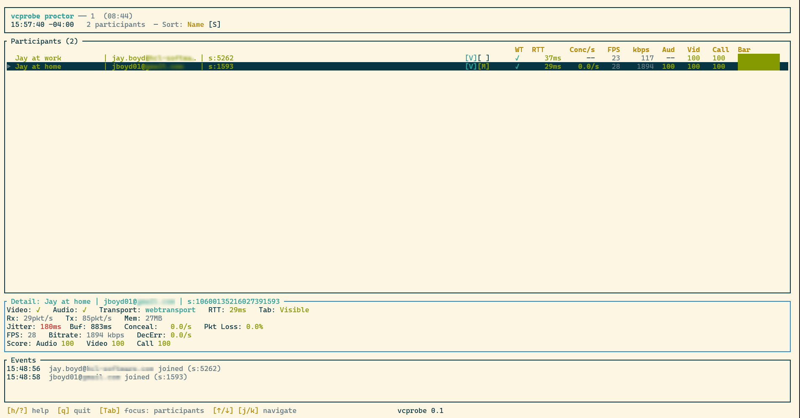
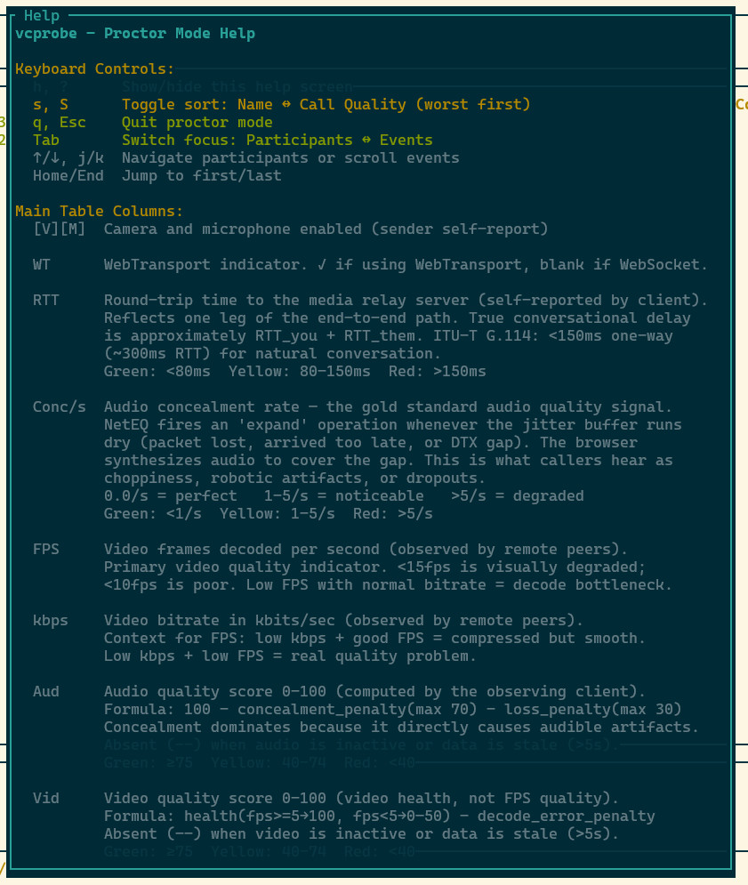
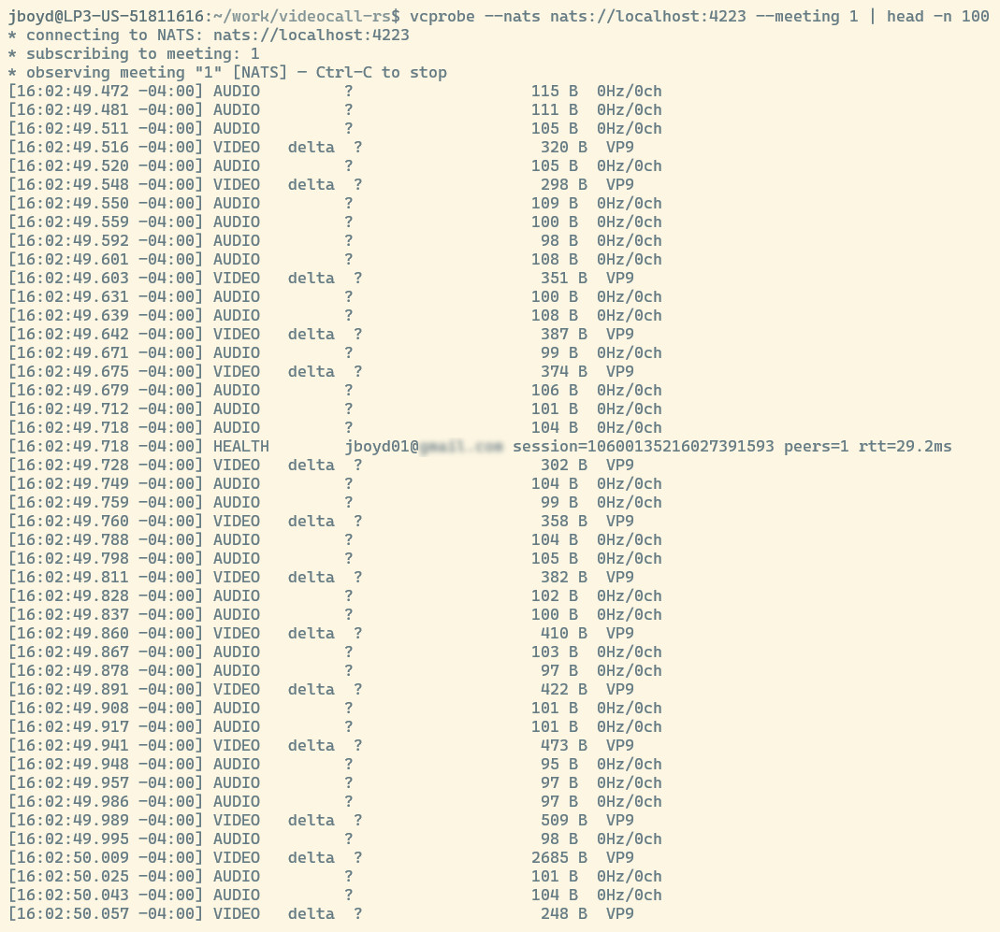

# vcprobe

Command-line diagnostic tool for videocall-rs meetings. Joins a meeting as a passive observer and displays packet-level activity in real time. Supports three transport modes (WebTransport, WebSocket, NATS) and two display modes (scrolling log, full-screen TUI dashboard).

## Build

```bash
cargo build --release -p vcprobe
```

## Usage

### Scrolling log (default)

Join a meeting and print one line per packet:

```bash
# WebTransport
vcprobe https://webtransport.example.com/lobby/observer/meeting-1

# WebSocket
vcprobe wss://websocket.example.com/lobby/observer/meeting-1

# NATS (subscribe to health packets — no session join)
# This requires access to your NATS server, either locally or perhaps via
# portforwarding
vcprobe --nats nats://localhost:4222 --meeting meeting-1
```

### Proctor mode (full-screen TUI dashboard)

Live participant table with video/mic status, call quality scores, and an event log.
This option requires connectivity to your NATS server (here I'm using `kubectl` port forwarding)

```bash
vcprobe --nats nats://localhost:4222 --meeting meeting-1 --proctor
```

Keyboard shortcuts in proctor mode:

| Key | Action |
|-----|--------|
| `q` / `Esc` | Quit |
| `s` | Toggle sort: join order vs. call quality |
| `Tab` | Switch focus between participant table and event log |
| `Up`/`Down` or `j`/`k` | Scroll focused panel |
| `Home` / `End` | Jump to top / bottom |
| `?` | Toggle help overlay |

### Probe mode (connectivity check)

Connect, wait for session assignment, then exit. Useful for health checks:

```bash
vcprobe --probe https://webtransport.example.com/lobby/probe/meeting-1
vcprobe --probe --timeout 3 wss://websocket.example.com/lobby/probe/meeting-1
```

Exit code 0 = connected successfully, 1 = failed or timed out.

## CLI Reference

| Flag | Description |
|------|-------------|
| `<URL>` | Meeting URL (`https://` for WebTransport, `wss://` for WebSocket) |
| `--nats <URL>` | NATS server URL (e.g., `nats://localhost:4222`) |
| `--meeting <ID>` | Meeting ID (required with `--nats`) |
| `--proctor` | Full-screen TUI dashboard |
| `--probe` | Connectivity check (join then exit) |
| `--timeout <N>` | Exit after N seconds |
| `-v` / `--verbose` | Show sequence numbers, sizes, crypto packets |
| `-q` / `--quiet` | Suppress status lines; only show packet summaries |
| `--utc` | Timestamps in UTC (default: local time) |
| `--insecure` | Skip TLS certificate verification |

## Transport Modes

**WebTransport / WebSocket**: vcprobe joins the meeting as a real participant (sends CONNECTION + heartbeat packets). It receives all media, heartbeat, and health packets forwarded by the relay. Useful for verifying end-to-end packet flow.

**NATS**: vcprobe subscribes to the health packet NATS subject for a meeting without joining the meeting itself. It only sees health packets (not media). This is the preferred mode for `--proctor` since it doesn't consume relay bandwidth or appear as a participant.

## Proctor Dashboard

The proctor TUI displays:

- **Participant table**: session ID, display name, audio/video enabled, talking status, call quality score (color-coded), active server URL, RTT
- **Health details**: tab visibility, memory usage, packet rates, send queue depth
- **Event log**: join/leave events, quality changes, connection events

Quality scores are color-coded: green (75-100), yellow (40-74), red (0-39).

### Proctor mode dashboard



### Proctor mode help overlay



### NATS packet log view



## Architecture

```
vcprobe
  ├── main.rs         — CLI parsing, mode dispatch
  ├── transport.rs    — WebTransport, WebSocket, NATS connection handlers
  ├── nats_transport.rs — NATS subscription logic
  ├── display.rs      — Scrolling log packet formatter
  ├── proctor.rs      — Full-screen ratatui TUI
  └── state.rs        — MeetingState: participant tracking, health aggregation
```

## Examples

A test health publisher is included for development:

```bash
cargo run --example test_health_publisher -p vcprobe
```

This publishes synthetic health packets to a local NATS server, useful for testing the proctor dashboard without a live meeting.
