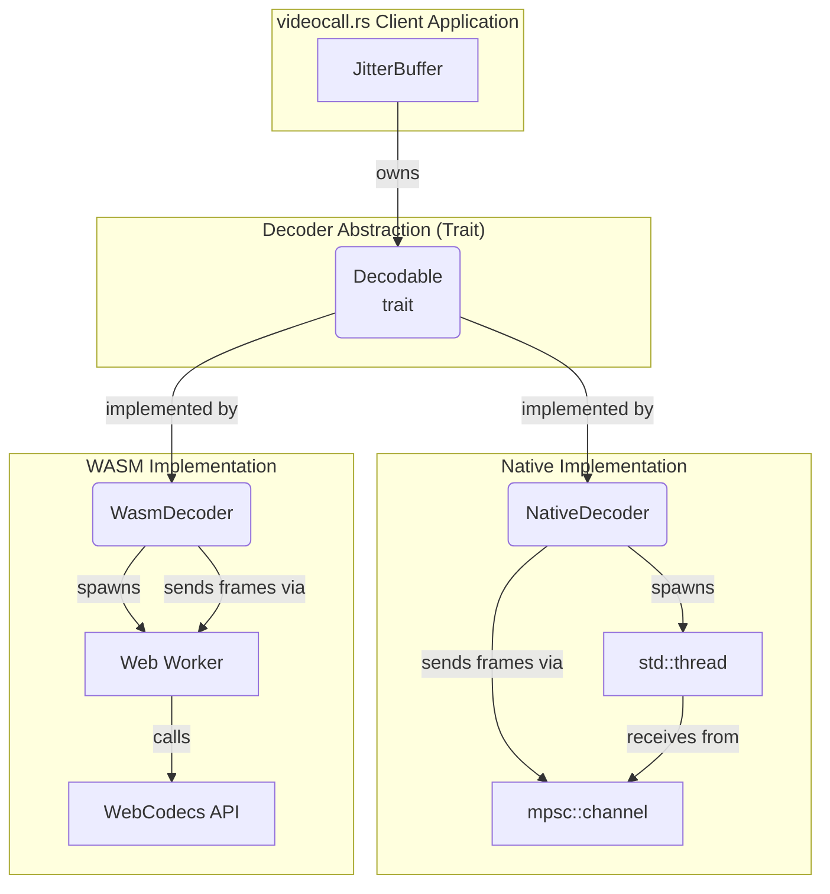

# `videocall-codecs`: Jitter Buffer & Decoder

<a href="https://opensource.org/licenses/MIT"></a>
<a href="https://discord.gg/JP38NRe4CJ"></a> 
<a href="https://www.digitalocean.com/?refcode=6de4e19c5193&utm_campaign=Referral_Invite&utm_medium=Referral_Program&utm_source=badge"></a>

This crate is a core component of the **[videocall.rs](https://github.com/security-union/videocall-rs)** project. It provides a high-fidelity, cross-platform video decoder and jitter buffer, implemented in pure Rust. It is designed to mirror the core architectural concepts of the jitter buffer found in Google's `libwebrtc`, but with a simplified, modern, and idiomatic Rust API.

The primary goal of this crate is to provide a robust mechanism for `videocall.rs` clients to receive encoded video frames from an unreliable network, reorder them, buffer them to smooth out network jitter, and prepare them for a decoder in a continuous, monotonic sequence.

## Features

- **Cross-platform**: Works on native (libvpx) and WASM (WebCodecs) targets
- **Built-in Jitter Buffer**: Automatic frame reordering, gap detection, and adaptive playout delay
- **Ergonomic API**: Simple `push_frame()` interface hides complexity
- **VP9 Codec Support**: High-quality video compression
- **Real-time Optimized**: Designed for low-latency video streaming

## Quick Start

### Basic Usage

```rust
use videocall_codecs::{
    decoder::{Decoder, VideoCodec},
    frame::{FrameBuffer, VideoFrame, FrameType}
};

// Create a decoder with a callback for decoded frames
let decoder = Decoder::new(
    VideoCodec::VP9,
    Box::new(|decoded_frame| {
        println!("Decoded frame: {}x{}", decoded_frame.width, decoded_frame.height);
    })
);

// Create and push frames - jitter buffer handles the rest!
let video_frame = VideoFrame {
    sequence_number: 1,
    frame_type: FrameType::KeyFrame,
    data: encoded_data,
    timestamp: 0.0,
};

let frame_buffer = FrameBuffer::new(video_frame, current_time_ms);
decoder.decode(frame_buffer);
```

### WASM with Canvas Rendering

For WASM targets, you can receive `VideoFrame` objects directly for canvas rendering:

```rust
#[cfg(target_arch = "wasm32")]
use videocall_codecs::decoder::WasmDecoder;

#[cfg(target_arch = "wasm32")]
let decoder = WasmDecoder::new_with_video_frame_callback(
    VideoCodec::VP9,
    Box::new(|video_frame: web_sys::VideoFrame| {
        // Render to canvas
        let canvas = get_canvas_element();
        let ctx = canvas.get_context("2d").unwrap();
        ctx.draw_image_with_video_frame(&video_frame, 0.0, 0.0).unwrap();
        video_frame.close();
    })
);

// Same simple API
decoder.push_frame(frame_buffer);
```

## Architecture

### Jitter Buffer

The built-in jitter buffer automatically handles:

- **Frame Reordering**: Out-of-order frames are buffered and played in sequence
- **Gap Recovery**: Jumps to keyframes when frames are lost
- **Adaptive Delay**: Adjusts playout delay based on network jitter
- **Buffer Management**: Prevents buffer overflow with configurable limits

### Cross-Platform Design

```
┌─────────────────┐    ┌──────────────────┐    ┌─────────────────┐
│   Your App      │    │  videocall-codecs │    │   Platform      │
│                 │    │                  │    │                 │
│ decoder.decode()│───▶│  JitterBuffer    │───▶│ Native: libvpx  │
│                 │    │  FrameReordering │    │ WASM: WebCodecs │
│                 │    │  AdaptiveDelay   │    │                 │
└─────────────────┘    └──────────────────┘    └─────────────────┘
```

## Web Worker Setup (WASM)

For WASM builds, the decoder runs in a Web Worker for better performance. Add this to your `index.html`:

```html
<!-- Compile the worker -->
<link
    data-trunk
    rel="rust"
    href="../videocall-codecs/Cargo.toml"
    data-bin="worker_decoder"
    data-type="worker"
    data-cargo-features="wasm"
    data-cargo-no-default-features
    data-loader-shim
/> 

<!-- Runtime link for decoder -->
<link id="codecs-worker" href="/worker_decoder_loader.js" />
```

## API Reference

### Core Types

#### `VideoFrame`
```rust
pub struct VideoFrame {
    pub sequence_number: u64,
    pub frame_type: FrameType,
    pub data: Vec<u8>,
    pub timestamp: f64,
}
```

#### `FrameType`
```rust
pub enum FrameType {
    KeyFrame,    // I-frame, can be decoded independently
    DeltaFrame,  // P-frame, depends on previous frames
}
```

#### `FrameBuffer`
```rust
pub struct FrameBuffer {
    pub frame: VideoFrame,
    pub arrival_time_ms: u128,
}

impl FrameBuffer {
    pub fn new(frame: VideoFrame, arrival_time_ms: u128) -> Self;
}
```

### Decoder Trait

```rust
pub trait Decodable: Send + Sync {
    type Frame;
    
    fn new(
        codec: VideoCodec, 
        on_decoded_frame: Box<dyn Fn(Self::Frame) + Send + Sync>
    ) -> Self;
    
    fn decode(&self, frame: FrameBuffer);
}
```

### Platform-Specific APIs

#### Native Decoder
- Returns `DecodedFrame` with raw image data
- Uses libvpx for VP9 decoding
- Runs decoding in background thread

#### WASM Decoder  
- Returns `VideoFrame` objects for direct canvas rendering
- Uses WebCodecs API in Web Worker
- Includes `push_frame()` method for ergonomic usage

## Configuration

### Jitter Buffer Settings

The jitter buffer uses these constants (configurable in source):

```rust
const MIN_PLAYOUT_DELAY_MS: f64 = 10.0;   // Minimum buffering delay
const MAX_PLAYOUT_DELAY_MS: f64 = 500.0;  // Maximum buffering delay  
const JITTER_MULTIPLIER: f64 = 3.0;       // Safety margin for jitter
const MAX_BUFFER_SIZE: usize = 200;       // Maximum frames in buffer
```

### Cargo Features

```toml
[features]
default = ["native"]
native = []  # Enable native libvpx decoder
wasm = [     # Enable WASM WebCodecs decoder
    "wasm-bindgen",
    "web-sys", 
    "js-sys",
    # ... other WASM dependencies
]
```

## Examples

### Real-time Video Streaming

```rust
use videocall_codecs::{decoder::*, frame::*};

struct VideoStreamer {
    decoder: Decoder,
}

impl VideoStreamer {
    fn new(canvas_id: &str) -> Self {
        let canvas_id = canvas_id.to_owned();
        
        let decoder = Decoder::new(
            VideoCodec::VP9,
            Box::new(move |decoded_frame| {
                // Handle decoded frame (platform-specific)
                render_frame(&canvas_id, decoded_frame);
            })
        );
        
        Self { decoder }
    }
    
    fn on_network_packet(&self, packet_data: Vec<u8>, sequence: u64) {
        let frame = VideoFrame {
            sequence_number: sequence,
            frame_type: detect_frame_type(&packet_data),
            data: packet_data,
            timestamp: get_timestamp(),
        };
        
        let frame_buffer = FrameBuffer::new(frame, current_time_ms());
        
        // Jitter buffer handles everything automatically!
        self.decoder.decode(frame_buffer);
    }
}
```

### Error Handling

```rust
// The decoder handles most errors internally:
// - Invalid frames are dropped
// - Decoder errors trigger reset
// - Buffer overflow is managed automatically

// Your callback should handle rendering errors:
let decoder = Decoder::new(VideoCodec::VP9, Box::new(|frame| {
    if let Err(e) = render_to_canvas(frame) {
        log::error!("Rendering failed: {}", e);
    }
}));
```

## Performance Tips

1. **Keyframe Frequency**: Send keyframes regularly for gap recovery
2. **Sequence Numbers**: Use monotonic sequence numbers for proper ordering
3. **Buffer Size**: Adjust `MAX_BUFFER_SIZE` based on network conditions
4. **Worker Threads**: WASM decoder automatically uses Web Workers for performance

## Testing

```bash
# Run all tests
cargo test

# Test specific features
cargo test --features native
cargo test --features wasm

# Test jitter buffer specifically  
cargo test jitter_buffer
```

## License

Licensed under either of Apache License, Version 2.0 or MIT license at your option.



## Usage

The `videocall-codecs` crate is consumed by other parts of the `videocall.rs` project, such as `videocall-client` and `videocall-cli`. The following examples show how it can be integrated.

### In a Native Rust Project (like `videocall-cli`)

Add this crate as a dependency in `Cargo.toml`:

```toml
[dependencies]
videocall-codecs = { path = "../videocall-codecs" }
```

Then, instantiate and use the system:

```rust
use videocall_codecs::{
    decoder::{Decodable, Decoder},
    jitter_buffer::JitterBuffer
};
use std::sync::{Arc, Mutex};

// 1. Define a callback for when frames are decoded.
let on_decoded_frame = |frame| {
    println!("Render frame #{}", frame.sequence_number);
};

// 2. Create the platform-specific decoder.
let decoder = Decoder::new(Box::new(on_decoded_frame));

// 3. Create the JitterBuffer, giving it the decoder.
let jitter_buffer = Arc::new(Mutex::new(JitterBuffer::new(Box::new(decoder))));

// 4. In your network loop, insert frames as they arrive.
// let mut jb = jitter_buffer.lock().unwrap();
// jb.insert_frame(video_frame, arrival_time_ms);
```

### For the Web (WebAssembly)

This crate is configured for use with [`wasm-pack`](https://rustwasm.github.io/wasm-pack/) and is a key part of the `yew-ui` frontend.

1.  **Build the WASM modules**:

    ```bash
    wasm-pack build --target web --out-dir pkg -- --features wasm
    ```

    This command compiles both the main library and the worker binary, placing the output (`.wasm` and `.js` glue files) into a `pkg` directory.

2.  **Use in your Web App**:

    In your main application's JavaScript, you can now import and use the library. The `WasmDecoder` will automatically handle loading the worker.

    ```javascript
    import init, { JitterBuffer, Decoder } from './pkg/videocall_codecs.js';

    async function main() {
        await init();

        const onDecodedFrame = (frame) => {
            console.log("Render frame:", frame.sequence_number);
            // Here you would render the decoded frame data to a canvas
        };

        const decoder = Decoder.new(onDecodedFrame);
        const jitterBuffer = new JitterBuffer(decoder);

        // Feed frames into the jitter buffer from your network source (e.g., WebSocket)
        // jitterBuffer.insert_frame(videoFrame, arrivalTimeMs);
    }

    main();
    ```

## Running the Project

### Test Suite

To run the comprehensive test suite for the native target:

```bash
cargo test
```

### Simulation Binary

The project includes a terminal-based simulation that demonstrates the jitter buffer in action, complete with simulated packet loss and reordering. This is useful for testing the crate's logic in isolation.

To run the simulation:

```bash
cargo run --bin main
``` 