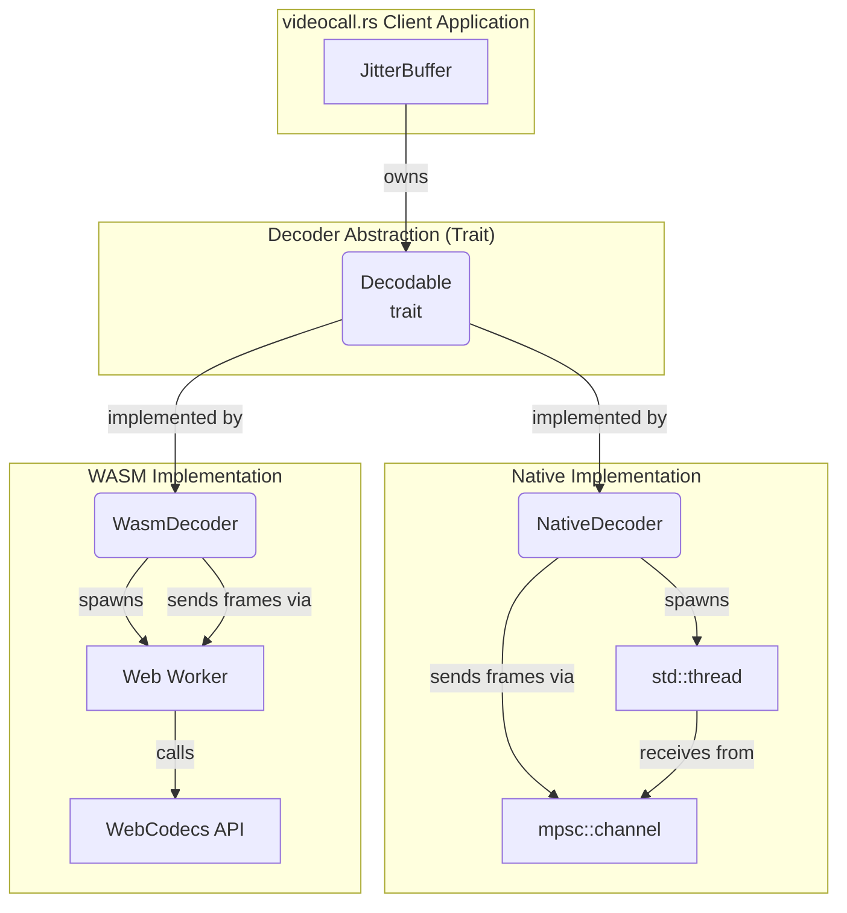

# `videocall-codecs`: Jitter Buffer & Decoder

<a href="https://opensource.org/licenses/MIT"></a>
<a href="https://discord.gg/JP38NRe4CJ"></a> 
<a href="https://www.digitalocean.com/?refcode=6de4e19c5193&utm_campaign=Referral_Invite&utm_medium=Referral_Program&utm_source=badge"></a>

This crate is a core component of the **[videocall.rs](https://github.com/security-union/videocall-rs)** project. It provides a high-fidelity, cross-platform video decoder and jitter buffer, implemented in pure Rust. It is designed to mirror the core architectural concepts of the jitter buffer found in Google's `libwebrtc`, but with a simplified, modern, and idiomatic Rust API.

The primary goal of this crate is to provide a robust mechanism for `videocall.rs` clients to receive encoded video frames from an unreliable network, reorder them, buffer them to smooth out network jitter, and prepare them for a decoder in a continuous, monotonic sequence.

## Core Features

- **Jitter Buffering**: Correctly reorders out-of-order video frames based on their sequence number.
- **Adaptive Playout Delay**: Dynamically adjusts the buffering delay based on a running estimate of network jitter (calculated using an RFC 3550-style algorithm). This allows the buffer to be resilient to changing network conditions while keeping latency as low as possible.
- **Frame Loss Recovery**: Recovers from dropped packets by waiting for the next available keyframe and dropping any intermediate, now-unusable delta frames.
- **Cross-Platform by Design**:
    - **Native**: On desktop targets (like the `videocall-cli`), the decoder runs in a dedicated `std::thread`, communicating with the jitter buffer via a high-performance MPSC channel.
    - **WebAssembly (WASM)**: For browser targets (like the `yew-ui`), the decoder is designed to run inside a **Web Worker**. It communicates with the main thread via `postMessage` and interfaces with the browser's built-in **WebCodecs API** for efficient, often hardware-accelerated, video decoding.
- **Extensive Test Suite**: A comprehensive set of unit tests validates the buffer's logic across a wide range of scenarios, including packet reordering, loss, and edge cases.

## Role in the `videocall.rs` Architecture

This crate is a foundational library for any `videocall.rs` client application. It encapsulates the complex logic of handling unpredictable network streams and turning them into a smooth flow of video frames ready for rendering.

The system is split into two main components, decoupled by a trait abstraction:

1.  **`JitterBuffer`**: The heart of the crate. This component receives `FrameBuffer` objects, measures network jitter, manages the adaptive playout delay, and holds frames until they are ready to be decoded. It is completely agnostic to the underlying platform.

2.  **`Decoder` (via the `Decodable` trait)**: This component is responsible for the actual decoding of a frame. The `Decodable` trait provides a simple API (`new` and `decode`). This crate provides two implementations used by different `videocall.rs` clients:
    - **`NativeDecoder`**: A wrapper around a `std::thread` for native builds.
    - **`WasmDecoder`**: A wrapper around a Web Worker that uses `wasm-bindgen` and `web-sys` to communicate with the browser's WebCodecs API.

This design ensures that the complex jitter buffer logic is written once and shared, while the platform-specific implementation details for different clients are cleanly encapsulated.



## Usage

The `videocall-codecs` crate is consumed by other parts of the `videocall.rs` project, such as `videocall-client` and `videocall-cli`. The following examples show how it can be integrated.

### In a Native Rust Project (like `videocall-cli`)

Add this crate as a dependency in `Cargo.toml`:

```toml
[dependencies]
videocall-codecs = { path = "../videocall-codecs" }
```

Then, instantiate and use the system:

```rust
use videocall_codecs::{
    decoder::{Decodable, Decoder},
    jitter_buffer::JitterBuffer
};
use std::sync::{Arc, Mutex};

// 1. Define a callback for when frames are decoded.
let on_decoded_frame = |frame| {
    println!("Render frame #{}", frame.sequence_number);
};

// 2. Create the platform-specific decoder.
let decoder = Decoder::new(Box::new(on_decoded_frame));

// 3. Create the JitterBuffer, giving it the decoder.
let jitter_buffer = Arc::new(Mutex::new(JitterBuffer::new(Box::new(decoder))));

// 4. In your network loop, insert frames as they arrive.
// let mut jb = jitter_buffer.lock().unwrap();
// jb.insert_frame(video_frame, arrival_time_ms);
```

### For the Web (WebAssembly)

This crate is configured for use with [`wasm-pack`](https://rustwasm.github.io/wasm-pack/) and is a key part of the `yew-ui` frontend.

1.  **Build the WASM modules**:

    ```bash
    wasm-pack build --target web --out-dir pkg -- --features wasm
    ```

    This command compiles both the main library and the worker binary, placing the output (`.wasm` and `.js` glue files) into a `pkg` directory.

2.  **Use in your Web App**:

    In your main application's JavaScript, you can now import and use the library. The `WasmDecoder` will automatically handle loading the worker.

    ```javascript
    import init, { JitterBuffer, Decoder } from './pkg/videocall_codecs.js';

    async function main() {
        await init();

        const onDecodedFrame = (frame) => {
            console.log("Render frame:", frame.sequence_number);
            // Here you would render the decoded frame data to a canvas
        };

        const decoder = Decoder.new(onDecodedFrame);
        const jitterBuffer = new JitterBuffer(decoder);

        // Feed frames into the jitter buffer from your network source (e.g., WebSocket)
        // jitterBuffer.insert_frame(videoFrame, arrivalTimeMs);
    }

    main();
    ```

## Running the Project

### Test Suite

To run the comprehensive test suite for the native target:

```bash
cargo test
```

### Simulation Binary

The project includes a terminal-based simulation that demonstrates the jitter buffer in action, complete with simulated packet loss and reordering. This is useful for testing the crate's logic in isolation.

To run the simulation:

```bash
cargo run --bin main
``` 