# `videocall-codecs`: Jitter Buffer & Decoder

<a href="https://opensource.org/licenses/MIT"></a>
<a href="https://discord.gg/JP38NRe4CJ"></a> 
<a href="https://www.digitalocean.com/?refcode=6de4e19c5193&utm_campaign=Referral_Invite&utm_medium=Referral_Program&utm_source=badge"></a>

This crate is a core component of the **[videocall.rs](https://github.com/security-union/videocall-rs)** project. It provides a high-fidelity, cross-platform video decoder and jitter buffer, implemented in pure Rust.

## Vision

Currently focused on high-quality video decoding and jitter buffering, `videocall-codecs` is expanding to become a comprehensive multimedia codec solution. **Audio support is coming soon** - we're actively working on integrating audio codecs (Opus, AAC) alongside our existing video capabilities to provide a unified, cross-platform audio/video processing pipeline.

Our roadmap includes:
- **Audio Codec Integration**: Opus and AAC support with the same cross-platform design
- **Unified Jitter Buffer**: Combined audio/video synchronization
- **Enhanced Web Support**: Audio processing in Web Workers alongside video
- **Real-time Audio Processing**: Low-latency audio decoding optimized for live streaming

## Features

- **Cross-platform**: Works on native (libvpx) and WASM (WebCodecs) targets
- **Built-in Jitter Buffer**: Automatic frame reordering, gap detection, and adaptive playout delay
- **Ergonomic API**: Simple `push_frame()` interface hides complexity
- **VP9 Codec Support**: High-quality video compression
- **Real-time Optimized**: Designed for low-latency video streaming
- **Web-ready**: Easy WASM integration with automatic Web Worker setup

## Quick Start

### Native Usage

```rust
use videocall_codecs::{
    decoder::{Decoder, VideoCodec},
    frame::{FrameBuffer, VideoFrame, FrameType}
};

let decoder = Decoder::new(
    VideoCodec::VP9,
    Box::new(|decoded_frame| {
        println!("Decoded frame: {}x{}", decoded_frame.width, decoded_frame.height);
    })
);

let video_frame = VideoFrame {
    sequence_number: 1,
    frame_type: FrameType::KeyFrame,
    data: encoded_data,
    timestamp: 0.0,
};

decoder.decode(FrameBuffer::new(video_frame, current_time_ms));
```

## Web Worker Setup (WASM)

For WASM builds, the decoder runs in a Web Worker for better performance. Add this to your `index.html`:

```html
<!-- Compile the worker -->
<link
    data-trunk
    rel="rust"
    href="../videocall-codecs/Cargo.toml"
    data-bin="worker_decoder"
    data-type="worker"
    data-cargo-features="wasm"
    data-cargo-no-default-features
    data-loader-shim
/> 

<!-- Runtime link for decoder -->
<link id="codecs-worker" href="/worker_decoder_loader.js" />
```

## Architecture

### Jitter Buffer & Temporal Smoothing

The jitter buffer is the heart of smooth video playback, working with the jitter estimator to adaptively handle network variability:

#### How Temporal Jitter Buffering Works

Real-time video streams suffer from network jitter - frames arrive at irregular intervals even though they were sent at regular intervals. The jitter buffer solves this by:

1. **Measuring Network Jitter**: Tracks arrival time variations vs expected timing
2. **Adaptive Buffering**: Dynamically adjusts how long to buffer frames based on network conditions  
3. **Smooth Playout**: Releases frames at regular intervals for consistent video playback

#### Jitter Buffer Components

- **Frame Reordering**: Out-of-order frames are buffered and played in sequence
- **Gap Recovery**: Jumps to keyframes when frames are lost
- **Adaptive Delay**: Adjusts playout delay based on network jitter (10ms-500ms range)
- **Buffer Management**: Prevents buffer overflow with configurable limits (200 frames max)

#### Temporal Smoothing Flow

Here's how the jitter buffer and estimator work together to transform irregular network arrivals into smooth video:

```mermaid
graph TB
    subgraph "Network Layer"
        NET["🌐 Network Stream<br/>VP9 Frames"]
        JITTER["⚡ Network Jitter<br/>Irregular Arrival Times"]
    end
    
    subgraph "Jitter Estimator"
        ARRIVAL["📥 Frame Arrival<br/>sequence_number: 42<br/>arrival_time: 1000ms"]
        CALC["🧮 Jitter Calculation<br/>Expected: 33.3ms intervals<br/>Actual: 45ms interval<br/>Delta: +11.7ms"]
        ESTIMATE["📊 Jitter Estimate<br/>Running Average: 8.5ms<br/>(EWMA with 1/16 smoothing)"]
    end
    
    subgraph "Jitter Buffer"
        BUFFER["📦 Frame Buffer<br/>Reorder & Store<br/>Max: 200 frames"]
        DELAY["⏱️ Adaptive Playout Delay<br/>Target: jitter × 3.0<br/>Range: 10ms - 500ms<br/>Current: 25.5ms"]
        READY["✅ Ready Queue<br/>Frames past delay threshold"]
    end
    
    subgraph "Output"
        DECODE["🎬 Decoder<br/>Smooth Frame Stream"]
        DISPLAY["📺 Video Display<br/>Consistent 30fps"]
    end
    
    NET --> JITTER
    JITTER --> ARRIVAL
    ARRIVAL --> CALC
    CALC --> ESTIMATE
    ESTIMATE --> DELAY
    
    ARRIVAL --> BUFFER
    BUFFER --> READY
    DELAY --> READY
    READY --> DECODE
    DECODE --> DISPLAY
    
    classDef networkBox fill:#8B0000,stroke:#660000,stroke-width:2px,color:#ffffff
    classDef jitterEstBox fill:#1E3A8A,stroke:#1E40AF,stroke-width:2px,color:#ffffff
    classDef bufferBox fill:#166534,stroke:#15803D,stroke-width:2px,color:#ffffff
    classDef outputBox fill:#B45309,stroke:#C2410C,stroke-width:2px,color:#ffffff
    
    class NET,JITTER networkBox
    class ARRIVAL,CALC,ESTIMATE jitterEstBox
    class BUFFER,DELAY,READY bufferBox
    class DECODE,DISPLAY outputBox
```



**Key Insights:**

1. **🔴 Network Jitter Problem**: Frames arrive irregularly due to network congestion, routing changes, and variable latency
2. **🔵 Jitter Measurement**: The estimator tracks arrival time variations using an exponentially weighted moving average (EWMA)
3. **🟢 Adaptive Buffering**: Buffer delay automatically adjusts based on measured jitter (3x safety margin)
4. **🟠 Smooth Output**: Frames are released only after sufficient buffering time, ensuring consistent playout

**Example Scenario:**
- Expected frame interval: 33.3ms (30fps)
- Measured jitter: 8.5ms average
- Adaptive delay: 8.5ms × 3.0 = 25.5ms
- Result: Frames buffer for ~25ms then play smoothly

This approach trades a small amount of latency (10-500ms) for significantly improved video quality and eliminates stuttering caused by network jitter.

### Cross-Platform Architecture

The crate provides unified jitter buffering across native and web platforms, with platform-specific decoder implementations:

```mermaid
graph TB
    subgraph "Application Layer"
        APP["🔧 Your Application<br/>push_frame(), decode()"]
    end
    
    subgraph "Native Platform"
        subgraph "Native Runtime"
            NATIVE_JB["📦 Jitter Buffer<br/>Frame Reordering<br/>Adaptive Delay<br/>Gap Recovery"]
            NATIVE_DEC["🖥️ Native Decoder<br/>libvpx (VP9)<br/>Direct System Access"]
        end
        NATIVE_OUT["📺 Native Output<br/>Direct Memory<br/>No GC Overhead"]
    end
    
    subgraph "Web Platform"
        subgraph "Main Thread"
            WASM_API["🌐 WASM API<br/>WasmDecoder<br/>JavaScript Bindings"]
            JS_APP["📱 Web App<br/>Canvas Rendering<br/>VideoFrame API"]
        end
        
        subgraph "Web Worker Thread"
            WORKER_JB["📦 WASM Jitter Buffer<br/>Frame Reordering<br/>Adaptive Delay<br/>Gap Recovery"]
            WORKER_DEC["⚙️ WebCodecs Decoder<br/>Browser API<br/>Isolated Processing"]
        end
    end
    
    APP --> NATIVE_JB
    APP --> WASM_API
    
    NATIVE_JB --> NATIVE_DEC
    NATIVE_DEC --> NATIVE_OUT
    
    WASM_API --> WORKER_JB
    WORKER_JB --> WORKER_DEC
    WORKER_DEC --> JS_APP
    
    classDef appBox fill:#4A5568,stroke:#2D3748,stroke-width:2px,color:#ffffff
    classDef nativeBox fill:#166534,stroke:#15803D,stroke-width:2px,color:#ffffff
    classDef webBox fill:#1E3A8A,stroke:#1E40AF,stroke-width:2px,color:#ffffff
    classDef workerBox fill:#7C2D12,stroke:#9A3412,stroke-width:2px,color:#ffffff
    
    class APP appBox
    class NATIVE_JB,NATIVE_DEC,NATIVE_OUT nativeBox
    class WASM_API,JS_APP webBox
    class WORKER_JB,WORKER_DEC workerBox
```



**Architecture Benefits:**

🖥️ **Native Performance**: Direct libvpx integration with zero-copy memory access  
🌐 **Web Compatibility**: WebCodecs API with automatic Web Worker isolation  
⚙️ **Worker Separation**: Heavy processing moved off main thread for smooth UI  
🎯 **Unified Logic**: Same jitter buffer and frame management across platforms  
📦 **Memory Safety**: Rust ownership prevents common C/C++ decoder vulnerabilities

**Platform Comparison:**

| Feature | Native | WASM/Web |
|---------|--------|----------|
| **Decoder** | libvpx (C++) | WebCodecs API |
| **Threading** | OS threads | Web Workers |
| **Memory** | Direct access | Managed + manual cleanup |
| **Performance** | Maximum | Near-native |
| **Deployment** | Binary executable | Browser + CDN |

The crate implements a trait-based abstraction that allows the same jitter buffer logic to work across both native and WASM targets, with platform-specific decoder implementations handling the actual video decoding.

## API Reference

### Core Types

```rust
pub struct VideoFrame {
    pub sequence_number: u64,
    pub frame_type: FrameType, // KeyFrame or DeltaFrame
    pub data: Vec<u8>,
    pub timestamp: f64,
}

pub struct FrameBuffer {
    pub frame: VideoFrame,
    pub arrival_time_ms: u128,
}
```

### Platform APIs

**Native:**
```rust
let decoder = Decoder::new(VideoCodec::VP9, Box::new(|frame| {
    // Handle decoded frame
}));
```

**WASM:**
```javascript
const decoder = new WasmDecoder(VideoCodec.VP9, (videoFrame) => {
    ctx.drawImage(videoFrame, 0, 0);
    videoFrame.close();
});
```

## Framework Integration

## Configuration

### Jitter Buffer Settings

```rust
const MIN_PLAYOUT_DELAY_MS: f64 = 10.0;   
const MAX_PLAYOUT_DELAY_MS: f64 = 500.0;  
const JITTER_MULTIPLIER: f64 = 3.0;       
const MAX_BUFFER_SIZE: usize = 200;       
```

### Cargo Features

```toml
[features]
default = ["native"]
native = ["libvpx-sys"]
wasm = ["wasm-bindgen", "web-sys", "js-sys", "wasm-bindgen-futures"]  
```

## Troubleshooting


## Performance Tips

1. **Always call `videoFrame.close()`** in WASM to prevent memory leaks
2. **Use Web Workers**: Automatically enabled when available
3. **Send keyframes regularly** for gap recovery
4. **Use monotonic sequence numbers** for proper ordering

## Testing

```bash
cargo test --all-features
wasm-pack test --headless --chrome --features wasm
```

## License

Licensed under either of Apache License, Version 2.0 or MIT license at your option.
